# 职业黑客新手时最大的遗憾及其建议。

> 原文：<https://medium.com/nerd-for-tech/the-biggest-regret-of-professional-hackers-when-they-were-beginners-and-their-advice-8db930f521ca?source=collection_archive---------10----------------------->

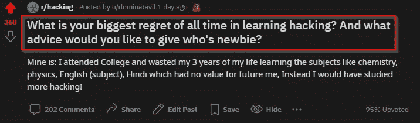

我在 Reddit 上冲浪，无意中发现了这个帖子，我觉得它非常有趣，并认为它可能对开始黑客生涯的初学者有所帮助。问题是“在学习黑客的过程中，你最大的遗憾是什么？你对谁是新手有什么建议？”

有些时候，我们会后悔做了一些没有任何帮助的事情，因为这个人说他浪费了 3 年的时间学习那些他不再觉得有帮助的科目。因此，让我们看看其他黑客的遗憾，以及有人可以从这些错误中学到什么。

## 让我们从那些评论中学习。

# 开始吧！

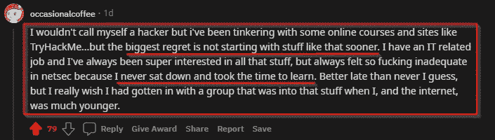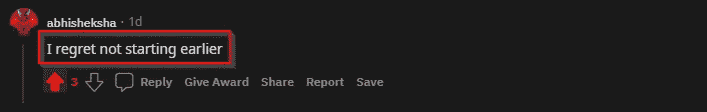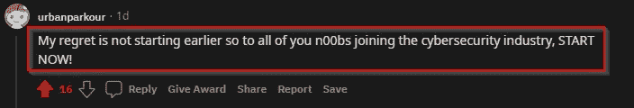

这听起来可能很刺耳，但却是事实

当这个人说他已经准备好了开始的所有材料，但是他没有早点开始，你可以在“我从来没有坐下来花时间去学习”这句话中看到他的遗憾。正如流行的说法“**种树的最佳时间**是 20 年前。第二个**最佳时间是现在**我真的鼓励你们开始学习你们喜欢摆弄的新东西，有很多免费的东西供我们开始，比如**TryHackMe**rooms**hack the box**rooms 和大量的教育材料，你们可以使用并从中学习。

# 努力和坚持是关键！

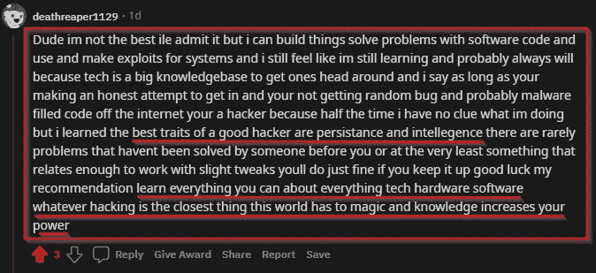

这是我看到的最好的评论，他基本上是在谈论他是如何学习的。你看，这不是关于你如何开始你的黑客生涯，而是关于你学到了什么，以及你在现实生活中的道德黑客之旅中能使用多少。“优秀黑客的最佳特质是坚持和智慧”我想总结一下这句话，没有人生来就聪明&你真的需要相信坚持和努力。不要考虑最终目标，专注于过程，这才是最重要的，缓慢而稳定地赢得比赛！

# 开始记笔记！

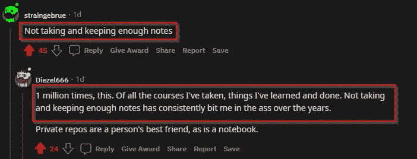

最大的遗憾是当你没有在正确的时间找到正确的东西，就像他们说的，最强大的工具是在正确的时间派上用场的；所以一定要把所有的事情都记在纸上或网上，你也应该学会利用这些信息。

# 永远不要停止学习！

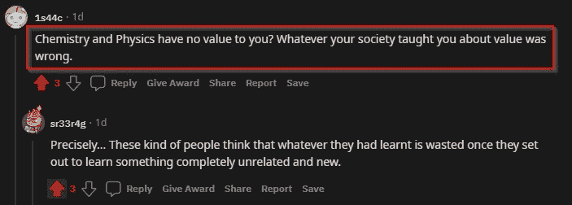

作为对 OPs 遗憾的答复

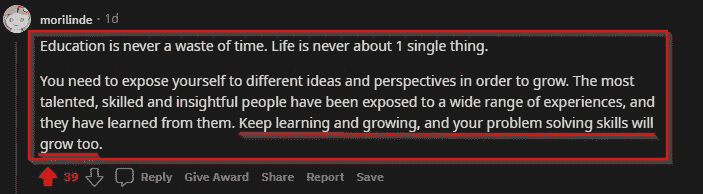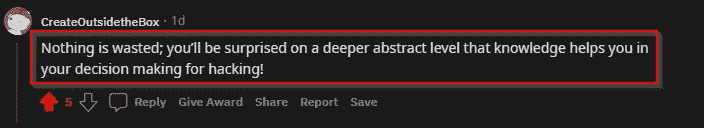

我 100%同意这个家伙/女孩“教育从来不是浪费时间。生活从来都不是一件简单的事情。”你真的需要让自己接触不同的场景，并从中学习。正如你所看到的，黑客是关于心态、不同的视角和跳出框框思考的，但要达到这种心态，你需要成为一个持续的学习者。总之，**永远不要停止学习！**

## 要成为一名黑客，你不需要成为一名程序员！

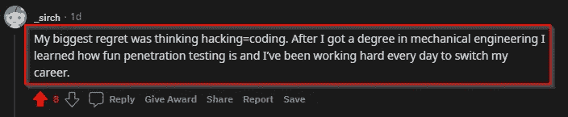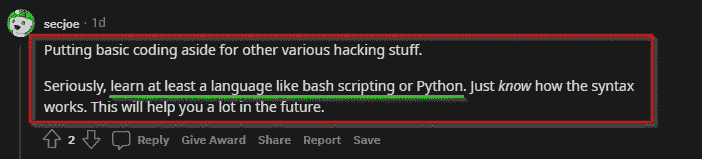

真的，伙计们，当你开始从事黑客工作时，你不需要成为一名程序员，但你需要知道程序是如何工作的，以便能够破解它，当你想更深入地研究真正的技术东西时，这变得很重要。从表面上看，你不需要成为一名**程序员**就能从事黑客工作，但是学习编码确实有助于增加你的知识基础。在[这个视频](https://www.youtube.com/watch?v=wv2YhT89LDU)，LiveOverFlow 很好的解释了这一点。

## 只做好事！

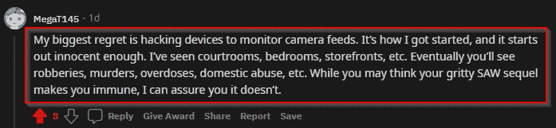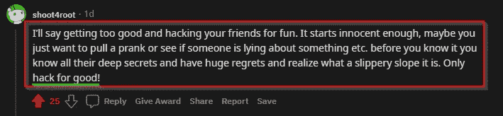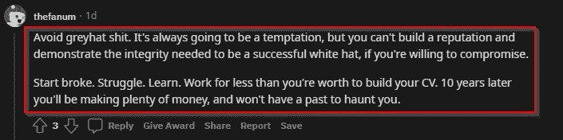

俗话说“权力越大，责任越大”，这位评论者解释得很好。黑客是一种技能，它有能力摧毁任何基础设施，它会开始无辜，但最终会足够可怕，把人送进监狱。所以不要用你的技能伤害任何人或非法。在我们的社区里没有对黑帽子的尊重，所以要小心！只有在你被允许的情况下才可以入侵。

## 不要做一个脚本小子

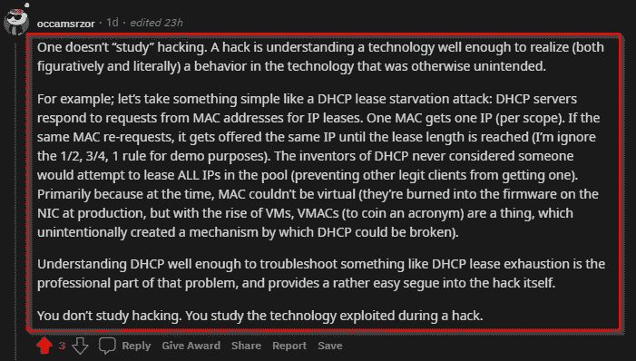

这是有史以来最好的回答“一个黑客对一项技术的理解足够深刻，能够意识到(无论是比喻上还是字面上)这项技术中的一种行为，而这种行为原本是没有意识到的。”你应该学习技术是如何工作的，IP 是如何工作的，网站是如何工作的，什么是 VPN，它是如何工作的？不要只是使用已经可用的东西，要了解这些东西是如何工作的，不要做一个脚本小子。

当然，我不会一一列举所有的 200 条评论，你可以在这里阅读[的帖子](https://www.reddit.com/r/hacking/comments/nlsrc8/what_is_your_biggest_regret_of_all_time_in/)。

🔥任务:免费张贴我的每一寸知识教你如何黑客！

跟随我:

推特:[twitter.com/Real0xdom](https://twitter.com/Real0xdom)

insta gram:[www.instagram.com/0xdom/](https://www.instagram.com/0xdom/)