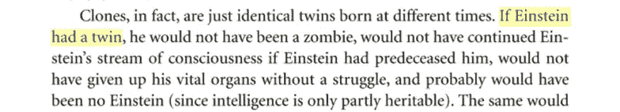
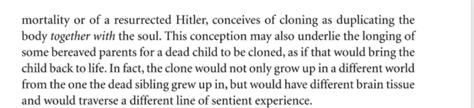
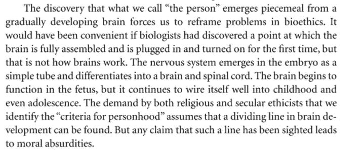
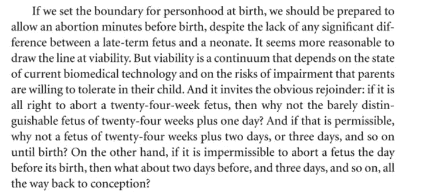

# 史蒂芬·平克的空白石板被我恶毒地吹毛求疵第一部分。

> 原文：<https://medium.com/nerd-for-tech/the-blank-slate-by-steven-pinker-viciously-nitpicked-by-me-part-one-a6efec1e1c3b?source=collection_archive---------3----------------------->

每个人都应该阅读史蒂芬·平克的《空白的石板》。这不是一本难读的书，所以每个人都完全有可能读它。话虽如此，我认为有一些小错误足够严重，值得指出。以下是其中的几个。

我用谷歌搜索“如果爱因斯坦有一个双胞胎”，看到了第 224 页到第 228 页的全部内容——这是一个很好的五页长的随机免费样本，可以很容易地用截图保存。这篇文章的所有内容都与这些页面相关。我不会张贴链接，因为它可能不会以可预测的方式工作。

在空白石板的第 226 页上写着:

我对此的挑剔是:

1.  “意识流”并没有很好的定义，因此没有人能确定在某种意义上，或者在某种程度上，爱因斯坦的意识流是否会被他的孪生兄弟延续。
2.  正如平克自己所指出的，同卵双胞胎经常彼此非常相似。如果平克有证据证明双胞胎中的一个是天才，而另一个可能不是，他应该拿出来。智力是否只是部分遗传无关紧要，因为双胞胎不会从另一个双胞胎身上遗传他或她的智力。

在第 227 页上写着:

一条“感知体验线”并没有被很好地定义，所以不可能知道克隆人是否“会穿越一条不同的感知体验线”。

在第 227 页上写着，

我对这一段有三点文体上的挑剔:

1.  “[……]迫使我们重新思考生物伦理学中的问题。”更好的说法是“迫使我们重新思考一些生物伦理问题。”毕竟，我们没有被强迫去重新定义所有的人。

2.“如果生物学家发现了[…]，那就方便了”应该是“如果生物学家发现了[…]，那就方便了”。

3.“[……]大脑完全组装并第一次插上电源打开的一个点[……]”这没有任何意义。生物学家如何发现大脑何时被“插上电源”？太荒谬了。平克清楚地表明，他知道大脑不是这样工作的，他补充道，“但这不是大脑的工作方式。”但在我看来，它在风格上仍然很弱。

在同一段中，平克说“[大脑]继续将自己连接到童年甚至青春期”，这是一个事实错误。事实上，用平克的比喻来说，大脑在青春期甚至成年期都在继续“给自己布线”。大脑在 24 岁左右完成自我连接。

 [## 内容:大脑成熟大约在 24 岁时完成

### 与成年人相比，青少年对酒精的敏感度不同的主要原因是他们的大脑…

sites.duke.edu](https://sites.duke.edu/apep/module-3-alcohol-cell-suicide-and-the-adolescent-brain/content-brain-maturation-is-complete-at-about-24-years-of-age/) 

成年是一个定义的问题，不同的定义是 13 岁(犹太教)，16 岁，18 岁，或者最迟 21 岁。生理上的成年开始于青春期结束，青春期几乎总是小于 16 岁，甚至经常只有 6 岁。

英国的国民医疗服务体系说“但是女孩从 8 岁到 13 岁，男孩从 9 岁到 14 岁之间开始青春期是完全正常的。如果青春期没有在平均年龄左右开始，通常没有必要担心，但如果青春期在 8 岁之前开始或在 14 岁左右还没有开始，向你的全科医生寻求建议是个好主意。”

 [## 青春期提前或延迟

### 青春期是孩子长大成人后身体开始发育和变化的时期。青春期的标志包括女孩…

www.nhs .英国](https://www.nhs.uk/conditions/early-or-delayed-puberty/) 

这一整段应该从书中删去，因为它没有增加任何内容:

这是整本书中为数不多的完全胡说八道的部分之一，否则这本书会非常精彩。你可能会说，如果我们将法定驾驶速度设定为每小时 60 英里，我们应该准备好接受有人以每小时 59.9 英里的速度驾驶，尽管时速 59.9 英里的汽车和时速 60.1 英里的汽车之间没有任何显著差异。有了法律，你需要一个清晰的界限。投票年龄和饮酒年龄也是如此。

由[凯利·西克玛](https://unsplash.com/@kellysikkema?utm_source=medium&utm_medium=referral)在 [Unsplash](https://unsplash.com?utm_source=medium&utm_medium=referral) 上拍摄的照片