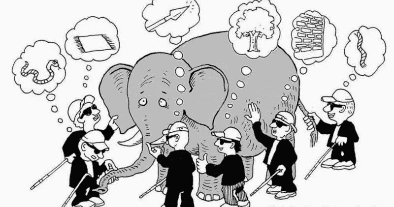

# 盲人和大象

> 原文：<https://medium.com/nerd-for-tech/the-blind-men-and-the-elephant-6fe1fa6c5a0c?source=collection_archive---------6----------------------->

## 2020 年代技术选择的警示故事

*今天看了一篇有趣的*中[*篇*](https://javascript.plainenglish.io/enough-why-its-time-to-rip-out-angular-7d831802c8a2) *。它写得很好，但非常主观——尽管它确实与我自己的个人经历产生了共鸣。令我吃惊的是它所激起的攻击的激烈程度。显然，* Angular *与其说是一个网络框架，不如说是一种信仰。这个回答让我开始思考如今我们如何选择技术。*

自从我 1972 年开始开发软件以来，一些(几乎所有的)事情都发生了变化。事实上，在我职业生涯的大部分时间里，我不断学习和使用新技术和工具，既有挑战又有乐趣。唯一不变的是变化。

由于我为初创公司和大型独立软件开发商做过开发，我认为我对挑战和成本有一个相当合理的看法。不管值不值得，以下是我的信念。个别技术和框架是有用的，但短暂的，我们的贸易工具。*大多数会通过，最终会被取代。*你会因为别人用什么牌子的锤子而情绪激动吗？

我认为我们这个行业的一个问题类似于 [***盲人摸象***](https://en.wikipedia.org/wiki/Blind_men_and_an_elephant) 的比喻。我们人类倾向于根据自己有限的主观经验宣称绝对真理，而忽视他人有限的主观经验，这些经验可能同样有效。如今，许多开发人员完全在一个受限的问题空间内工作:基于浏览器的应用和移动应用、服务器端服务和微服务、SQL 和 noSQL 数据库，以及无数其他专业领域中的任何一个——数据中心和云计算——特定于供应商或混合云技术。很容易开始认为自己在软件开发世界中的一小部分就是整个软件开发世界。

有时候，过多的专门化可能不利于理解和应用软件工程和架构原则，这些原则是在过去 50 年中辛苦学到的——并且可能导致一个人陷入总是认为自己知道的比实际知道的多的危险陷阱。专门化是可以的，但是如果一个人想要避免被现实中无处不在的颚咬到屁股，那么对一般软件架构和工程原理的合理基础，以及对软件和软件开发的其他方面的合理理解是必要的。

> 实际上，在软件的设计和实现中所做的每一个选择都代表了相互竞争的需求之间的妥协。不这样想是天真的。没有完美的选择，也没有最好的选择，只有能够奏效的妥协。

大多数(不是全部)对媒体文章的负面回应来自那些工作非常以 T2 为中心的人。我并不是说*棱角分明*不好。但它不是也不可能是完美的。没有框架是。在我看来，一个专业的软件工程师应该努力理解和处理它的弱点(不管它们看起来有多小)，而不是生气或情绪化地为它辩护。我们都有更多的东西要学，理性地回应批评是一种方法。

对于那些想更深入思考像 *Angular* 这样的框架必须做出的妥协的人来说，这里有一些我个人关心的问题:

1.  **关注点分离**:用户界面软件应该关注 UI/UX，而不是应用程序的功能。UI 及其组件应该专注于向用户呈现数据和选择，并响应用户的动作。它应该向底层应用程序发送消息，以便检索数据和实现用户表达的动作。这是从 1985 年的 Mac 开始，在构建 Mac、Windows、Swing、Eclipse SWT、Web、iOS 和 Android 应用程序的过程中得来不易的教训。这种分离极大地简化了应用程序测试和可维护性。从我的角度来看， *Angular* 将 UI 和应用程序功能混合到一定程度，这对于传统的 Web(或移动)应用程序来说可能是可以接受的，但对于基于云的微服务应用程序来说是有问题的。
2.  **抽象级别**:这些年来，软件生产率的许多提高都来自于抽象的增加，而没有牺牲对底层模型的太多控制。 *Angular* 向开发人员呈现了高度的抽象，但对我来说，这种抽象与底层技术模型偏离太多，我无法适应。我怀疑一个只使用过 *Angular* 的开发者可能甚至难以描述底层的技术模型。对我来说这似乎很冒险。
3.  一致的架构:一致的架构模型使得框架更容易学习和利用。从我作为软件架构师的角度来看， *Angular* 更多的是有用特性的集合，而不是一个设计良好的架构的实现。它最明显的目标是减少编码，但是它没有显示出中心组织主题的证据。减少编码非常有用——但是由于编码通常不超过实现软件系统成本的 10%,我宁愿拥有更一致架构的测试、可靠性和可维护性优势。

这个故事的寓意是明智地选择框架，睁大你的眼睛，清楚地理解妥协。没有什么是完美的，也没有什么是永恒的。我相对肯定的是，那些在本文开头提到的攻击这篇文章的人，不太可能更容易接受我的文章。我所能期望的最好的结果是，一些人至少会考虑所讨论的问题，甚至会尝试学习和评估其他解决方案。*那些不理解过去的人注定要重复过去。*