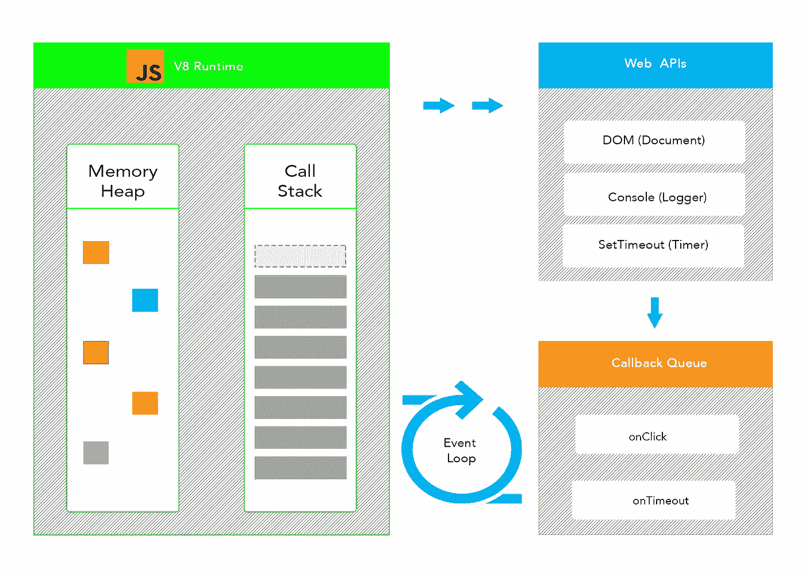

# 解释了调用栈和内存堆。

> 原文：<https://medium.com/nerd-for-tech/the-call-stack-and-memory-heap-explained-e50450aa1274?source=collection_archive---------6----------------------->

JS 事件循环的可视化表示

调用栈和堆不会干扰你的日常工作流程。然而，理解调用堆栈和内存堆是至关重要的。它们是每个软件工程师都应该理解的基本概念。请记住，栈和堆并不是 JavaScript 的专有概念。其他低级语言如 C 和 C++也使用堆栈和堆。

**什么是调用栈？**

调用栈**负责保持我们应用程序的执行流**。没有它，JavaScript 就不知道什么时候调用什么。

让我们来看一个如何与调用堆栈通信的例子。

## 什么是内存堆？

堆负责存储我们的数据。这就是**内存分配**发生的地方。

让我们回顾以下内容

因为所有的 JavaScript 引擎都是不同的，所以变量的分配位置也不尽相同。在很大程度上，你可以这样想。更简单的变量将被存储在堆栈中，更复杂的变量如对象、数组和更复杂的数据结构。