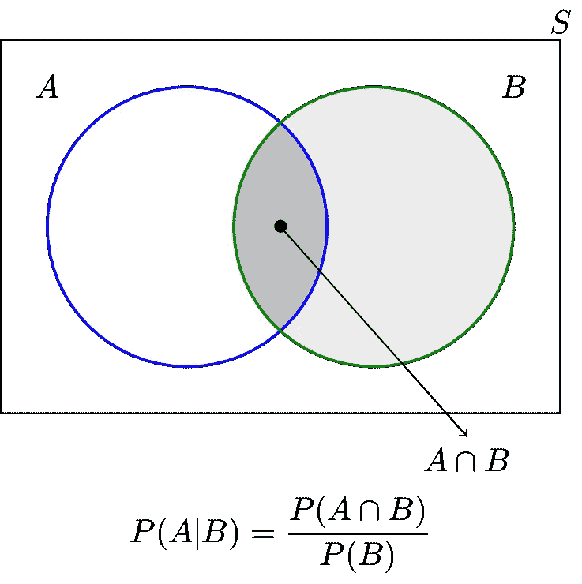

# 条件概率的链式法则

> 原文：<https://medium.com/nerd-for-tech/the-chain-rule-of-conditional-probabilities-656d8d2dbc15?source=collection_archive---------0----------------------->

# 介绍

条件概率链规则也称为一般乘积规则。它允许计算任意数量的一组随机变量的相关分布。它只允许使用条件概率。

链规则在贝叶斯网络的研究中非常有帮助，贝叶斯网络根据条件概率来定义概率分布。在本文中，我们将详细了解链式法则。

# 描述

条件概率出现:

*   当特定事件发生的概率改变时
*   [满足一个或多个条件时。](https://www.technologiesinindustry4.com/2021/12/ensemble-methods-in-deep-learning.html)
*   这些条件再次成为事件。
*   用专业术语来说，如果 A 和 B 是两个事件，那么 A w . r . t . B 的条件概率用 P (A|B)表示。
*   所以，当我们用条件概率来说话的时候，只是举一个例子，我们做了一个对应于“给定 B 之前已经发生的事件 A 的概率”的陈述。

**如果 A 和 B 是独立事件**

从独立事件的定义来看，事件 A 的发生不依赖于事件 B，因此 [P (A|B) = P (A)。](https://www.technologiesinindustry4.com/)

**如果 A 和 B 互斥**

由于 A 和 B 是不相交的事件，当 B 已经发生时，A 将发生的概率为 0。因此，P (A|B) = 0

当 P (B) =0 时，P (A|B)的条件概率是不确定的。如果 P (B) =0，这是可以接受的。这意味着事件 B 永远不会发生。因此，谈论给定 b 的概率是没有意义的。

如果 A 和 B 是样本空间 S 中的两个事件，那么给定 B 的条件概率被定义为

[P (A|B) =P (A∩B) P (B)，当 P (B) > 0。](https://www.technologiesinindustry4.com/2021/12/ensemble-methods-in-deep-learning.html)

# 链式法则

我们可以重新排列条件概率的公式，得到链式法则:

P (A，B) = p (A|B) p (B)

我们可以将这分为三个变量:

P(A，B，C) = P(A| B，C) P(B，C) = P(A|B，C) P(B|C) P(C)

[和一般意义上的 n 个变量:](https://www.technologiesinindustry4.com/2021/12/ensemble-methods-in-deep-learning.html)

P(A1，A2，…，An)=；P(A1| A2，…，An) P(A2| A3，…，An) P(An-1|An) P(An)

一般来说，我们称之为链式法则。

这个公式对于贝叶斯信念网特别重要。它提供了一种计算全联合概率分布的方法。前述的条件概率是一种概率度量。因此，它满足概率公理。具体来说，

[公理 1:对于任意事件 A，P (A|B) ≥0。](https://www.technologiesinindustry4.com/)

公理 2:给定 B，B 的条件概率为 1，即 P (B|B) =1。

公理 3:如果 A1,A2,A3,⋯是不相交的事件，那么 p(a1∪a2∪a3⋯|b)=p(a1|b)+p(a2|b)+p(a3|b)+⋯

更多详情请访问:[https://www . technologiesinindustry 4 . com/2021/12/the-chain-rule-of-conditional-probabilities . html](https://www.technologiesinindustry4.com/2021/12/the-chain-rule-of-conditional-probabilities.html)