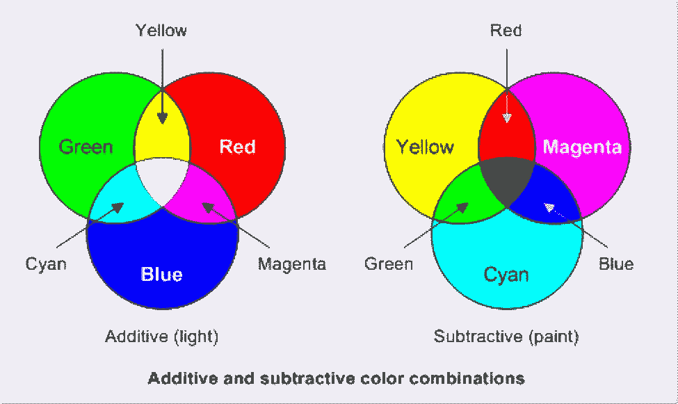

# 色彩理论——为什么计算机使用 RGB 而不是 RYB？

> 原文：<https://medium.com/nerd-for-tech/the-color-theory-why-do-computers-use-rgb-instead-of-ryb-205b75d6e783?source=collection_archive---------0----------------------->

红色、黄色和蓝色——原色。这就是我们在幼儿园被告知的，不是吗？但是还有更多。你知道吗？

来源 [Unsplash](https://unsplash.com/photos/5Z9GhJJjiCc)

如果你是开发人员，你可能知道计算机使用 RGB 系统。现在的问题是——如果 RYB 是原色，那么为什么计算机使用 RGB 呢？

深入到线下，首先需要了解色彩理论。有两种不同的理论-

1.  添加剂
2.  负的

在详细说明之前，让我问你-光到底是什么？或者更确切地说是可见光，就像你在阅读本文时看到的那种。不去探究电磁辐射、波长以及其他类似的物理现象——光只是反射到我们眼中的颜色。

事情是这样的——就像玩家依赖游戏，植物依赖环境一样——根据不同的情况，我们对原色也有不同的看法。光和颜料(或墨水)的不同情况。

> 利兹大学色彩学教授斯蒂芬·韦斯特兰说:“我们能看见是因为光线进入了我们的眼睛。”。“光通过两种方式进入我们的眼睛:(1)直接来自光源；以及(2)从物体反射。这导致两种类型的颜色混合，加色和减色。

# 负的

当我们混合颜料或墨水时，就会产生减色混合。油漆或墨水在这里是不发光的物体。当光线照在它们身上时，它们会反射。颜料分子吸收一些波长的光，反射其余的光。我们就是这样看待这类物体的。

减色法的原色是——红绿黄。不是。它们是 CMYK——青色、品红色、黄色和代表黑色的 K(以区别于代表蓝色的 B)。只是一个约定)

当 CMY(不是 K)混合时，它会产生褐色。有点泥泞。为了得到更黑的颜色，使用了黑色的附加 K。CMYK —印刷和出版公司使用的模型。

来源[内网](https://intranet.mcad.edu/kb/cmyk-vs-rgb-what-color-space-should-i-work)

# 添加剂

加法是投射一种或多种彩色光(波长)的情况。这些颜色混合后会产生更多的光。RGB，红-绿-蓝混合后会产生更亮的颜色，最终产生白光。这就是我们的电脑、电视和其他发光屏幕的工作原理。

当光线从屏幕上发出时，它使用一种加色系统。如果你想看到接近紫色的颜色，系统应该同时发出红光和蓝光。

如你所知，大多数电子屏幕都是暗的，RGB 模式是用来发光的。将这些颜色组合起来产生较亮的颜色，与深色屏幕形成良好的对比。

你现在应该明白了。但总而言之，

> 当产生光时，使用 RGB 标准；CMYK 标准是针对反射光的。
> 
> 电子设备产生光；印刷的纸张反射光线。

你能行的。但是—

## 如果我用黑纸打印会怎么样？

我们迫不及待地想让光线印在黑纸上。光不能画在一个表面上(讽刺地)。因此，我们仍然需要使用墨水。

## 在黑纸上用白墨怎么样？

来源-打印机墨水很硬。即使你选择使用白色，纸张也有可能会浸透墨水。但是激光打印机可以做到这一点。

## 但是，但是，RYB 怎么办？

嗯，那是幼儿园的故事。颜色的颜色不是那么容易变淡的。但是 RYB 仍然会被认为是原色——从**艺术的角度**。

现在你知道成人的故事了。以下是了解更多颜色或色彩的资源。

1.  由[馆](https://pavilion.dinfos.edu/Article/Article/2355687/additive-subtractive-color-models/#:~:text=Because%20additive%20colors%20use%20transmitted,they%20appear%20muted%20in%20contrast.)提供颜色模型
2.  通过之间的[差异进行加法与减法比较](http://www.differencebetween.net/science/difference-between-additive-colors-and-subtractive-colors/)
3.  手工黑纸印刷[堆叠交换](https://crafts.stackexchange.com/questions/8690/printing-on-black-paper)
4.  科学色彩理论 [HowStuffWorks](https://science.howstuffworks.com/primary-colors.htm)
5.  大不列颠[的彩色印刷](https://www.britannica.com/technology/color-printing)

就这样，我告别了。