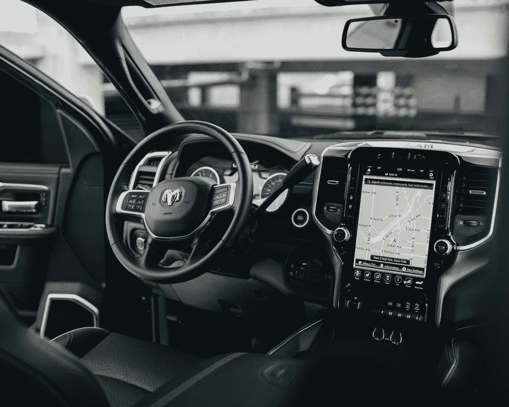

# 自动驾驶市场商业化加速，初创团队如何突围？—第二部分

> 原文：<https://medium.com/nerd-for-tech/the-commercialization-of-the-autonomous-driving-market-is-accelerating-how-can-start-up-teams-4d96cb82ed0a?source=collection_archive---------2----------------------->

各行各业都需要无人驾驶。至于具体场景的落地顺序，创业公司要考虑错误成本、刚性需求和市场容量，通过自己的技术快速适应各个行业。

## **技术验证后，自动驾驶助力实体经济增长**

近年来，疫情正在推动各行各业走向无人化和自动化。但对于自动驾驶公司来说，**疫情是危机中迎接变化的机会。**

疫情隔离需求导致移动医院和社区对送货车的需求旺盛，间接带来了送货车市场的爆发。**目前，自动驾驶已经经过技术验证阶段，走向商业化阶段。**自动驾驶带来的价值是多方面的。许多实体经济行业都受益于自动驾驶技术。

无论是从会计、省钱和管理的角度，还是从安全和企业品牌的角度，它都在唤醒客户的需求。

**在核算**方面，目前一辆车在客户的生产线上可以跑 23.5 个小时，可以代替两组一天三班倒的人，也就是至少 3 到 4 个司机的成本。

以每年 10 万元人民币(14907.57 美元)的成本计算，三年可以为客户节省 120 万元人民币(178829.52 美元)。

**人事管理方面**，由于工作环境恶劣，年轻司机越来越少，在人口老龄化的压力下，公司很难招到工人。

AI 驱动程序可以通过帮助客户“节省管理”来帮助解决这个问题。

**在安全方面**，AI 司机最大的好处就是永远不会累。特别是 AI 司机的应用将显著减少矿山的安全问题，安全事故可能导致停产。

## **在自动驾驶商业化正在发生的红海下，各厂商的企业路线也各不相同。**

有些企业选择特殊场景，如港口、矿山、物流等。有的从一辆小车和特定场景出发，考虑试错成本低，可控。

考虑“是否是刚需”，换句话说，能不能做成生意？这对客户有用吗？

对于厂商来说，**市场容量**也是很好理解的。适应一个模型需要付出大量的努力、劳动和成本。如果适合一款车型，只卖两款肯定不划算。

自动驾驶一定是一场持久战。我们需要考虑的不是短期内实现爆发式增长，而是要有足够的耐心去了解和学习场景，踏踏实实的满足客户的需求，做好长跑的准备。

## 自动驾驶的产业化焦点

自动驾驶的主流算法模型主要基于有监督的深度学习。它是一种算法模型，推导出已知变量和因变量之间的函数关系。需要大量的结构化标记数据来训练和调整模型。

在此基础上，要想让自动驾驶汽车变得更加“智能”，形成可在不同垂直落地场景下复制的自动驾驶应用商业模式闭环，模型需要有海量、高质量的真实道路数据支撑。

## 2D-三维融合数据

例如，为了开发自动驾驶汽车的多模型机器学习算法，一些制造商需要融合两个不同维度的不同数据集。这个操作很重要，但是手动执行很有挑战性。

AI 公司甚至希望数据公司能够更好的了解算法技术和需求场景，参与算法的研发，给出数据采集的优化建议。创造竞争优势也成为数据服务提供商关注的焦点。

## 常见的数据标注类型包括:

2D 包围盒

[车道标线](https://tinyurl.com/u7u4me)

[视频跟踪标注](http://tinyurl.com/wmu4yfhh)

点标注

[语义分割](https://tinyurl.com/48w576p7)

三维物体识别

3D 分割

传感器融合:传感器融合长方体/传感器融合分割/传感器融合长方体跟踪

# 结束

将你的数据标注任务外包给 [ByteBridge](https://tinyurl.com/5xccnrn9) ，你可以更便宜更快的获得高质量的 ML 训练数据集！

*   无需信用卡的免费试用:您可以快速获得样品结果，检查输出，并直接向我们的项目经理反馈。
*   100%人工验证
*   透明和标准定价:[有明确的定价](https://www.bytebridge.io/#/?module=price)(包含人工成本)

为什么不试一试呢？

资料来源:https://it.sohu.com/a/548390166_121065600