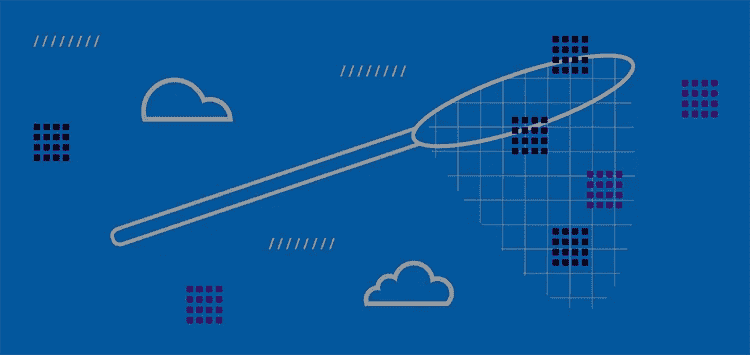

# 完整的客户数据堆栈:数据收集(第 2 部分)

> 原文：<https://medium.com/nerd-for-tech/the-complete-customer-data-stack-data-collection-part-2-9cd7cd7efff?source=collection_archive---------27----------------------->

# 关系数据及其他

[在第一部分](https://rudderstack.com/blog/the-complete-customer-data-stack-data-collection-part-1)中，我们谈到了在构建数据堆栈时全面考虑数据和基础架构的重要性。我们强调了类别在这一整体视图中的重要作用，并详细介绍了两个主要数据来源中的第一个，事件数据。

在这篇文章中，我们将讨论另一个主要的数据源，关系数据。我们将概述如何从云应用程序和数据库中收集关系数据，我们还将提到另外两个不太重要但仍然重要的数据源。

# 关系数据

这是我们几乎总是要处理的另一大类数据。因为我们需要处理这样的数据，所以我们发明了英语教学的整个概念。传统上，这些数据来自 RDBMS 系统，但是随着云的兴起，也有新类型的来源公开类似的结构化数据，主要是云应用程序。让我们看看关系数据的一些特征，以及它们与流数据的区别:

*   它们经常变化。
*   它们通常不会大量出现，尽管这种情况可能会发生。
*   他们有很高的维度。

关系数据，不管它是来自云应用还是数据库，都会非常频繁地发生变化。它也可以被删除，这是我们不必处理流数据的事情，这在确保数据集的一致性方面有很大的不同。例如，想象一个电子商务篮子；顾客在买东西时，可能会多次添加和删除商品。如果我们想跟踪我们的数据基础设施篮子，我们必须跟踪这些变化。

大多数情况下，关系数据与点击流数据的数量不同。对于云应用来说尤其如此；毕竟，即使你的 CRM 上有数百万客户，我们也必须处理数百万行，而不是数十亿行，就像点击流数据那样。然而，对于 RDBMS 来说，情况并非如此；在大多数情况下，点击流数据量更大，但仍低于点击流数据量。

最后一个重要特征是维度，这也是与流式数据的巨大差异。CRM 可以轻松拥有数百个表，而大多数云应用和数据库至少有数十个表。所有这些表都是相关的，这大大增加了我们需要使用的数据和基础设施的复杂性。

# 如何从云应用程序中收集数据

云应用程序很快变得过剩。如今，几乎每个公司都在运营中使用云应用。客户关系管理系统、营销平台、客户成功工具，所有这些应用都是在云上交付的。

云应用与 RDBMS 的不同之处在于，它们捕获了很多重要的数据，但我们并不拥有它们的后端基础设施，所以我们不能只从它们的数据库中获取 ETL 数据。

在大多数情况下，我们可以通过 REST API 访问数据，而有些可能会公开批量导出的机制。

API 的问题在于它们不是为与数据交互而设计和构建的。它们的主要目的是支持应用程序。这意味着与它们交互通常涉及少量数据，而在您想要获取大量数据的情况下，会增加很多延迟。这意味着，从我们正在处理的所有不同类别的数据来看，数据源都要慢一些。即使是相对少量的数据，从它们同步数据也可能需要几天时间。最后，除了上述所有这些，每个供应商对其 API 都有严格的速率限制，您可以开始了解访问您的云应用程序数据的过程有多慢。

从云应用程序收集数据时经常发现的另一个问题是错误。当您与云应用程序交互时，整个系统会涉及到许多不同的网络和后端。这意味着错误和网络故障是不可避免的。此外，API 错误在大多数情况下都没有得到很好的记录，很快您就会意识到，您需要一个具有一流错误处理能力的数据收集系统来从这些系统中提取数据。

最后，云应用的一个主要困难是处理删除。在最好的情况下，该应用程序实现了软删除，您可以将其同步到您的数据基础架构。在最坏的情况下，允许硬删除。在这种情况下，没有简单有效的方法来处理它们。

当您构建或寻找一个工具来从云应用程序中提取数据时，以上是您必须记住的两件重要事情。

话虽如此，大多数从云应用程序收集数据的系统都由两个主要组件构建而成:

1.  负责调度和协调数据收集作业执行的调度程序。这些作业本质上是批处理作业。
2.  几个连接器，每个我们想要从中提取数据的云数据源一个，负责连接到数据源并从中提取数据。

云数据收集系统的另一个重要方面是维护将用于实现增量同步的全局状态。您真的需要一种方法，只从云资源中提取新的和更新的数据。否则，很快，你将结束永无止境的同步作业。

# 如何从数据库中收集数据

RDBMS 系统是所有软件系统中最重要的组成部分之一。它们是允许我们处理我们的软件的状态并为将来使用它而保存它的系统。由于这些系统包含有价值且独特的数据，我们需要收集这些数据并将其一致地存储在我们的数据基础架构中。

RDBMS 系统的好处是依赖于我们自己的基础设施。这使我们能够与他们进行更紧密的集成，并对流程进行更多的控制。

然而，RDBMS 系统的风险在于这些系统通常非常关键。您最不想做的事情就是使您的生产数据库无响应，因为您弄乱了您执行的查询。不过，正如我们将会看到的，还是有办法减轻风险的。

从 RDBMS 系统收集数据的第一种方法是连接它并执行查询，这些查询将返回我们希望存储在数据基础结构中的数据。这些查询通常非常简单；每个表一个 select 查询也可以筛选一些列。可能会使这些查询更加复杂的是，如果我们只想收集更新的数据，那么就像在云应用程序的情况下一样，我们的 ETL 工具需要维护一些状态，以跟踪记录被同步的最后时间，并确保它将从该点继续。

这种方法有几个缺点。

*   随着查询变得越来越复杂，响应时间越来越长，这给数据库带来了压力。
*   删除很难处理。

您可以遵循一些策略来避免给数据库带来额外的压力。第一个也是最明显的一个是在数据库负载较低的时候执行收集任务。

处理这个问题的另一种方法可能也是最有效的方法是维护主数据库的副本，并只在该数据库上执行维护收集作业。这样，即使出现问题，唯一受影响的数据库将是副本。这种方法的问题在于它增加了基础设施及其管理的复杂性。

另一方面，删除仍然很难处理，就像云应用的情况一样。软删除可能是一个好策略，但对于生产数据库来说不是很有效。

还有一种从数据库中收集数据的方法越来越流行。该方法基于**变更数据捕获(CDC)** 的概念。其工作方式是将数据收集应用程序附加到数据库的复制日志中。

此复制日志的目的是允许副本跟随领导者。为此，领导者维护一个包含一系列命令的日志，当执行这些命令时，副本服务器上的最终状态将与领导者相同。

我们可以利用这种机制从我们的数据库中收集数据，并将其存储到我们的数据基础设施中，以便存档和进一步分析。

这种方法的好处是我们给数据库增加的压力很小。另一个好处是，现在我们也可以非常有效地处理删除。领导会告诉我们什么时候删什么，我们就去做。

CDC 的主要问题是处理复制日志可能会很复杂，因为它的结构在不同的数据库之间没有标准化。每个 RDBMS 都遵循自己的复制日志体系结构。这一事实还增加了许多我们必须注意的边缘情况，这些情况可能没有得到很好的记录，因为复制日志是非常深奥的工具，从来不是作为与外部流程交互的接口而构建的。

最后，因为我们处理的不是状态，而是改变状态的命令，所以使用不公开典型 RDBMS 接口的目的地可能会更困难，例如当数据必须存储为 asS3 或 Kafka 时。

不管实现 CDC 有多困难，从 RDBMS 系统收集数据很可能是未来的趋势，所以一定要密切关注这个领域及其供应商。

# 其余的数据

我们讨论了必须处理的最重要的数据来源。还有许多其他类型的生成数据，我们可能希望以某种方式处理它。日志文件等数据可用于网络安全目的，来自基础设施的遥测数据也很重要。尽管如此，这些数据类型通常以不同的方式使用，而不是像我们之前讨论的那样使用不同的工具。所以现在就不重点说这些了。

还有几个其他来源也很重要，下面两个可能是最常见的来源。

# 电子表格

这些是每个公司都会产生的非常常见的数据类型。还有一个工作表非常重要的重要用例——离线数据。想想那些因为任何原因不得不手动收集的数据。最简单的方法是使用工作表。

不过，床单很容易处理。它们的体积极小，变化很慢，维数也很低。因为这些特点，我们可以很容易地与他们合作；例如，删除一个存储表的表，并在每次收集数据时再次提取所有数据，而不会对性能造成任何影响。

我们将用来收集电子表格数据的机制通常类似于我们对云应用程序所做的事情。实际上，使用它们的一种非常常见的方式是将它们存储为 Google Sheets，然后像使用其他云应用程序一样从云中取出它们。

# 云对象存储

像 S3 和谷歌云存储服务。越来越多的数据存储在那里，要么是因为我们想要建立一个数据湖，要么是因为使用这些服务来共享数据很方便。

这些服务的复杂性在于，归根结底，它们只是文件系统，这意味着任何文件都可以存储在那里。所以处理它们的主要问题是数据序列化。

好的一面是，在云对象存储服务上存储数据变得越来越标准化。有了像 Apache Parquet、Apache Arrow、ORC 和 Iceberg 这样的技术，就有了存储数据的有效方法，同时增加了像模式支持这样的功能。

今天，处理这些来源主要是最初收集数据后的一个问题，但我觉得我们将越来越多地与他们合作。

# 免费注册并开始发送数据

测试我们的事件流、ELT 和反向 ETL 管道。使用我们的 HTTP 源在不到 5 分钟的时间内发送数据，或者在您的网站或应用程序中安装我们 12 个 SDK 中的一个。[入门](https://app.rudderlabs.com/signup?type=freetrial)。

本博客原载于
[https://ruder stack . com/blog/the-complete-customer-data-stack-data-collection-part-2](https://rudderstack.com/blog/the-complete-customer-data-stack-data-collection-part-2)