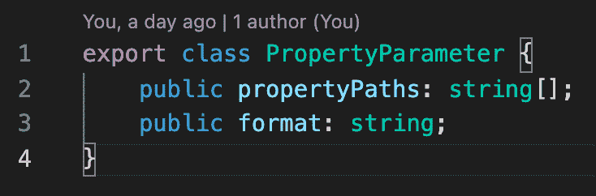
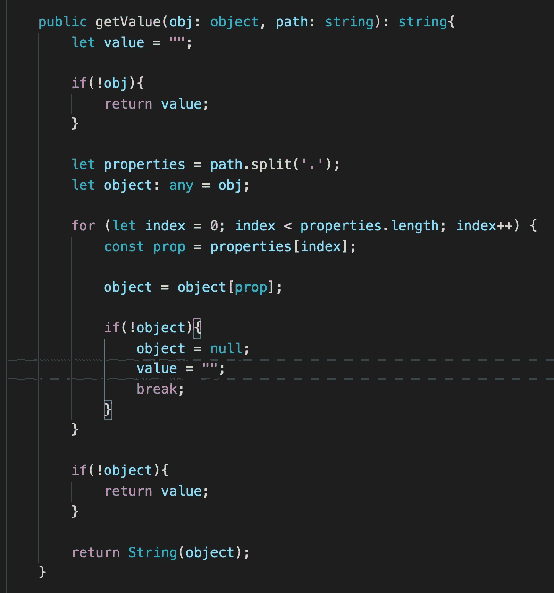
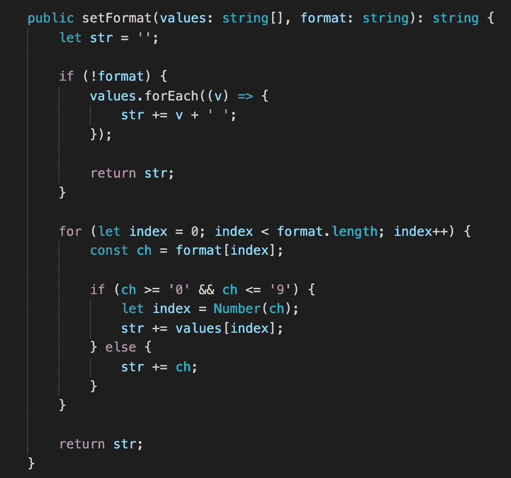
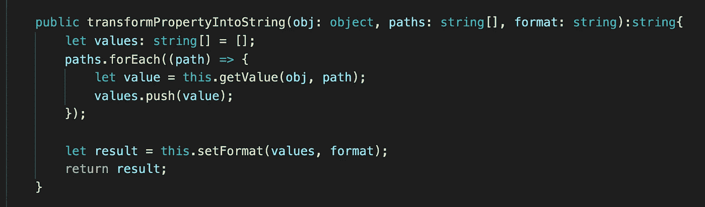
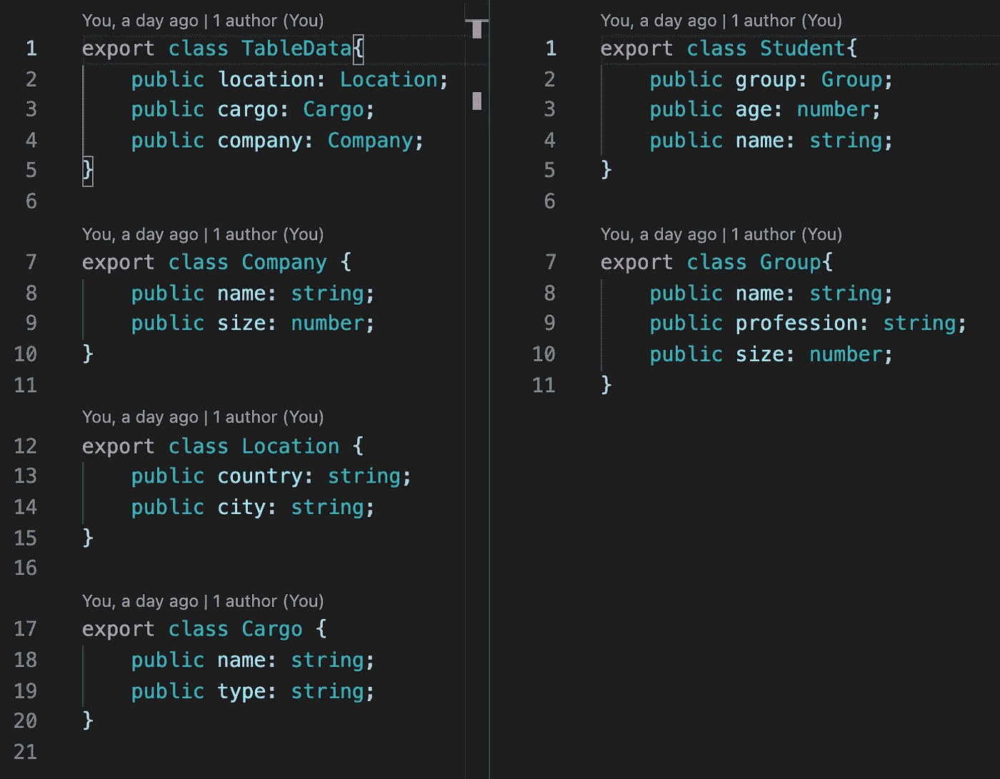
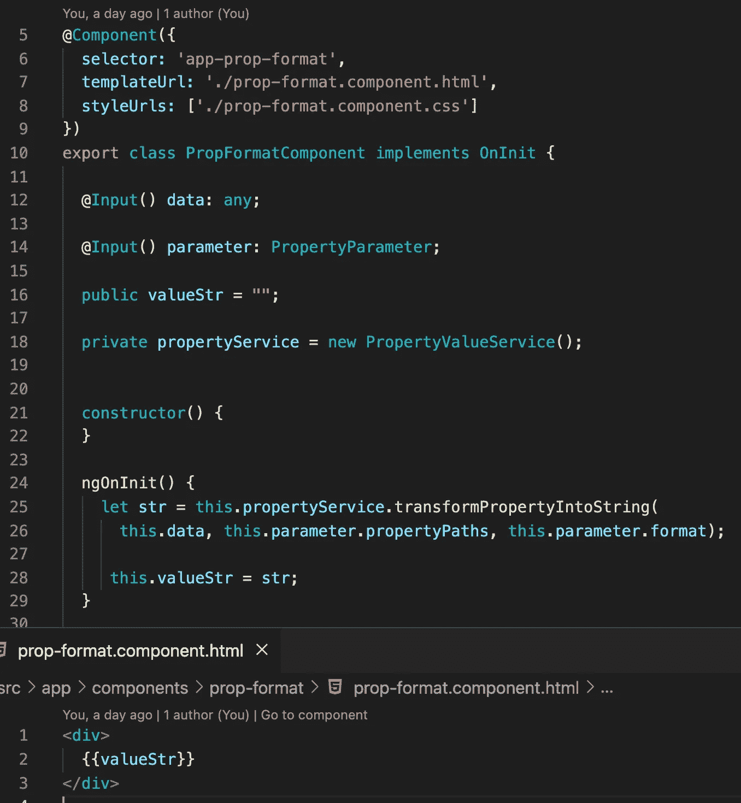
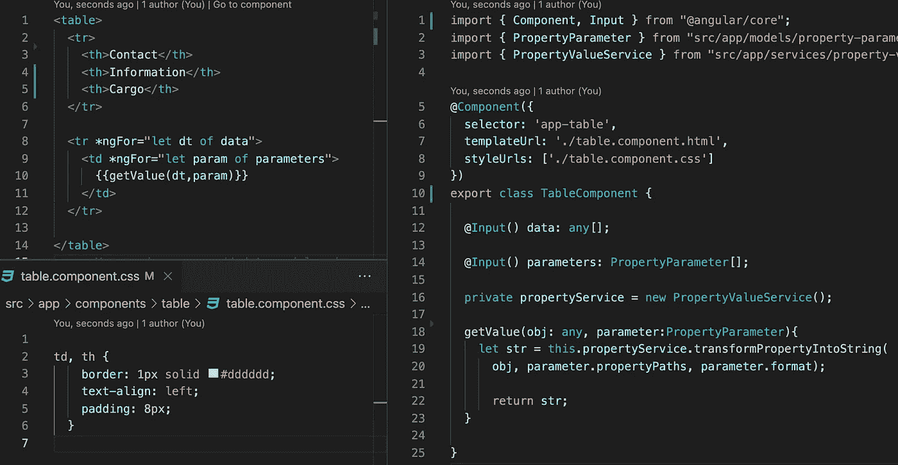
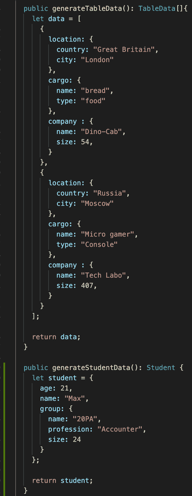
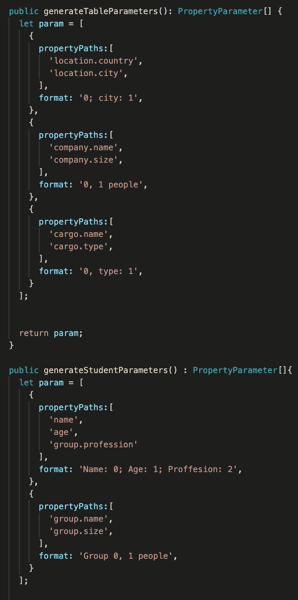

# 处理任何数据的组件。那是真的吗？

> 原文：<https://medium.com/nerd-for-tech/the-component-that-works-with-any-data-is-that-real-48ef2aa7d0f7?source=collection_archive---------13----------------------->

如果您创建了一个很好的组件，但是下个月您的客户来了，要求该组件处理不同的数据类型，那该怎么办？当然，您可以用相同的逻辑创建相同的组件，但是如果您在其中一个组件中发现了错误，那么拥有相同组件的两个版本是不好的。相反，您可以添加另一个字段，并检查一个字段是否为空，这意味着我们需要使用第二个字段。这似乎是一个很好的解决方案，但是需求总是变化的，这意味着你将拥有一个有很多开关情况的组件，或者你将仅仅重写一个组件。如果这个组件很小，这不会是一个问题，但是如果组件很大，这意味着你可能会产生新的错误。

对此肯定有更好的解决方案。我们需要创建一个服务，它可以以书面形式从对象中获取任何数据。用 JS 创建这个服务很容易，因为它是一种动态语言。

js 中的每个对象都可以作为一个字典，有了正确的路径我们就可以得到任何数据。最终，几乎所有数据都可以表示为字符串。

我们在名字上分开路径，如果右域存在，我们循环得到右域。

将来，将不同的字段放在一起并以正确的格式按正确的顺序设置它们会很好。

这里我们解析格式字符串，当我们找到一个数字时，我们使用这个数字作为索引，并在当前位置设置数据。

我们将所有这些方法放在一个可以与我们的属性模型一起工作的方法中。

下一步是创建几个可以处理任何数据的组件。

为此，我们创建了两个模型，大模型，里面有内部对象。

是时候使用我们的组件服务了。一个组件将非常小。

第二个是桌子。我认为这种方法在表格组件中非常有用，因为我们可以从外部设置表格。

在主应用程序组件中，我们为组件创建数据并设置参数。

现在，我们有了可以处理不同数据类型的组件，并且很容易从外部进行设置。

如果你需要仔细看看这个项目，这里有链接。

*原载于 2021 年 7 月 10 日*[*【http://tomorrowmeannever.wordpress.com】*](https://tomorrowmeannever.wordpress.com/2021/07/10/component-that-works-with-any-data-is-that-real/)*。*