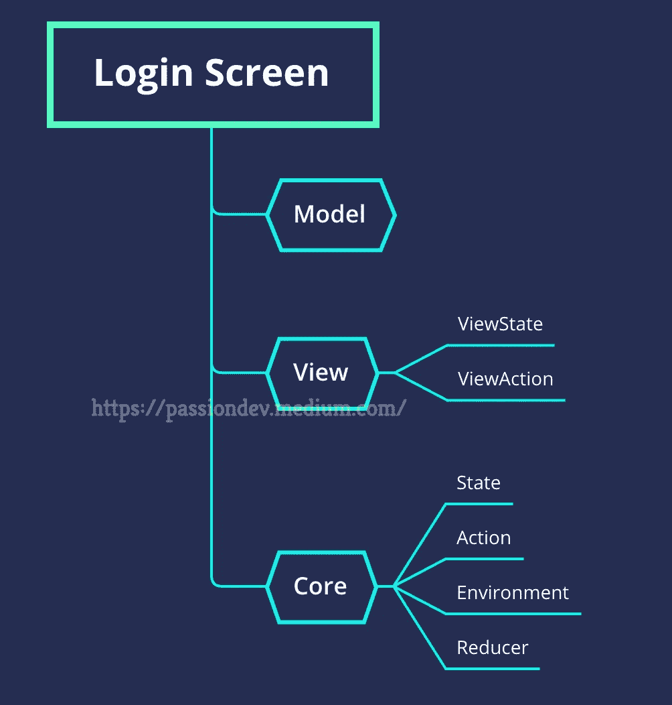

# 可组合架构——应用于实际项目——第 1 部分:通用结构

> 原文：<https://medium.com/nerd-for-tech/the-composable-architecture-apply-into-actual-projects-part-1-the-common-structure-2762e844cbd?source=collection_archive---------7----------------------->

首先，我要感谢上一个系列(以前在 Medium 上面)期间支持我的所有人，我真的很感激这一点。所以，接下来，我将带你进入一个新的系列课程，比第一个更吸引人，也更有帮助。让我们在现实生活中接触 Swift 可组合架构，而不是在纸上。

图片来源:[https://unsplash.com/photos/taiuG8CPKAQ](https://unsplash.com/photos/taiuG8CPKAQ)

# 对 SCA 的担忧

在过去的时间里，我收到了许多不同的问题以及有益的讨论，然后我意识到，一般来说，有两个要点是你们所关心的。

*   首先，SCA 看起来很酷，对吧，但是他们怎么知道这个架构是否适合实际的生产项目呢？
*   第二，似乎需要很长时间才能应用这个 SCA，因为它需要大量的时间来学习和正确实践。

对于第一个问题，根据我的经验，我会说:“是的，老实说，在实践中应用这个方法时，我遇到了许多困难和挑战，花了很多时间。然而，毕竟，我克服了它——至少，直到现在”

对于第二点，我会说:“这取决于你。没有不牺牲就能掌握一件事的快速简单的方法。但是，我再说一遍，当你从 PointFree 团队那里了解到这一点时，你会产生共鸣。”

然而，即使如此，我还是会试着为你建立一个足够好的结构，让你可以立即应用到这个项目中——只需要一些基本的东西。当然，我还是鼓励你尽可能地去挖掘这个令人惊叹的建筑。

# 共同结构

根据我的经验，我总结了你应该做的步骤，所以你只需要记住它们。

## 该结构

我们代码库的结构将如下所示

这种结构非常简单。只有一点担心:视图中的视图状态和核心中的状态。对于 ViewState 来说，是只存在于 view 内部的状态，对于 State 来说，是可以影响到 action 或 reducer 等其他模块甚至外部的状态。

## 要遵循的步骤

这是文章最重要的部分，你可以记笔记反复检查。

1.  创建模型——视图所依赖的数据
2.  创建视图
3.  定义与视图相关的状态、动作、环境和缩减器(我暂时称之为核心部分的状态)
4.  定义视图状态
5.  用状态映射视图状态
6.  从核心部件中的状态转移到视图状态
7.  使用 ViewStore 获取我们需要的操作，并将视图状态连接到视图
8.  定义还原剂和副作用

如果您感到困惑，请不要担心——只需记下概述步骤，我们将在下一篇文章中立即进入细节和实际示例。

# 结论

热身部分到此为止。在下一部分中，我们将实现身份验证阶段，更确切地说，是登录屏幕。在实施过程中，我会分析和解释每一个步骤。敬请关注。