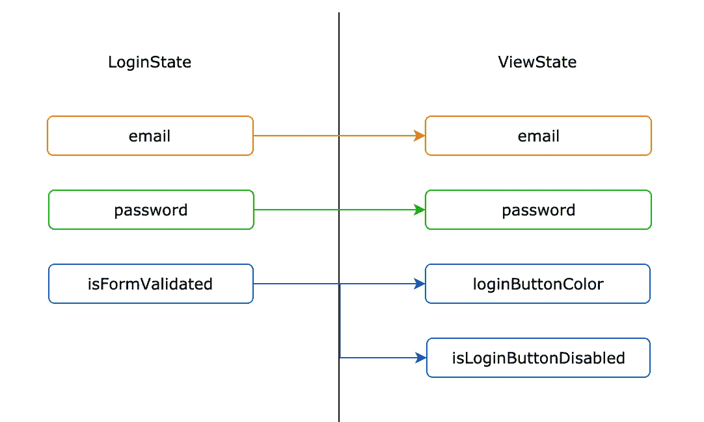
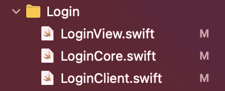

# 可组合架构——应用于实际项目——第 2 部分:登录屏幕的原始框架

> 原文：<https://medium.com/nerd-for-tech/the-composable-architecture-apply-into-actual-projects-part-2-the-raw-skeleton-of-the-login-acfe00783e95?source=collection_archive---------10----------------------->

你好，欢迎回到我的可组合架构教程系列。正如我在上一篇中所说的[，在这篇文章中，我将实现认证阶段，更具体地说，它是登录屏幕。但是等等，在开始之前，我想确保你不会错过任何与这个框架相关的](https://passiondev.medium.com/the-composable-architecture-apply-into-actual-projects-part-1-the-common-structure-2762e844cbd)[我以前的文章](https://passiondev.medium.com/)——我相信它们对你非常有帮助。


图片来源:【https://unsplash.com/photos/fGkBx7hX9Ms 

为了真正有效，我建议重读我以前的帖子，尤其是结构部分，以便对我即将要做的事情有一个大致的了解。然后，你也会很容易地在我的一点点时间里掌握我将要写的知识。此外，本文的目的仅仅是建立一个结构，所以我不打算让 UI 吸引人或漂亮—(把有趣的部分留给我们)。好了，我们开始吧。

## 步骤 1:定义模型

首先，为了保持本系列的内容简单，这里的模型只是一个包含电子邮件和密码的对象。LoginView 依赖于两部分数据。当然，在现实世界中，模型必须更加复杂。

## 步骤 2:创建视图

其次，创建视图——在本例中，它是登录视图。所以在这个视图中，我们需要两个文本字段和一个登录按钮。

```
// MARK: - Propertiers
[@State](http://twitter.com/State) private var email = ""
[@State](http://twitter.com/State) private var password = ""

// MARK: - View
var body: some View {
  VStack() {
    Text("Duy Bui - iOS Developer")
    TextField("Email", text: self.$email)
    TextField("Password", text: self.$password)
    Button("Sign In") {}
  }
}
```

## 步骤 3:定义核心

这是这个架构中最重要的部分，**核心**——所以在登录视图中，我们将拥有 LoginCore。在这一部分，我们将有 4 个组件:

*   ***逻辑状态*** 结构
*   ***登录操作*** 枚举
*   ***逻辑环境*** 结构
*   ***loginReducer*** 对象

让我们深入细节

*   ***LoginState*** 包含你认为可以通过 LoginView 中的一些动作反映出来的数据。例如，在用户在电子邮件和密码字段中填写一些文本后，我们肯定需要考虑验证它们以相应地显示 UI。所以，我想除了` ***email*** 和` ***密码*** 之外，我还需要一个名为`***is form validated***的属性

```
public struct LoginState: Equatable {
  public var email: String
  public var password: String
  public var isFormValidated: Bool {
    return email.count > 0 && password.count > 0
  }
}
```

*   ***登录动作*** —这是我们定义视图中发生的动作的地方。目前，我在考虑 3 个主要的行动——更改电子邮件和密码文本字段，然后点击登录按钮。未来，如果我们有更多的行动，我们只需要在这次行动中增加新的案例。

```
public enum LoginAction: Equatable {
  case emailTextFieldChanged(text: String)
  case passwordTextFieldChanged(text: String)
  case loginButtonTap
}
```

*   ***逻辑环境*** —留空。你可以认为这个结构看起来像是协调器，它将拥有所有的依赖关系，比如网络或数据库机制

```
public struct LoginEnvironment {
}
```

*   ***LoginClient*** —也留空—该类将处理网络调用。它发送主体请求并返回结果。

```
public struct LoginClient {
}
```

因此，LoginClient 将具有:

*   *LoginRequest* :包含参数或头等
*   *LoginClient* 包括` *live* 甚至` *stub* 版本用于测试目的

## 步骤 4:用状态映射视图状态

该视图状态将存在于 LoginView 中。它将处理视图中每个组件的状态。电子邮件和密码字段从视图状态映射到状态。这非常简单易懂。

让我们更上一层楼。按钮的颜色及其状态取决于` *isFormValidated* `参数，因此它将被映射如下



图片来源:Duy Bui

所以，这段代码看起来像这样

```
struct ViewState: Equatable {
    var email: String
    var password: String
    var loginButtonColor: Color
    var isLoginButtonDisabled: Bool
  }
```

# 结论

让我们看看本教程结束后登录文件夹中的所有文件。



好的，我认为这篇文章足够长来设置我们需要的所有东西。在下一部分中，我们将实现减速器部分的逻辑。我也把所有的部分连接在一起。敬请关注。别忘了把这篇文章分享给你的朋友。编码快乐！