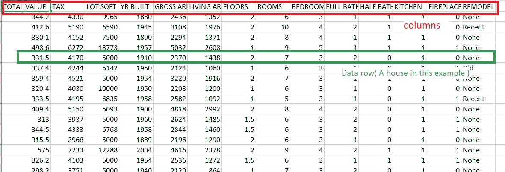
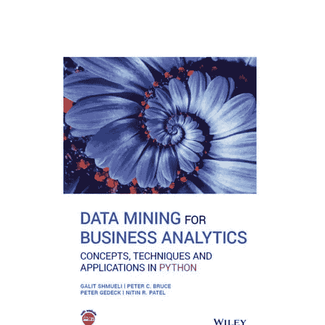

# 数据挖掘任务的核心

> 原文：<https://medium.com/nerd-for-tech/the-core-of-a-datamining-task-fa26466f9799?source=collection_archive---------8----------------------->

这张图片来自于 [Freepik](http://www.freepik.com) 网站

大家好

在发表这篇文章的时候，我正在接受计算机工程教育，我是一名高年级的学士学位学生。上学期我上了一门名为数据挖掘的课程。我喜欢它的概念和从数据中提取信息后的结果，所以我想与您分享我作为数据科学家/工程师学到的基础知识。

开始之前，我们需要了解数据挖掘中使用的一些术语:

**数据集:**以表格形式呈现的数据集合。大多数情况下，CSV 文件包含行和列，列是数据类型的字段(或标题),行是实际数据

图 1。房屋及其总价值的数据集

**数据挖掘任务:**据我所知有两类任务，一是预测，二是分类。预测意味着预测一个值，例如，预测房价。分类意味着进行分类，例如，如果我们有两类购买者和非购买者，分类的行为是将帐户所有者分类为非购买者或购买者。

在我们的数据挖掘任务中，我们总是开发一个模型来预测或分类我们的新数据。

**结果:**我们预测或分类的变量就是我们的结果变量。例如，在预测任务中，我们希望预测房价，房价是我们的结果值，或者在分类任务中，我们希望将一个人分类为买方或卖方，这里的结果值是包含买方或卖方的变量。如图 1 所示，总值是我们的结果变量(我们希望预测总值)。

**无监督学习:**如果我们在数据集中没有结果值，我们应该使用聚类算法来创建聚类(创建类)，然后我们可以用修改后的数据来训练模型。

**监督学习:**如果我们的数据集有结果值，我们可以使用监督算法，如线性回归或 k-最近算法。图 1 中显示的用于预测总价的数据集是监督学习。

**过度拟合:**如上所述，对于预测或分类任务，我们总是通过拟合数据来训练模型。模型总是有可能过度拟合数据，这意味着模型将拟合训练数据，如果我们再次向其中插入数据，模型将给出准确的结果变量(或者我们的错误率接近于零)。因此，如果我们向模型中插入新的数据，它不能准确地预测或分类结果值。为了更好地理解这一点，我们可以说，如果一个学生记住了数学书上的问题，他就不能回答新的数学问题，但如果他学会了这些问题，他就可以在考试中轻松地解决新问题，并取得好成绩。

所以让我们开始吧

# 这项工作概括为 7 个步骤

## **一个。**明确你的目标

找到你的目标，你想从你的数据中得到什么？

## 两个。找到最符合您目标的数据集

> *数据越好，结果越好*

查找与您的目标相匹配的最佳数据集，例如查找缺失值最少的数据集。

## **三个。**了解您的数据

确切地知道什么是数据列是数据挖掘任务的一个非常重要的部分，因为如果您想要删除不相关的值以减少数据，您必须知道哪些列对您的任务没有用。

## **四个。预处理和清理您的数据**

在我们开始使用我们的数据之前，我们需要使用两个作品:

1.  *数据缩减:*如果我们的数据集非常大，或者我们有与结果值不相关的列，我们需要删除那些列。
2.  *填写缺失值:*如果我们的数据集中有一些缺失值，我们将使用中值或线性回归算法(或任何合适的算法)来填充它们。当然，如果我们有很多丢失的值，最好删除这些列。

请注意，为了填充缺失值或减少列，我们需要知道我们的数据，如果列与结果值高度相关，我们不会删除它。了解数据的各个方面非常重要。

## **五个。**开始对您的数据进行分区

将您的数据分成 2(或 3)个分区

第一个分区是您的训练数据

第二部分是我们的验证数据

**训练数据定义:**对于我们的预测或分类问题，我们需要一个模型，我们将训练我们的模型以适应我们的数据

**验证数据定义:**我们将验证我们的模型(在它适合训练数据之后)，以了解它的误差和方差

注意**第三部分也称为测试数据**并不总是使用，它将用于测试不同型号的性能。

## **六个。火车模型**

对数据集进行分区后，我们将使用训练数据来拟合一个模型，该模型有几种算法可用，例如:线性回归、聚类、主成分分析(PCA)等。在选择模型并使其适合训练数据之后，我们将使用验证数据来评估模型的性能。我们可以使用几个模型，并使用验证数据评估它们的性能。

## **七。最后一步**

选择了最佳模型后，我们的模型就可以使用了，插入新的数据并预测一个结果值或得到该类的类。

这是对数据挖掘任务核心的简单解释，当然，还有更多细节，这是针对初学者的。此外，还有另一个系统来划分工作，这在参考书第 57 页上有解释。

希望你已经知道这是怎么回事了。

有很多库可以帮助你，例如:[熊猫](https://pandas.pydata.org/)， [sklearn](https://scikit-learn.org/) ， [numpy](https://numpy.org/) ， [TensorFlow](https://www.tensorflow.org/) ，…

所以如果你有任何问题，你可以在这里评论。我很乐意帮忙🙂。

参考书籍:Galit Shmueli，Peter C. Bruce，Peter Gedeck，Nitil R. Patel

贴出的图片是书的图片。

图 2。参考书《商业分析的数据挖掘》