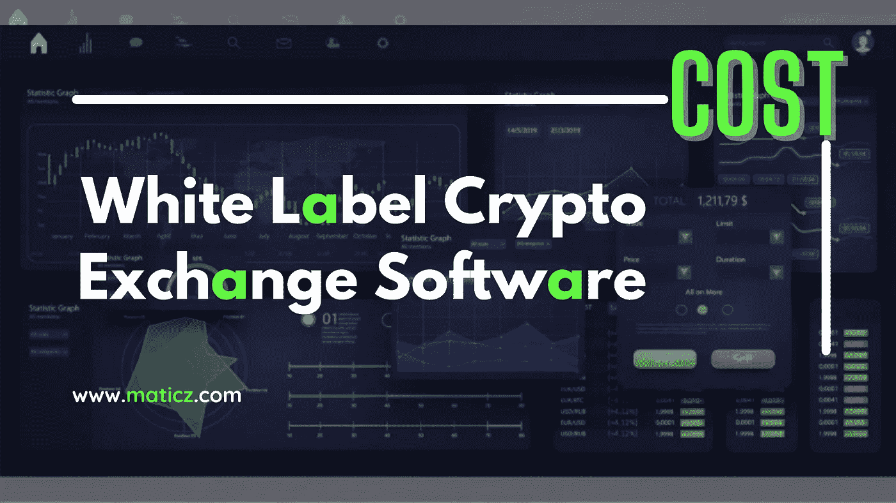

# 白标加密交换软件的成本

> 原文：<https://medium.com/nerd-for-tech/the-cost-of-white-label-crypto-exchange-d83a769a7b2b?source=collection_archive---------4----------------------->

**白标加密交换成本**

在现代，加密货币在金融市场上越来越受欢迎。许多商界人士正在成为加密货币交易所的所有者。不仅仅是美国，许多国家的商人都开始推出自己的加密货币交易平台。即使他们不了解加密货币兑换行业的技术知识。因为还不知道启动加密货币交换平台的技术知识。我们有一个解决办法。这是 [**白标加密交换软件。**](https://maticz.com/white-label-crypto-exchange-software)

是啊！

白标加密交换软件，搭建加密货币交换平台。作为，白标有现成的白标加密交换解决方案，为每一个企业家，商业磁铁，等等。,

White Label 加密交换软件是一款易于使用的软件，用于构建现成设计、开发和部署的加密交换平台。您可以定制选项来增强您的加密交换平台。

***那么，让我们来谈一谈*** 这个话题的主要核心

白标加密交换软件的成本完全取决于客户和顾客的要求和需求。因为每个商务人士都有不同的特点来发起他们自己的密码交换平台。

例如，业务人员 x 喜欢优先功能来启动它。但是，业务人员 xx 有另一个优先功能。所以，改变视角和特征。所以，那个。

大约白标加密交换软件的价格从 5000 美元起。

你可以购买最好的**白标加密交换**软件，拥有强大的功能和特性来启动你自己的加密交换平台。

**Maticz** 是专业的 [**白标加密交换软件**](https://bit.ly/38A9ig4) 提供商，构建具有功能和特性的白标加密交换平台。仅在 maticz 获得全天候的完整流动性集成支持。