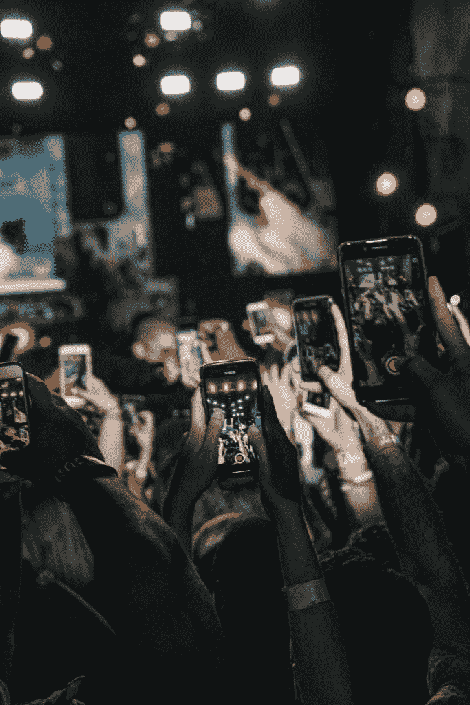

# 创造者/零工经济需要我们不断重塑自我，以保持领先

> 原文：<https://medium.com/nerd-for-tech/the-creator-gig-economy-needs-us-to-constantly-reinvent-ourselves-to-stay-ahead-of-the-rest-fc0d51d9f6cf?source=collection_archive---------9----------------------->

如果你和我一样，是零工/创造者经济的一部分，在数字时代以自由职业者为生，那么你可能会意识到不断改造自己的需要。从多才多艺和灵活多变的技能，到需要适应不断变化的市场需求，包括试验和承担风险的能力，创作者经济确实要求很高，需要创新的心态。随着技术的快速发展和演出性质的不断变化，我们首先必须重塑自我，才能走在其他人的前面。

例如，我开始是一名 SEO(搜索引擎优化)作家，然后扩展到代笔，涉足学术写作演出，成为一名内容作家，成为一名商业作家，现在，我发现自己是一名成熟的内容创作者，偶尔有网络新闻的机会，并推出了这个博客，作为打击由于疫情而日益减少的演出回报的一种方式。此外，我成为了一名内容创作者，几乎没有专业写作方面的教育背景，毕业时是一名冶金工程师，然后成为了一名 IT(信息技术)专业人士，在领先的 IT 公司工作了十年，结果却转向了全职自由职业者(顺便说一句，这并不矛盾，因为创作者经济是数百万兼职或全职工作者的家园)。

所以，你明白了。专业化和狭隘的利基工作的时代已经结束，取而代之的是一个蓬勃发展的创作者群体，他们可以轻松地写作，就像他们可以制作视频，或准备有吸引力的图形幻灯片，并将照片和其他视觉伴奏融入内容一样。此外，创作者也是那些在每个领域的多种创收活动之间切换的人，仅作家就必须精通从 SEO 到使用 CMS(内容管理系统)的一切，并擅长数字营销和个人品牌以吸引客户。

其他喜欢 YouTube 轰动效应的创作者也是如此，他们必须精通病毒视频端到端价值创造链的所有方面，必须处理从拍摄到编辑、制作背景配乐以及打磨它们以尽可能吸引人的一切。此外，那些成为令人垂涎的影响者的人是那些拥有“诀窍”和“让内容成为病毒的眼睛”的人，这是他们需要不断重塑自己的地方，以感受让内容与目标受众“点击”的脉搏。

问任何一个内容创作者，他们都会告诉你客户的要求有多高，尤其是在需要“全面”掌握技能和专攻利基市场的时候。虽然这可能看起来矛盾，但由于工作的性质，零工经济需要我们既精通所有行业，又精通某些行业。事实上，交付整个需求包才是最重要的，而不是对一个人能贡献什么挑三拣四。此外，做一名自由职业者意味着“开放”尽可能多的工作，这样才能让自己不被埋没，这也是多功能性、灵活性和适应性脱颖而出的地方。在没有收入保障的情况下，创作者不得不一直寻找更多的机会，这就是上述属性发挥作用的地方。

也许，我们这些创作者在每一次演出中重塑自我的最重要原因是技术和数字时代的本质，根据定义，这是由摩尔定律的指数变化所引导的。每个月或不到一个月，推动数字时代的技术都有更多的变化，这要求创作者不断重塑自我，只为在竞争中保持领先，在竞争中胜出。虽然与其他创作者相比，内容作者并非如此，但我可以向你保证，在多种平台(如媒体、子媒体或各种颜色的博客)上的内容创作本身就是一场“逐底竞赛”，不断改变驱动病毒式传播的算法，需要无休止的重新发明。

最后，快速说明一下创造者经济是如何变成蛮荒的西部的，在那里，成为有影响力的人的库尔援助是如此令人上瘾，以至于几乎每个人和他们的狗都渴望成为一个。然而，这个“泡沫”很可能迟早有一天会破裂，根据一些人的说法，Medium 等平台已经出现了这种情况，作家的报酬越来越少，因此有必要寻找替代方案，这也需要彻底改造。总之，你有多好并不重要，因为你上一次的演出、文章、博客、视频、设计或艺术决定了你的下一步，这也是在每次迭代中比其他人更好的需要。

*原载于 2021 年 12 月 12 日*[*http://rammohansusarra . in*](https://rammohansusarla.in/2021/12/12/the-creator-gig-economy-needs-us-to-constantly-reinvent-ourselves-to-stay-ahead-of-the-rest/)*。*