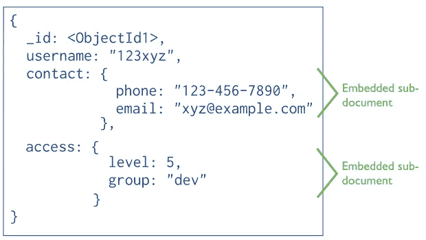
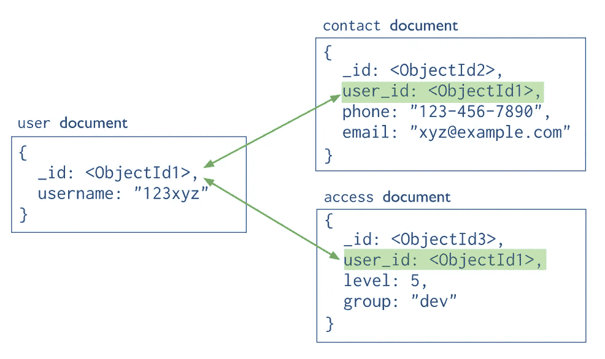
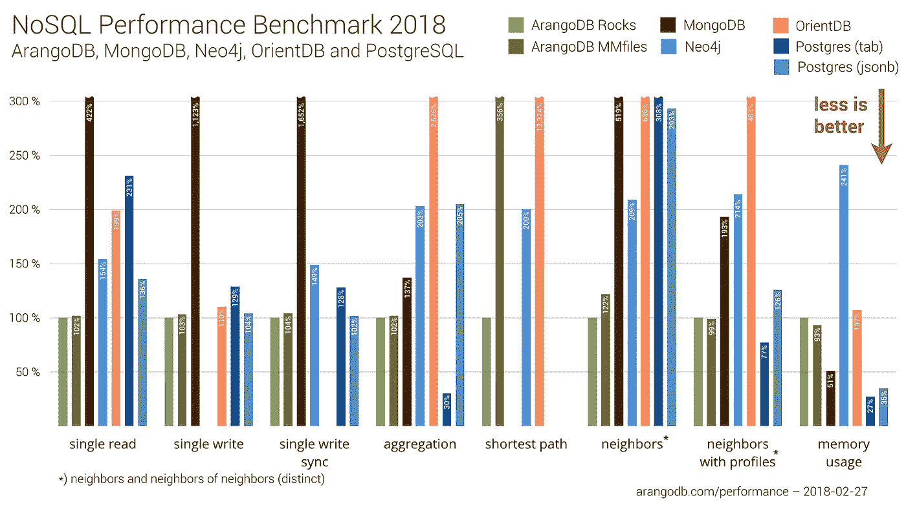
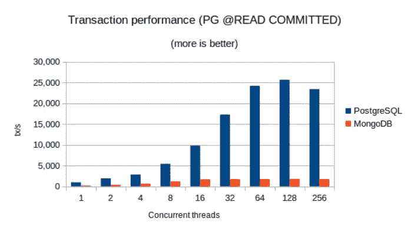

# MongoDB 的黑暗面

> 原文：<https://medium.com/nerd-for-tech/the-dark-side-of-the-mongodb-f66f198a566b?source=collection_archive---------0----------------------->

MongoDB 是您的应用程序的正确选择吗？你意识到缺点了吗？

> 免责声明:我已经在一家知名公司的生产部门工作了两年多，这是我们所经历的问题的总结。

MongoDB 最强大的地方之一是它将数据存储在一个集合中的方式。MongoDB 让您以一种[非规范化或规范化](https://docs.mongodb.com/manual/core/data-model-design/#embedded-data-models)的方式存储数据，但是大多数时候这两种方式都是有害的！

*   **为什么 MongoDB 的反规范化方式可能不好？**

通常，反规范化数据的主要目标是通过删除连接来获得更好的性能。但是，只有在访问用户时需要子字段(如上面示例中的“地址”和“联系人”)时，才建议取消数据的规范化。因此，独立地访问“联系”和“访问”将是痛苦的。

**如果你独立需要这些领域，你该怎么做？**

MongoDB [建议](https://docs.mongodb.com/manual/core/data-model-design/#normalized-data-models)使用规范化的模型，就像任何传统的 RDMS 一样！

在现实场景中，大多数时候需要单独访问集合，所以 MongoDB 在这里没有优势！但这还不是全部。如果您在 MongoDB 中使用这种方法，您也会损失性能，因为关系和连接是 RDMS 创建的目的，而 MongoDB 在 3.2 版本中添加了 [$lookup](https://docs.mongodb.com/manual/reference/operator/aggregation/lookup/#pipe._S_lookup) 特性，该特性也受到分片的[限制！](https://docs.mongodb.com/manual/reference/operator/aggregation/lookup/#lookup-sharded-collections)

## 效率

许多人认为 MongoDB 非常高效，然而，这完全不是事实。

下面是 arangoDB 的一个[基准测试，它比较了几个数据库的性能:](https://www.arangodb.com/2018/02/nosql-performance-benchmark-2018-mongodb-postgresql-orientdb-neo4j-arangodb/)

这里是另一个来自 [enterprisedb](https://www.enterprisedb.com/performance-benchmark-postgresql-vs-mongodb) 的基准测试，它比较了 MongoDB 和 Postgres:

如您所见，如果性能是您关心的问题，MongoDB 可能不是一个好的选择！

## 事务: **ACID** (原子性、一致性、隔离性、持久性)

处理事务是企业应用中的必备功能，尤其是当数据很有价值时。从版本 4 开始，MongoDB 引入了[事务 API](https://docs.mongodb.com/v4.0/core/transactions/) ,起初看起来很酷，但是，在事务 API 中有一个很大的警告信息:

> 重要事项:
> 
> 在大多数情况下，多文档事务比单个文档写入会导致更高的性能成本，并且多文档事务的可用性不应该替代有效的模式设计
> 
> ….

就这些吗？不

您还需要一个副本集来使用事务 API！如果你在一台服务器上使用事务，你会得到错误。有许多[限制](https://severalnines.com/database-blog/overview-multi-document-acid-transactions-mongodb-and-how-use-them)会让你后悔使用事务 API。

## 灵活模式

使用嵌入式方式时，MongoDB 的灵活性很酷。但是它也允许你在任何你想要的地方插入任何类型的数据。有了这个功能(或者 bug？)您将失去数据库层的验证，一切都必须在应用程序层进行双重检查。

对于文档模型中的每一个变化，最佳实践是进行一次迁移，使所有数据共享相同的结构。否则，您最终会得到大量 if-else 语句和肮脏的代码。

# MongoDB 有那么差吗？

MongoDB 有利有弊。这是一个不错的 DBMS，但是，IMHO MongoDB 不应该用作应用程序的主数据库，除非您确切地知道您的应用程序将做什么，并且您知道它的弱点。

# 其他人是怎么看待 MongoDB 的？

在这篇文章的最后，我想补充一些与我有同感的人的参考资料:

1.  [为什么你永远不应该使用 MongoDB](http://cryto.net/~joepie91/blog/2015/07/19/why-you-should-never-ever-ever-use-mongodb/)
2.  [哪些公司已经离开了 MongoDB，为什么？他们搬到哪里去了？](https://www.quora.com/Which-companies-have-moved-away-from-MongoDB-and-why-What-did-they-move-to)
3.  [PostgreSQL vs MongoDB](https://dev.to/ben/postgresql-vs-mongodb-30b1)
4.  [为什么我们从 NoSQL MongoDB 迁移到 PostgreSQL](http://blog.shippable.com/why-we-moved-from-nosql-mongodb-to-postgressql)