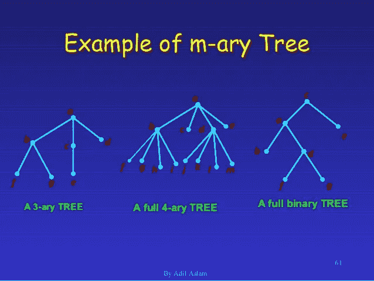
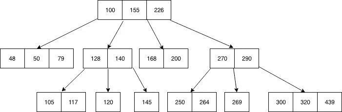
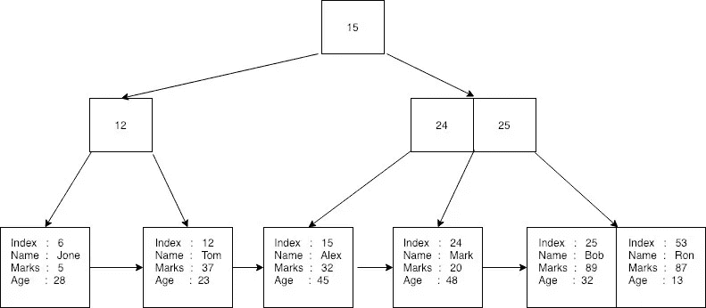
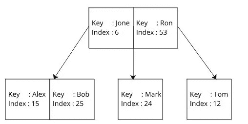

# 关系数据库下的数据结构

> 原文：<https://medium.com/nerd-for-tech/the-data-structures-underneath-relational-databases-9950797a88ac?source=collection_archive---------13----------------------->

> “我们是抽象思维的受害者，以至于当地球陷入火海时，我们几乎没有勇气穿过房间去看恒温器。”
> ——特伦斯·麦肯纳

# 关系数据库魔术

Python 是建立在 CPython 之上的，而 CPython 又是建立在 c 之上的。JavaScript 中的所有东西都是一个散列表对象。这些是我们知道、接受甚至理解的常见抽象概念。关系数据库中的抽象又如何呢？MySQL、PostgreSQL 和 SQLite 等关系数据库是开发人员日常依赖的数据模型。然而，这些开发人员中有多少人能够解释他们工具的内部工作原理？不要害怕！本指南旨在将您的关系数据库知识提升到 Chad 的水平。

# 它从一棵树开始

我们旅途中的第一条路将我们引向一棵神秘的 m-ary 树。虽然这棵树看起来乌云密布，但它与计算机科学中通常教授的二叉树没有太大区别。一棵 m 元树是一棵有根的树，其中每个节点不超过 m 个孩子。让我们来分析一下。一棵有根的树仅仅意味着它是一棵有根的树，与一棵看起来更像一个没有圈的图的无根自由树相反。这是你常见的树。每个节点不超过 m 个子节点。二叉树和三叉树都是 m 叉树的类型。二叉树是 m 元树，其中 m=2。三元树是 m 元树，其中 m=3。m 元树的唯一区别是每个节点最多可以有 m 个子节点。你可以简单地把一棵 m 叉树想象成一棵有很多孩子的二叉树。就是这样。神秘感被驱散了。



m 元树示例

# 蜜蜂之树

我们爬上 m 叉树的许多节点，向外眺望地平线。我们看到一棵看起来与我们所知道的 m 元相似的树，但它并不相同。这种树被称为 B 树(“蜜蜂树”)。B 树是一种 m 元树数据结构，它是自平衡的，并以排序的升序在其节点中存储关键字。每个键有两个对两个子节点的引用。左侧子节点键小于当前键。右侧子节点键大于当前键。一个节点可以有 n 个键。子节点的最大数量是 n-1\B 树遵守的奇怪规则允许它有 O(log n)的搜索、插入和删除时间复杂度。恭喜你。如果您已经了解到这一步，那么您应该了解数据库使用的基本结构。从现在开始，我们将简单地扩展这些概念。



b 树示例

```
| Type           | Insert   | Delete   | Search   |
| -------------- | -------- | -------- | -------- |
| Unsorted Array | O(1)     | O(n)     | O(n)     |
| Sorted Array   | O(n)     | O(n)     | O(log n) |
| B-Tree         | O(log n) | O(log n) | O(log n) |
| B+Tree*        | O(log n) | O(log n) | O(log n) |
```

*注意:B+树对于插入和删除的最坏情况时间复杂度为 O(M*log n + log L)，对于搜索的最坏情况时间复杂度为 O(log n + log L)。*

# 知识在树叶里

有一棵树看起来和 B 树一模一样，只有一个小的区别。它只在其叶节点上存储数据。这种特殊的树被称为 B+树(“蜜蜂+树”)。在 B+树中，所有非叶节点都被复制为叶节点。B+树拥有的另一个重要属性是指针。您可以遍历叶节点中的所有值，因为每个叶节点都有一个指向下一个叶节点的指针。这棵树就是我们想到数据库时想到的树。我们如何存储已知记录中的键值对呢？对于给定的记录，行中的数据被转换为字节流。现在我们有两个部分，主键和字节流。这两部分合在一起称为有效载荷。有效载荷是存储在 B+树的叶子中的数据。

```
SELECT * FROM User WHERE id = 0;
```

对于非叶节点，主键用作索引数据的键。这样，我们可以从树根开始对树进行二分搜索法，或者通过遍历树叶进行线性搜索。在上面的代码片段中，我们将使用 id(“主键”)搜索 B+树，以找到与 id 相关联的记录。



数据库中的 b+树



数据库中的 b 树

# 最后的工具

你学得很好。我们现在知道了数据库是如何工作的，以及如何通过主键获取记录，但是如果我们没有 id 呢？让我们看看下面的查询。

```
SELECT * FROM User WHERE username = 'testuser';
```

为了理解这个查询的内部工作原理，我们需要使用到目前为止我们所学的所有神圣树知识，并结合一个工具:页面。页面解决了如何物理存储数据的重要问题。在深入研究之前，先退一步，我们需要理解每个 SQL 数据库都有两个操作系统文件:一个数据文件和一个日志文件。出于此目的，我们关心数据文件。数据文件可以分为两类:主要数据和次要数据。主数据包含启动信息以及所有实际的数据库数据。不需要辅助数据。它使用索引来允许跨许多文件甚至不同的磁盘存储和检索数据。而是作为一个整体返回到数据文件。数据文件被分成页面。像原子一样，页面是数据库的基本构件。它们的大小是固定的，具有可以引用的唯一数字标识符，并且包含重要的元数据。B 树和 B+树中的每个节点都存储在页面中。

# 树大师的崛起

b 树用于存储索引。b+树用于存储表。现在在我们心中的知识是提升到树木大师的水平。当我们执行类似上面的选择查询时，我们看到我们需要“用户名”等于“测试用户”。数据库将定位与用户名相关联的适当的 B 树。它将在树中搜索匹配“testuser”的用户名，并使用“testuser”找到 0 的索引(“主键”)。一旦知道了主键，数据库将搜索 B+树并找到具有相同主键的节点。它将返回主键和字节流。它会将字节流转换回人类可读的文字，查询就完成了。

# 愿树木与你同在

现在，我授予你树木大师的头衔。这个旅程已经结束了，但是我希望有了这些新知识，你可以更完整地了解这个世界。我们从 M 元树开始，上升到 B 元树，征服了 B+树，并把所有这些放在一起理解关系数据库是如何工作的。愿树木与你同在。

## 来源

[幕后的数据库存储引擎](/@shashankbaravani/database-storage-engines-under-the-hood-705418dc0e35)

[SQL Server 如何在幕后处理数据](https://hub.packtpub.com/how-sql-server-handles-data-under-the-hood/)

[B+树索引是如何在数据库中建立的？](https://en.wikipedia.org/wiki/B%2B_tree B+ tree https://towardsdatascience.com/how-b-tree-indexes-are-built-in-a-database-6f847fb3cfcc?gi=fc3b3159bbf4)

[数据库 B 树索引的工作原理](https://cstack.github.io/db_tutorial/ Let's Build a Simple Database https://dzone.com/articles/database-btree-indexing-in-sqlite)

[忙于 B 树](/basecs/busying-oneself-with-b-trees-78bbf10522e7)

[了解 SQL Server 如何在数据文件中存储数据](https://www.mssqltips.com/sqlservertip/4345/understanding-how-sql-server-stores-data-in-data-files/)