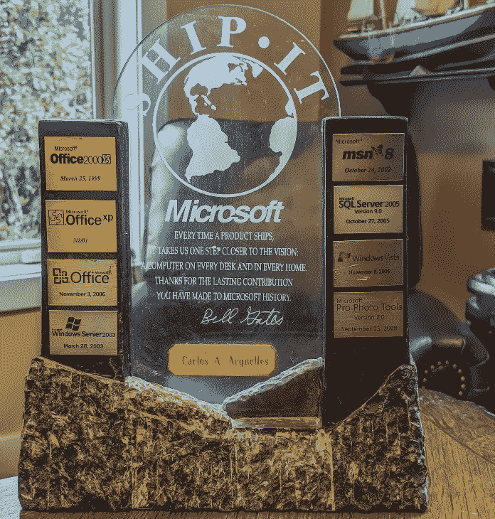
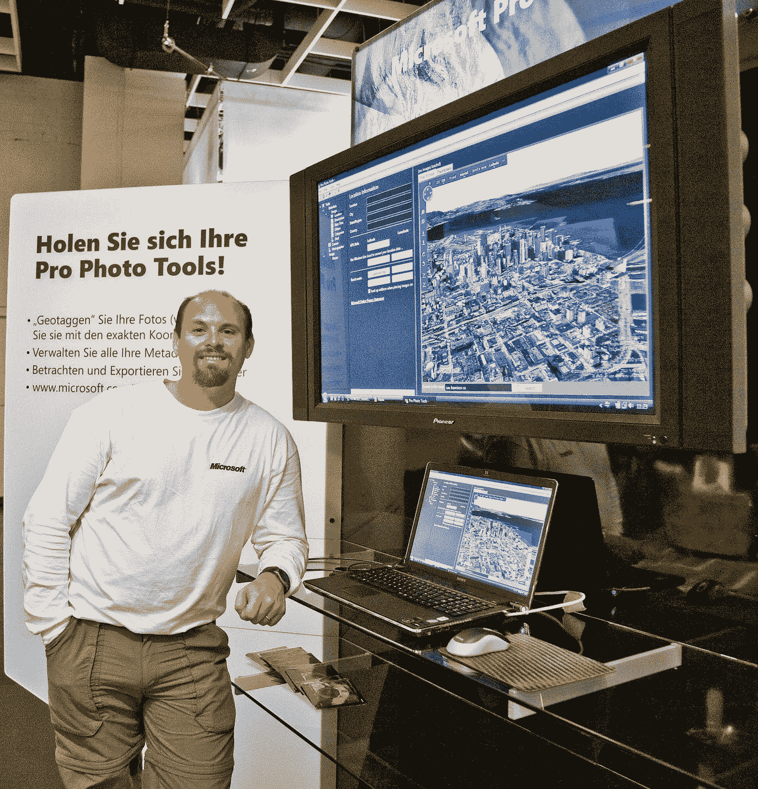
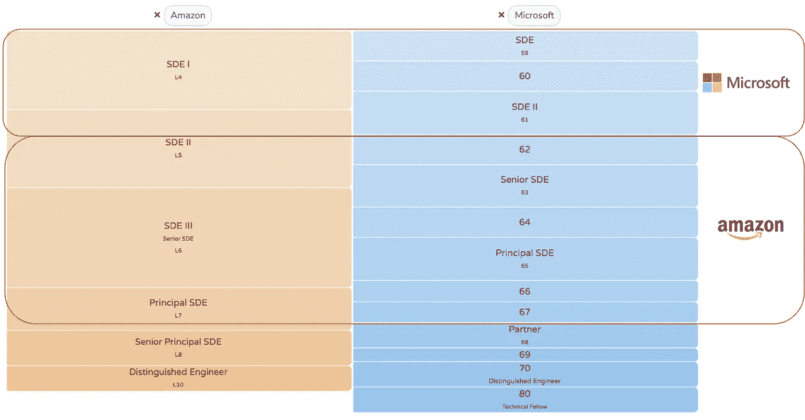

# 我失去微软工作的那天

> 原文：<https://medium.com/nerd-for-tech/the-day-i-lost-my-job-at-microsoft-anatomy-of-stasis-f0e2cd653e3a?source=collection_archive---------0----------------------->

## 有时候坏事发生是为了让好事发生

我的“微软发货”——每次你发货，你都会得到一个小金属板来贴上你的奖品

当我到达会议室时，我深深地吸了一口气。前一天晚上，当我看到一份邀请我和我的老板以及人力资源部开会的邀请函时，我知道会发生什么。2008 年是糟糕的一年:房地产泡沫，次贷危机，到处都是银行倒闭。微软陷入了困境。在微软工作了 11 年后，在史上最严重的全球经济衰退中，我即将失业。5000 名其他微软工程师也将加入。我走进房间时，虚弱地笑了笑。

我想写这个故事有三个主要原因。

*   我认为被解雇是一种耻辱。我想挑战这一点。2009 年 1 月 22 日，我成为微软[大规模裁员 5000 人](https://techcrunch.com/2009/01/22/sad-day-for-microsoft-5000-laid-off-earnings-and-revenues-down/)的一员。这不是因为我的表现:两个月前我刚刚被提升。生活结果很好:从那以后，我已经升了六级。
*   我坚信*有时候坏事会发生，所以好事也会发生。*就我而言，在微软被解雇后，我去了亚马逊，在那里我开始了改变我生活的 11 年旅程。
*   只有当失业的前景迫使我进行自我反省时，我才真正明白我让恐惧和惰性把我拖入了停滞状态。多年来，我的职业生涯没有任何进展。这让我在加入亚马逊的时候有了给事业超级充电的决心和能量。我太害怕离开微软，但我又非常不开心。

事实是，我讨厌微软。

不过，我并不总是讨厌微软。当我在 1997 年作为一名大学毕业生加入时，它是最令人惊叹的地方。到处都充满了活力和才华。微软不会做错事。我很自豪能成为这一切的一部分。股票以极快的速度增长和分裂。我在博客中写了几个怀旧的故事，讲述了在微软的美好时光，比如“[90 年代在微软工作的回忆”、“T14 我为比尔·盖茨通宵工作的那个晚上”、“T15 兔子和蜜蜂，在微软申请专利”](https://link.medium.com/DFtR2QNELgb)

我非常感谢微软教给我的东西。我在微软的头五年对我成为一名专业软件工程师至关重要。在大学里，你做一两个星期的小项目，交出来，拿到成绩，继续前进。有时你在团队中工作，大多数时候你独自工作。如果你做了一个糟糕的技术选择，你通常几年都不用处理它的影响。但当我在 1997 年加入微软时，突然之间我被扔进了微软 Office 和微软 Windows 的庞大代码库，我在数千名工程师中为几十亿美元的多年项目贡献代码。我周围还有一些世界上最聪明的软件工程师，他们比我聪明得多。我充满活力，沉浸其中。我肯定已经不在堪萨斯了。

然而，当比尔·盖茨把钥匙交给史蒂夫·鲍尔默时，公司开始走下坡路。我们称之为[失去的十年](https://www.vanityfair.com/news/business/2012/08/microsoft-lost-mojo-steve-ballmer)。史蒂夫有着糟糕的商业头脑，参与了一系列命运多舛的收购，比如斥资 70 亿美元收购诺基亚的手机业务。史蒂夫还分泌睾丸激素，鼓励和奖励竞争，无论是内部还是外部，所以他(也许不知不觉？)煽动了一种暗箭伤人和残忍行为的文化。这地方有毒。微软病得非常非常重。这表现在它停滞了十年的股价上，也表现在它并不鼓舞人心的软件发布上。当苹果公司用 iPod 和 iPhone 震惊世界的时候，微软推出了一个漏洞百出、毫无生气的 Windows Vista。

*【在我对当前的微软公司做出愤怒的评论之前，我喜欢塞特亚·纳德拉如何扭转公司的局面。这是一个完全不同的世界！但史蒂夫对公司并不伟大，那十年也不是微软最辉煌的时刻】。*

2007 年，我加入了微软的富媒体集团(RMG)。RMG 是一个开发摄影相关软件的团队，而摄影是我的一个爱好，所以把爱好和我的日常工作结合起来似乎很有趣。我对这个空间充满热情！

但是我没有考虑到一些逆风。

**首先，不分青红皂白地资助一个空间是一件危险的事情，团队实际上被过度资助了。**

亚马逊(我离开微软后会加入的公司)明白这一点，以至于他们选择“**节俭**”作为编码亚马逊 DNA 的[领导原则](https://www.amazon.jobs/en/principles)之一。*的官方描述是:“事半功倍。* ***约束滋生足智多谋、自给自足和发明创造。*节俭是亚马逊最不受欢迎的领导原则，因为它经常被用来证明自己的节俭。是的，亚马逊在很多方面都非常便宜，但是在这种领导原则背后有很多智慧。获得更少的资源来建造一些东西是一个强迫的功能，让你专注于重要的事情，并逐渐增加价值来赢得信任。**

微软的 RMG 提供了一个反面教材。我们将与 Adobe Lightroom 竞争。Adobe 用 18 个月和 18 名工程师建成的？我们要用 35 个人来解决这个问题！有一个令人印象深刻的高级和首席工程师团队，他们基本上花了两年时间互相辩论和讨论自行车脱落问题，最终发布了零代码。即使在这 35 名工程师中，也几乎没有领地。我们甚至开始收购公司来“加速”这一过程。这些收购除了增加组织阻力之外，实际上没有取得任何成果。今天我坚信，如果我们资助了一半规模的团队，我们将会推出真正的产品。

我们有如此多的可支配现金，我们创建了一个名为“ [Icons of Imaging](https://news.microsoft.com/2006/06/29/microsoft-launches-icons-of-imaging-program-at-first-microsoft-pro-photo-summit-recognizing-present-and-future-leaders-in-photography-and-digital-imaging/) 的项目，在这个项目中，我们与世界一流的摄影师合作，如斑比·坎特雷尔、里德·霍夫曼、丹尼斯·雷吉、约翰·肖、马修·约旦·史密斯和阿尔特·沃尔夫。我们团队的一名幸运成员与[阿尔特·沃尔夫](https://en.wikipedia.org/wiki/Art_Wolfe#Documentary_television_series:_Travels_to_the_Edge_with_Art_Wolfe)一起前往南极洲拍摄公共电视连续剧【T4 旅行到边缘】T5。我们花了一个下午的时间和斑比·坎特雷尔进行私人拍摄。我们有一个装满高端打印机(价值数万美元)的实验室，这样我们就可以测试产品的打印能力。我们有一整套佳能“L”镜头，可以随时借用，比如 2000 美元的 70-200 毫米 f/2.8L。摄影是我的爱好，所以从很多方面来说，这份工作的好处使它成为一份梦想的工作。

但是在软件工程方面，我什么都没学到。我没有发展我的事业。这个队从一开始就注定要失败。事实上，我享受了这么多的额外津贴，这在很长一段时间里掩盖了这个事实。

我没有考虑到的第二个不利因素是，我们的企业基因中根本没有制造正确产品的能力。

公司有他们做得非常好的特定事情。苹果做*漂亮的设计*。微软做*正经企业*。亚马逊提供网络服务。谷歌确实*疯狂规模化*。一旦这些公司冒险远离他们的核心 DNA，他们就会有点动摇，脱离他们的舒适区。亚马逊的 Alexa 是一款伟大的产品，但没有苹果设备那样的美感。与此同时，我一般不会期望苹果的网络服务表现出和亚马逊 AWS 一样的健壮性。这并不是说苹果不能做伟大的网络服务，或者亚马逊不能做漂亮的界面，但这确实违背了他们的核心 DNA，所以有逆风。

在摄影和艺术方面，土坯是城堡之王。这是他们的核心基因。这是他们已经做了几十年的事情。Photoshop、Illustrator 和 Lightroom 非常漂亮。如果你在为摄影师或艺术家制作产品，这种美感和创造性会吸引他们。

相反，微软有 Windows 和 Office…实用的和公司的。我今天用的是 Mac，每次看微软视窗我都想吐。就是这么公事公办，一本正经。用户互动毫无乐趣可言。

2008 年 9 月，我在德国科隆获得了这种顿悟。我们在 [Photokina](https://www.photokina.com/) ，一个著名的摄影行业展会上，展示了我们制作的一个叫做[微软专业照片工具](https://blogs.windows.com/windowsexperience/2008/09/19/microsoft-pro-photo-tools-2-released)的东西。所有的大玩家也在那里。我们把摊位设在 Adobe 的隔壁。我们的 DNA 差异再明显不过了——你几乎可以看着一个摊位，然后是另一个，来来回回。甚至他们的展位也很漂亮，大胆的原色，艺术曲线，非常有趣和诱人。我们的展位是黑白的，棱角分明，看起来很像公司。我们是无聊的企业家，他们很有趣。

您诚挚的 2008 年德国科隆摄影展

马后炮永远是 20/20。我现在可以非常清楚地看到，我在一个永远不会成功的产品上浪费了时间:我们获得了过多的资金来建造一些明显超出我们 DNA 的东西。

带着同样的后知之明*，我也能看到自己的缺点和错误。*我深深地不喜欢微软已经成为的公司，但我太懒了，也害怕真正离开微软。所以我留了下来，过了几年，不快乐，但没有做任何事情来解决这种不快乐。跳进未知世界的前景把我吓死了。当你盯着一个你将要跳进的池子，你知道水将会结冰时，你会有同样的感觉。失败了怎么办？我知道我的情况并不好，但我也知道我可以驾驭这家公司，继续平庸下去。我已经说过了:我确实很平庸。低风险，低回报。我在微软的最后两年，我没有任何进步。微软从一项事业变成了一份薪水。我不知道为什么我会让自己这样。我本打算在生活中做得更好，但有一段时间我迷失了方向。

我还想强调一点。尽管有很多缺点，微软仍然是一个很好的工作场所。我仍然被非常聪明的人包围着。我周围仍然有一流的教育机会。我本可以也应该更好地利用我的环境。我被宠坏了，不懂得珍惜大量的特权。我陷入了*自满*和我*认为这是理所当然的*是我的错过。给你的思考练习:问问你自己，如果我今天失去了工作，我会后悔没有利用这份工作每天给我的机会吗？被聪明人包围总是一种特权，拥抱它吧！

就我个人的精神和情感而言，简单地说，被解雇是发生在我身上最好的事情。我需要那记耳光来作出反应，重新站起来，掸掉身上的灰尘，做得更好。

具有讽刺意味的是，就在一个月前，我决定离开。每年的 12 月 31 日，我都会花几个小时进行自我反省，想想那一年我完成了什么，我去过哪里，我要去哪里，等等。2008 年 12 月 31 日，我认真审视了自己。我想，这不是我应该成为的人。我需要离开公司，承担一些风险，让自己置身于一种完全不同的文化中。不要那么害怕失败。我润色了我的简历，把它发给了亚马逊和谷歌(当时西雅图大都会地区的另外两家大雇主)，并开始用我在 Target 买的 20 美元的白板练习编码问题。因此，当我在 1 月份与人力资源部和我的老板进行那次可怕的会面，告诉我我的雇佣关系被终止时，我在精神上和情感上都已经准备好继续前进了。害怕，是的，非常害怕。但是准备好了。

我也知道裁员会发生。几个月来，微软的雷德蒙园区一直有传言。我的团队浪费了两年时间，没有向市场推出一款产品。我们都是裁员的明确对象。这不是私人恩怨。

我的经理是个非常好的人。那天他告诉我这个消息时哭了。为了救我，他进行了长期艰苦的斗争。我们还是好朋友。

值得称赞的是，微软确实对我照顾得很好。在经济衰退中丢掉工作是很可怕的。我一次性拿走了 8 个月的遣散费。那是非常慷慨的。我的妻子和我也非常节俭，所以我们有一些积蓄，如果有必要的话，可以舒适地度过一年。这消除了很多压力。其他一直入不敷出的微软公司不顾一切地尽快接受任何他们能接受的工作。我不慌不忙，花了一个月的时间练习编写面试问题，并在亚马逊和谷歌上完成了完整的循环。我最终得到了两家公司的邀请，远远高于我在微软的薪水。

我选择了亚马逊。那是 2009 年，我被 AWS 的想法迷住了。当时它还处于起步阶段，但我知道它将改变世界，我想在它还很早的时候成为它的一部分。我在亚马逊工作了 11 年，在亚马逊的时候，我从微软的低级员工 62 成长为相当于微软高级员工 67，而[努力工作，享受乐趣，创造历史](https://sociomirrorcom.wordpress.com/2018/04/09/how-did-amazons-internal-slogan-work-hard-have-fun-make-history-originate/)。2014 年升校长。

我在亚马逊的职业发展比在微软快得多。我在两家公司呆的时间一样长，但是亚马逊文化更适合我。

2020 年，我决定回到 2009 年没有走过的路……我加入了谷歌，从那以后，我愉快地成为了一名高级工程师。

回想起来……2009 年 1 月 22 日，当我紧张地走进那个房间，人力资源部和我的经理正在那里等我时，我感觉在经济衰退、未来不确定的情况下丢掉工作是我可能遇到的最糟糕的事情。但是，事实证明这是发生在我身上最好的事情。我需要那一次颠簸，让我走上今天的道路。而且，我喜欢今天的我和我这一生所做的一切。

我希望这个小故事能激励你，如果你发现自己处于像我这样的情况下——只要记住无论发生什么事情，总有一线希望，拥抱意外之喜可能带你去的地方！