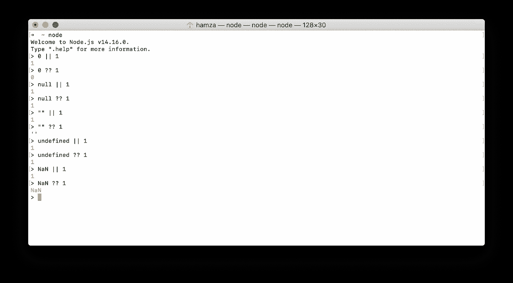
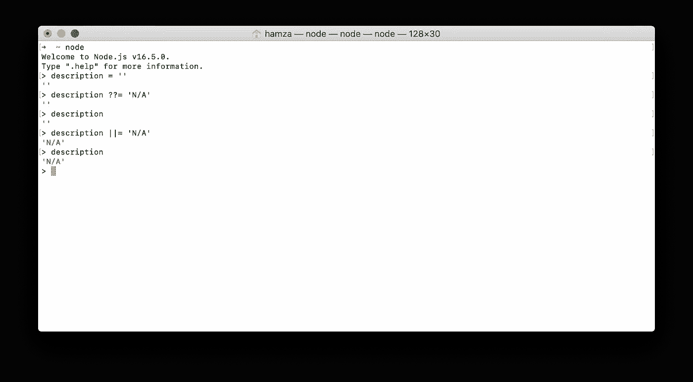

# ||和|的区别？？Javascript 和 NodeJS 中的运算符

> 原文：<https://medium.com/nerd-for-tech/the-difference-between-and-operators-in-javascript-nodejs-3696b0ce02ff?source=collection_archive---------0----------------------->

简而言之，两个算子的区别归结为`[falsy](https://developer.mozilla.org/en-US/docs/Glossary/Falsy)` 和`null/undefined`的区别。其中，**逻辑或** ( `||`)运算符在`falsy` 值的情况下取右操作数，包括*空字符串、0、false、NaN* 等。只有当左侧设置为`null`或`undefined`时，**无效合并**运算符(`??`)才接受右侧操作数。说到这里，我们可以把`??`操作符看作`||`的子集。



比较||和？？节点交互 shell 中的运算符

我们希望使用`??`而不是`||`的一个实际例子是，当一个空字符串`""` 是一个有效值并且我们希望默认值为`N/A`时。如果没有`??`，我们将需要编写:

```
if(currentDescription == null) {
    targetDescriptionn = "N/A";
}
else {
    targetDescriptionn = currentDescription;
}// or using the ternary operatortargetDescription = currentDescription == null ? "N/A": currentDescription
```

可以替换为更短的一行程序:

```
targetDescriptionn = currentDescription ?? "N/A"
```

我仔细检查任何我不确定的 javascript 行为(我们都知道 Javascript 并不总是以我们期望的方式运行)的方法是运行交互式 nodejs shell。根据我的经验，这比谷歌搜索答案要快。访问 NodeJS 交互 shell 的方法是简单地在终端中输入 `*node*` *(假设****NodeJS****添加在* `*$PATH*` *)。*

## 附加运算符—逻辑 AND (&&=)和 OR(||=)赋值运算符

*逻辑与&或赋值运算符只有* ***在 NodeJS 版本 15+*** 中可用

上面操作符的一个很好的补充是`logical AND assignment (&&=)`——它的行为与`additional assignment operator (+=)`非常相似。运算符的一个很好的用例是在现有变量上设置默认值。

```
description &&= "N/A"
```

如前所述，只有在描述变量设置为`null`或`undefined`的情况下，描述的值才会设置为`N/A`。

然而，如果要求在`falsy`值(比如说空字符串)的情况下改变描述的值，则可以使用`logical OR assignment (||=)`

```
description ||= "N/A"
```



的用法示例？？= and ||=