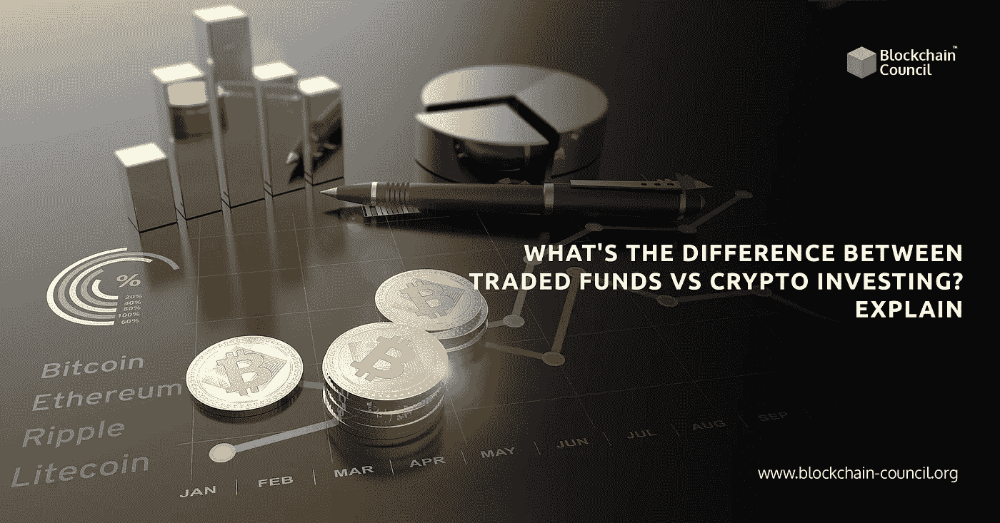

# 交易基金与加密投资的区别:解释

> 原文：<https://medium.com/nerd-for-tech/the-difference-between-traded-funds-v-s-crypto-investing-explained-9cf9fc29c294?source=collection_archive---------5----------------------->

加密货币使用和接受度的上升催生了无数长期投资的新选择。例如，区块链交易所交易基金(ETF)是市场上获得牵引力的最新概念。还有， [**加密货币交易**](https://www.blockchain-council.org/certifications/certified-cryptocurrency-trader/) 和投资是新手进入加密世界最受欢迎的方式。

区块链 ETF 是交易基金，持有投资区块链技术并从中获利的公司股票。既然区块链是一种技术，它就不局限于某个特定的公司或产品。它跨越了各个部门，整个过程有点复杂。

投资加密货币相对简单。首先，你可以直接投资一枚硬币或代币，然后赚取数字资产作为回报。此外，你可以通过 P2P 交易买卖加密硬币。任何有金融背景，有 [**加密货币认证**](https://www.blockchain-council.org/certifications/certified-cryptocurrency-expert/) 的人都可以从事加密投资。

本文将详细介绍这两种选择，以便您做出明智的选择。

# 目录

*   区块链交易所交易基金
*   与 ETF 相关的风险
*   加密货币投资
*   加密货币公司和投资
*   投资加密货币个人退休账户(IRA)
*   加密验证器和挖掘器
*   投资加密前需要知道的事情
*   底线

# 区块链交易所交易基金

区块链 ETF 作为一种连贯的投资工具，投资于一些区块链特有的股票。然而，投资者在投资区块链交易所交易基金时，并没有“购买”任何东西。相反，他们把钱押在技术发展的前景上，并依靠它来获利。

随着区块链技术在全球范围内的分散和开放，全球各地的公司都成为这些 ETF 的参与者。不管怎样，他们在北美公司有最大的风险敞口。

值得注意的是，区块链是加密货币和众多其他领域背后的底层技术。换句话说，加密是区块链技术的众多应用之一。正如加密货币专家所说，区块链可以没有加密货币，但反过来是不可能的。

# 与 ETF 相关的风险

区块链 ETF 和其他一样，是基于主题的投资。因此，技术生态系统的不可用性或失败总会带来风险因素。此外，大多数从区块链交易所交易基金中获利的公司并不完全依赖它，例如英伟达和英特尔。

处于发展初期的区块链 ETF 依赖于网络的稳定性和适应性。因此，正如[**密码顾问**](https://www.blockchain-council.org/certifications/certified-cryptocurrency-auditor/) 所同意的，这个领域的初创公司更容易失败。

然而，ETF 的波动性不如加密货币，一旦完全开发，可能会产生更好的收入。

# 加密货币投资

虽然购买和持有硬币是投资加密货币最常见的方式，但替代方案是无限的。除了**加密货币交易**，您还可以选择以下选项:

# 加密货币公司和投资

你可以投资部分或全部专注于加密的公司。此外，您可以选择支持加密的采矿硬件公司，并将其添加到您的投资组合中。

# 投资加密货币个人退休账户(IRA)

如果你想积累税收优惠，Crypto advisors 建议投资个人退休帐户。此外，IRA 服务提供商可以加强您所持有的加密货币的安全性。

# 加密验证器和挖掘器

投资加密最直接的方式可能是成为加密货币网络的验证者，或者自己挖掘它。您可以赚取加密奖励，并将其作为投资持有。而且，也可以像**加密货币专家**做的那样，把它们换成其他硬币。

# 投资加密前需要知道的事情

加密货币的波动性很大，投资风险很高。此外，加密硬币的价格比共同基金和股票等其他资产变化更快。然而，许多加密货币专家认为它对你的投资组合很有价值。

这是最重要的，你被告知任何最近的发展在密码市场。此外，参加**加密货币认证**课程会让你深入了解税收序列。但是，踏入市场后你就会知道**加密货币交易**的风险。

# 底线

总之，我们可以说，加密投资和 ETF 都是令人兴奋的投资方式。然而，两者有很大的不同。区块链 ETF 持有股票，并投资于区块链相关公司。此外，他们从技术进步中获利。

投资 crypto 可以采取多种形式，例如，加密货币交易和挖矿。尽管加密交易更加成熟，但它充满了风险。在把你的钱投入任何硬币之前，你应该考虑一个加密顾问。

区块链委员会是了解加密货币的一个很好的平台。请参观一下。