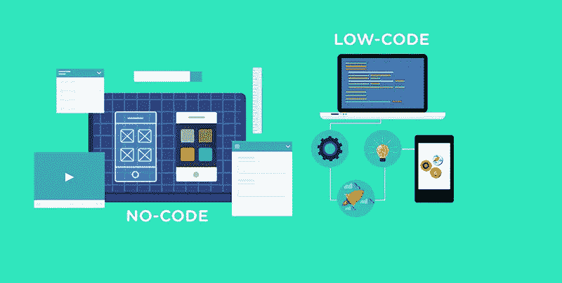

# 低代码平台的内幕

> 原文：<https://medium.com/nerd-for-tech/the-down-low-on-low-code-platforms-4bde316416fd?source=collection_archive---------10----------------------->

从低代码到无代码，这里是独家新闻

最近市场上出现了低代码到无代码平台的崛起。很容易理解为什么这种趋势正在流行，因为为大多数公众编写应用程序或开发网站很困难。这使得任何对计算机科学知之甚少或一无所知的人都可以很容易地创建漂亮且功能良好的应用程序、网站和网上商店。

# 什么是低代码或无代码平台？

这些平台旨在加速创建应用程序或网站的艰难过程，让用户只需几行代码就能构建它们。用户使用预先配置的组件或配置以及图形用户界面来设置他们喜欢的东西。

# 为什么要走这条路？

去无代码化的好处不难看出。当涉及到事后推出变更时，它们允许高效的生产和简单的操作。你可以节省大量的现金

事实上，它们的市场正在飞速增长。

## 效率和生产力

与传统的编码方式和屡试不爽的编码方式相比，这种方式更加简化，并且能够更快地投入市场。开发应用程序或网站所需的时间大大减少。在当今快速发展的技术环境中，节省的时间可以说是成败的关键。

## 灵活

这些平台让企业和员工能够快速、无痛苦地改变一些事情。它们通常与所有类型的操作系统一起工作，并且允许响应设计适应终端用户可能正在观看的任何屏幕尺寸。

## 成本效益

对于一个可能没有资金雇佣大量软件工程师的小公司来说，这可能是一个巨大的优势。这种更低的拥有成本归因于更长的寿命和更高的投资回报。支付一个大型开发团队的工资会变得非常昂贵，非常快。就当是物有所值吧。

## 安全性

与你所想的相反，无代码平台实际上也非常安全。其中大多数都带有一套管理工具和威胁检测软件，以及受控的访问权限，以确保适当的人可以访问适当的数据。享有特权的个人将能够在任何时间点监控安全性。

# 这是卫兵换岗吗？

我不认为我们会很快看到软件工程师的消亡。虽然这些低代码甚至无代码的平台便宜、方便、敏捷，但它们仍然不允许真正独特和直观的设计所需的定制。此外，所有的东西都将开始互相看起来，随着 Bootstrap 这样的样式库越来越流行，我们已经受够了。

然而，我确实认为这种趋势是小男人(或女人)的胜利。它允许小企业主以更少的时间和金钱投入对他们的公司进行更多的控制。

如果你喜欢我的博客内容，请随时查看我的其他博客或在我的 LinkedIn 上与我联系！

 [## Jamon Dixon -熨斗学校-德克萨斯州奥斯汀大都会区| LinkedIn

### 全栈式 web 开发人员，对事物的工作原理充满好奇，并具有解决问题的能力。拥有强大的…

www.linkedin.com](https://www.linkedin.com/in/jamondixon/)