# AWS Lightsail 中实例的动态 IP 地址

> 原文：<https://medium.com/nerd-for-tech/the-dynamic-ip-address-of-instances-in-aws-lightsail-b3dfb1562171?source=collection_archive---------2----------------------->

## 逐步|详细(第 3.1 部分)

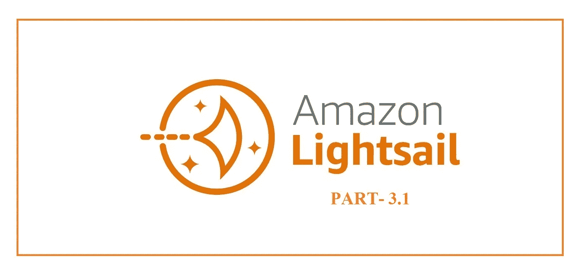

[**clickaws.com**亚马逊光帆 part 3.1](https://www.clickaws.com/)

如果你对网络概念有新的认识，动态 IP 地址意味着当我们在 AWS Lightsail 中停止和启动实例时，我们的 IP 地址会发生变化，这称为动态 IP 地址。

在本文中，我已经展示了 AWS Lightsail 中实例的默认和预分配 IP 是一个动态 IP 地址。我们必须登录 AWS 帐户，然后搜索 AWS Lightsail，之后，将打开一个新页面，在其中创建我们的实例。

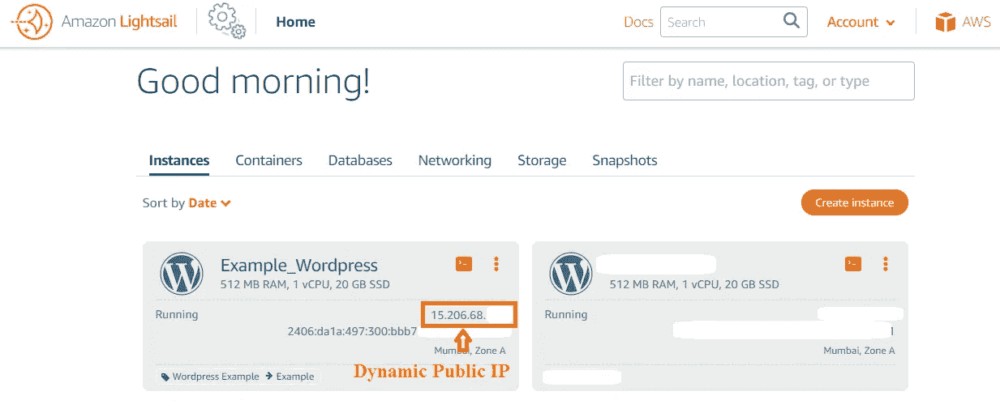

【ClickAWS.com】的**动态 IP**的

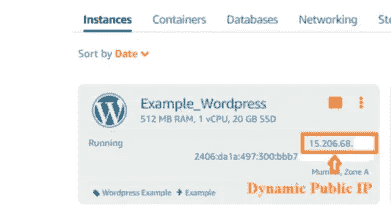

[**动态 IP(二)**](https://www.clickaws.com/)

正如我们已经看到的，我之前已经创建了实例，我以我们的第一个实例为例，即 Example_Wordpress。

**第一步:**点击 **3 点**然后点击**停止**。它将停止您的实例。

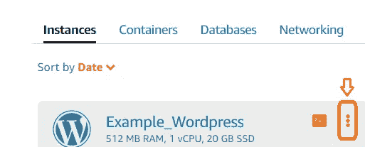

[**3 点由 ClickAWS.com**](https://www.clickaws.com/)

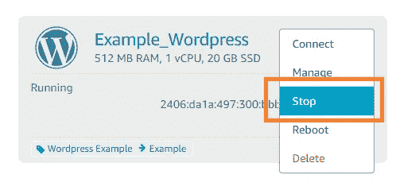

[**停由 ClickAWS.com**](https://www.clickaws.com/)

**步骤 2:** 检查他们的**不可用**是否已写，这意味着我们的实例已停止，并且没有显示公共 IP 地址。

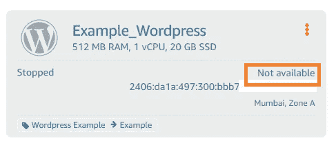

[**ClickAWS.com**](https://www.clickaws.com/)不提供

**第三步:**点击蓝色的**实例名**。新的一页打开了。

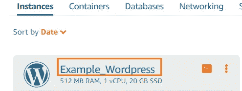

[**实例名由 ClickAWS.com**](https://www.clickaws.com/)

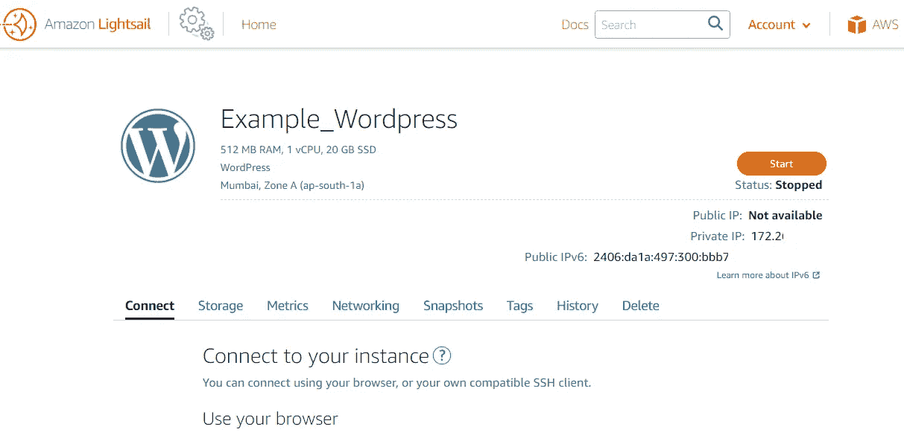

【ClickAWS.com**实例名称②由**到

**步骤 4:** 点击**开始。**

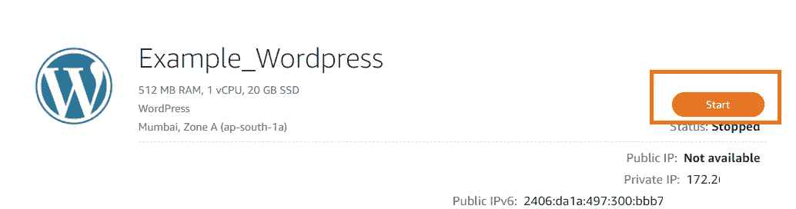

[**由 ClickAWS.com 开始**](https://www.clickaws.com/)

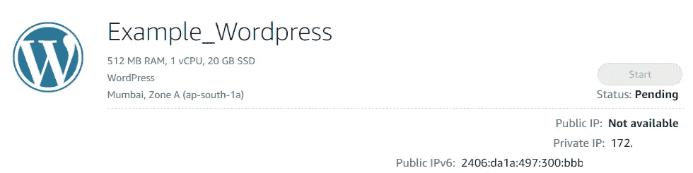

[**开始待定由 ClickAWS.com**](https://www.clickaws.com/)

**步骤 7:** 一个**新的动态 IP** 被创建。

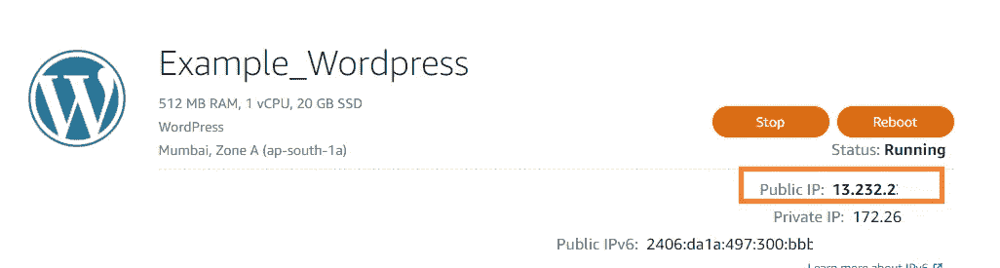

[**ClickAWS.com**新动态 IP](https://www.clickaws.com/)

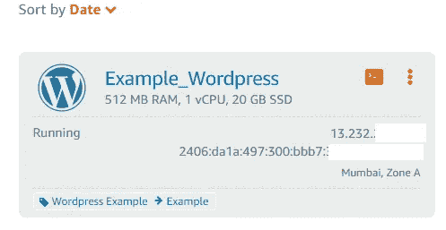

【ClickAWS.com**新动态 IP(二)**

欢迎提出建议、改进和疑问。

我希望这个博客能帮助和节省你的宝贵时间，这样你就可以和你爱的人一起度过了。保持微笑，展现爱心！！！

**下面是 AWS Lightsail 上 WordPress 网站托管的详细步骤系列的链接:**

**第一部分:** [如何在 AWS LightSail 上托管一个 WordPress 网站。](https://aws.plainenglish.io/how-to-host-a-wordpress-website-on-aws-lightsail-8808b70f7f7c)

**第二部分:** [查找 WordPress AWS Lighstail 仪表板的登录凭证。](https://www.clickaws.com/find-wordpress-password-in-aws-lightsail/)

**第三部分:** [从动态 IP 地址中设置一个 Lightsail 静态 IP 地址。](/@ankitgupta_974/setting-up-a-lightsail-static-ip-address-from-dynamic-ip-address-4a0628f63c52)

**第 3.1 部分:**AWS light sail 中实例的动态 IP 地址。(即将推出)

**第四部分:** [如何向亚马逊 Web 服务注册域名|使用 AWS Route53 注册域名。](https://aws.plainenglish.io/how-to-register-a-domain-name-with-amazon-80a1bf809859)

**第五部分:** [在 WordPress AWS Lightsail 上设置免费 SSL 证书。](https://www.clickaws.com/how-to-setup-or-enable-free-ssl-certificate-on-your-wordpress-aws-lightsail-instance/)

感谢您的阅读，如果您喜欢，请点击拍手按钮并分享它。

**如果你喜欢以上博客系列请支持我使用**[**Buymeacoffee**](https://www.buymeacoffee.com/AnkitGupta1)**。**

## **其他博客:**

 [## 亚马逊推出 Re: Skill Program 2021 |免费亚马逊 t 恤|免费亚马逊课程

### AWS re:技能——赚取奖励。

medium.com](/nerd-for-tech/amazon-launched-re-skill-program-2021-free-amazon-t-shirts-free-amazon-courses-88c4b95c9752)  [## AWS Lightsail 中 WordPress 的登录凭证-第 2 部分| WordPress 密码 Lightsail - CLICKAWS

### 在本文中，我们讨论了如何在 AWS LightSail 中使用 SSH 来查找 WordPress Admin 的登录凭证。这是…

www.clickaws.com](https://www.clickaws.com/find-wordpress-password-in-aws-lightsail/)  [## 免费培训、课程和证书——谷歌云技能提升。

### 谷歌将免费为 4000 万新生提供云计算培训。

medium.com](/nerd-for-tech/free-training-course-and-certificates-google-cloud-skill-boost-6ee61548f915) 

## **在 Linkedin 上帮我联系:**

 [## 印度马哈拉施特拉邦 ankit Gupta-Pune |职业简介| LinkedIn

### 我是一个深度学习爱好者/学习者，正在寻找一个可以贡献和提高我技能的机会…

www.linkedin.com](https://www.linkedin.com/in/ankit-gupta2/) 

**参考文献:**

[https://light sail . AWS . Amazon . com/ls/docs/en _ us/articles/Amazon-light sail-editing-WP-config-for-distribution](https://lightsail.aws.amazon.com/ls/docs/en_us/articles/amazon-lightsail-editing-wp-config-for-distribution)

关注我们以获取更多内容。

**查看更多与 AWS 相关的内容。**