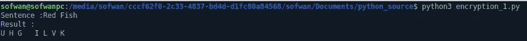
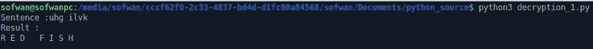

# 使用 Python 加密的早期——凯撒密码(第 1 部分)

> 原文：<https://medium.com/nerd-for-tech/the-early-days-of-encryption-using-python-caesars-cipher-1-602201f44fda?source=collection_archive---------18----------------------->


马库斯·斯皮斯克在 [Unsplash](https://unsplash.com/s/photos/encryption?utm_source=unsplash&utm_medium=referral&utm_content=creditCopyText) 上的照片

加密是一个流行术语，在信息技术中广泛使用。加密是一种保护数据不被你不想要的人访问的方法[1]。受保护的数据可以是聊天、电子邮件、文件和数据库。在聊天中，聊天信使必须通过在聊天隧道通信系统中间截取聊天来应用加密以保护聊天不被无权阅读聊天的人阅读。它还保护用户的隐私和聊天的安全性，使用户舒适地使用聊天信使。使用密码并将密码保存在数据库表中的应用程序被鼓励在将密码保存在表中之前加密密码，因此即使可以访问数据库的应用程序管理员或数据库管理员也不知道密码是什么，尽管他可以更改密码，因为他对数据库具有完全访问权。

如果你想加密数据或文本，你用一个密钥改变你的文本，这个密钥是一种方法或算法，所以文本变成了一些无法理解的东西。你发送数据的人必须有特定的密钥来解密或翻译它以理解文本。

今天的加密算法比早期的加密算法更加复杂和难以理解。有一些现代算法，如 TripleDES、Two fish 加密和 Blowfish 加密是一些最强的加密算法[2]。

在这一系列文章中，我想解释一下早期的加密算法。第一个是凯撒密码，由罗马将军和政治家尤利乌斯·凯撒[2]使用，他在公元前 44 年被政敌暗杀[3]，第二个是第二篇文章中的波利比乌斯广场。这两个都是我用 Python 实现的。

凯撒密码是一种加密技术，通过将字母表中的每个字母向右或向左移动一些位置来实现。例如使用下面的密码，如果你写黑色，它就变成 EOAFN。[2]

plain:ABCDEFGHIJKLMNOPQRSTUVWXYZ
密码:DEFGHIJKLMNOPQRSTUVWXYZ

使用这种密码很容易将明文转换为加密文本，我们可以手动完成，特别是当文本很短时，但如果文本很长，则需要很大的努力来手动转换。为了使我们的任务更容易，我创建了一个 Python 脚本，这样我们可以比手动更容易地加密一个长单词。我还添加了 Python 脚本来解密加密文本。

写凯撒密码的算法如下:
1。创建一个简单字母表列表(名为 plainnya)，从 A 开始直到 z。通过向左移动 3 个字母来创建密码列表(命名为 ciphernya，
，因此它从 D 开始直到 C.
3。启动列表变量(名为 bil_huruf)来存储输入文本
4 的索引。输入文本
5。将输入文本转换成上部文本
6。基于普通索引查找输入文本的索引号。
7。基于输入文本索引打印出密码的字母表

代码如下所示:

```
plainnya=["A","B","C","D","E","F","G","H","I","J","K","L","M","N","O","P","Q","R","S","T","U","V","W","X","Y","Z","A","B","C"," "]ciphernya=["D","E","F","G","H","I","J","K","L","M","N","O","P","Q","R","S",
"T","U","V","W","X","Y","Z"," "] 
```

在上面的代码中，我们创建了 plainnya 列表和 ciphernya 列表。在这里，我们向左移动 3 个字母，你可以修改你想向左或向右移动多少个字母。

```
bil_huruf=[]
sente=input("Sentence :")
sentence_up=sente.upper()
```

我们创建了一个名为 bil_huruf 的列表，创建了一个输入文本，并将其大写转换为我们输入的每个字母，使其与 plainnya 列表和 ciphernya 列表内容相似

```
for i in range(len(sentence_up)):
    for j in range(len(plainnya)):
        if (sentence_up[i]==" "):
            bil_huruf.append(26)
            break

        if plainnya[j]==sentence_up[i]:
            bil_huruf.append(j)
```

然后我们对 plainnya 列表和 sentence_up 列表中的每个成员进行比较。如果这些列表中的字母表相同，我们使用 append 将索引号保存到 bil_huruf 列表中。如果有“空格”,我们把它附加在索引 26 上，它在密码表中是空格。例如，如果我们输入红鱼，那么 bil_huruf 中的索引包含 17，4，3，26，5，8，18，7。
R=17，E=4，D=3，space=26，F=5，I=8，S=18，H=7。

```
print("Result :")
for k in range(len(bil_huruf)):
    print(ciphernya[bil_huruf[k]],end=" ")
```

之后，我们用 ciphernya 列表打印 bil_huruf 列表中已有的每个索引，因此从文本:红鱼将变成:UHG ILVK



图 1:加密的结果

对于解密代码，它反过来，使加密结果作为输入和解密与平原。文本的结果:UHG ILVK 如下:



图 2:解密的结果

解密的代码如下:

```
# Decryption 1 - Caesar's Cipherplainnya=["A","B","C","D","E","F","G","H","I","J","K","L","M","N","O","P","Q",
          "R","S","T","U","V","W","X","Y","Z"," "]
ciphernya=["D","E","F","G","H","I","J","K","L","M","N","O","P","Q","R","S",
           "T","U","V","W","X","Y","Z","A","B","C"," "]bil_huruf=[]
sente=input("Sentence :")
sentence_up=sente.upper()for i in range(len(sentence_up)):
    for j in range(len(ciphernya)):
        if (sentence_up[i]==" "):
            bil_huruf.append(26)
            break

        if ciphernya[j]==sentence_up[i]:
            bil_huruf.append(j)print("Hasil :")
for k in range(len(bil_huruf)):
    print(plainnya[bil_huruf[k]],end=" ")
```

代码，我也保存在我的 github 账户上。[https://github.com/sofwanbl/encrypt-decrypt-1](https://github.com/sofwanbl/encrypt-decrypt-1)

**结论**

Caesar 的密码是早期的加密，易于理解，没有在现代加密上实现，因为有任何其他现代加密更安全，但通过了解早期的加密，我们了解加密是如何工作的。凯撒密码可以用编程语言实现，本文用 Python 实现了它。

**参考**

[1] Whitson Gordon,《加密初学者指南:什么是加密以及如何设置加密》, 2014 年 1 月 27 日。于 2021 年 4 月 17 日[在线]访问。可用:[https://life hacker . com/a-初学者指南-加密-是什么-如何-1508196946](https://lifehacker.com/a-beginners-guide-to-encryption-what-it-is-and-how-to-1508196946) 。

[2] Rithesh Raghavan，什么是数据加密？哪些都是顶级加密算法？2020 年 1 月 17 日。于 2021 年 4 月 17 日[在线]访问。可用:[https://acodez.in/data-encryption-algorithms/](https://acodez.in/data-encryption-algorithms/)

[3]国家地理学会，朱利叶斯·凯撒，2018 年 7 月 6 日。于 2021 年 4 月 17 日[在线]访问。
可用:[https://www . national geographic . org/encyclopedia/Julius-Caesar/](https://www.nationalgeographic.org/encyclopedia/julius-caesar/)