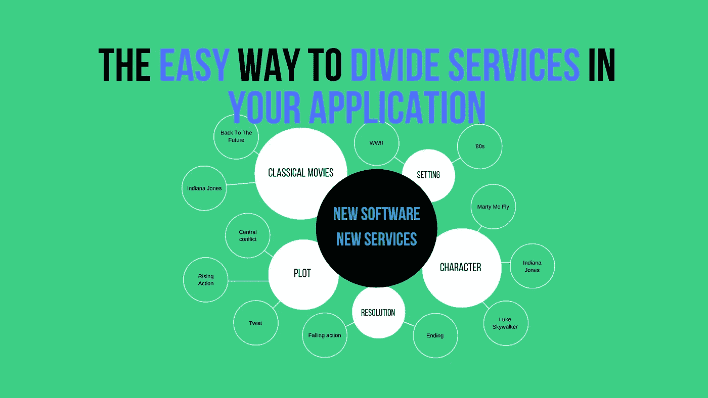

# 在应用程序中划分服务的简单方法

> 原文：<https://medium.com/nerd-for-tech/the-easy-way-to-divide-services-in-your-application-3ffc6606122?source=collection_archive---------8----------------------->

## 识别您的架构中的服务，并正确地划分它们

由[作者](http://www.arnoldcode.com)制作的插图

无论你编码什么，无论你做什么，分布式架构都是许多独立服务的协调。

设计应用程序的服务不是一件容易的工作。你必须考虑技术方面，责任，可能的重叠…