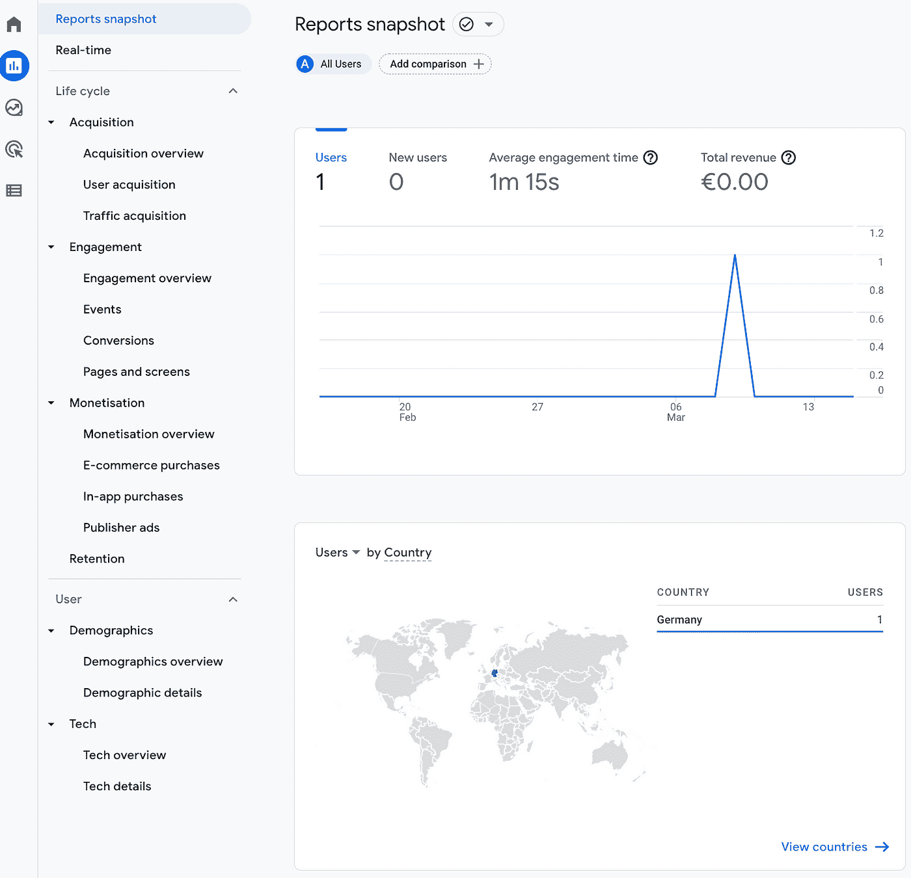
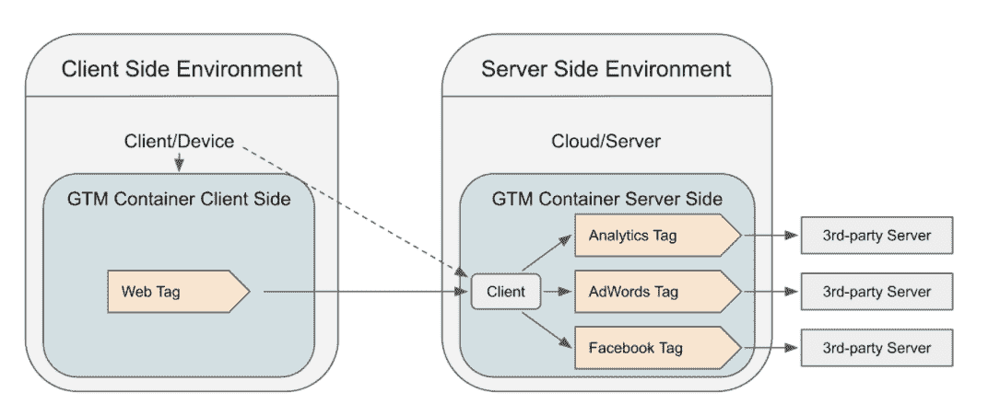

# 谷歌通用分析的终结有一个日期

> 原文：<https://medium.com/nerd-for-tech/the-end-of-googles-universal-analytics-has-a-date-9c636c0836f4?source=collection_archive---------2----------------------->

## (预期)大爆炸。今天，谷歌宣布了谷歌通用分析时代结束的细节。亚历山大·柯俊

照片由[伯纳德·赫曼特](https://unsplash.com/@bernardhermant)在 [Unsplash](https://unsplash.com/) 上拍摄

今天标志着网站和应用分析环境的巨大变化。几年来，谷歌分析有两个版本:通用分析和谷歌分析 4。这是企业所有者和分析团队并行跟踪两个系统的常见方法，将 web 流量写入 Universal Analytics 的属性和 GA4 属性。

今天，谷歌宣布关闭“旧的”通用分析服务的日期(或者最好说是 2 个日期)。

# 通用分析的终结

谷歌一直透明地表示，通用分析是过去，谷歌分析 4 是未来。在过去的几年里，他们一直致力于为从 UA 到 GA4 的平稳过渡奠定基础。

既然我们已经被告知服务的结束，知道您仍然可以并行运行这两个服务以适应 GA4 是很重要的。公司应该现在就开始行动，不要把 GA4 当成一个烦人的附带项目，因为一些重要的功能仍然缺失。

在新的谷歌分析 4 环境中，过去几个月谷歌分析平台的新功能已经达到 90%。
甚至当你看到过去几个月谷歌分析环境的新功能时，几乎所有东西都是针对谷歌分析 4 的。

谷歌官方透露通用分析属性不再收集点击量。然后才有可能查看 UA 房产未来 6 个月的历史数据。

**所以两个结束日期是:**

*   **2023 年 7 月 1 日面向所有免费用户**
*   【01.10.2023 年 10 月 1 日，面向所有付费用户(360 名客户)

在这些日期之后，你必须使用你的 GA4 属性来获得你的网站性能的新见解。

# 关于 GA4 的概述

在“旧的”通用分析和“新的”谷歌分析 4 之间，有一些很大的差异。每个接触谷歌分析 4 的人都会有所改变:

*   人们跟踪网站，在 GTM 中创建标签，并将其发送到谷歌分析
*   人们在平台上观看分析报告
*   人们从 BigQuery 中获取数据，并对其进行结构化，以构建更详细的定制分析

接下来，我想简单介绍一下 u a 和 GA4 的区别:

*   通用分析区分页面视图和事件。因此，用户访问一个新页面，在该页面上，用户可以触发事件。在 GA4 中，一切都是事件，所以页面视图是事件，点击按钮也是事件
*   在通用分析中，一个事件可以有 3 个附加信息:事件类别、事件操作和事件标签。在 GA4 中，每个事件可以有 25 个不同的参数，它们是键值对
*   谷歌分析平台的整体结构、导航和报告设计都发生了变化

*全新 GA4 导航*

*   GA4 也更侧重于定制。您可以更改现有报告并创建新图表。尤其是刚开始的时候，有时候有点力不从心。
*   谷歌分析 4 仍然缺少一些重要的功能，比如定制频道分组和推荐排除列表
*   GA4 的所有用户都可以将数据从他们的属性导出到他们的 BigQuery 实例中(在 UA 中，只有 360 付费用户可以做到这一点)
*   当然，导出的 BigQuery 数据的结构也发生了变化，它也只是基于事件及其参数

# 接下来是什么？

除了从通用分析到谷歌分析 4 的转变，追踪领域还有另一个变化，至少我想在这里提一下。我说的是客户端和服务器端的跟踪。多年来，人们在 GTM 的帮助下，通过在客户端实现的 JavaScript 代码来跟踪网站上用户的行为。

现在，在服务器端点的支持下，甚至可以跟踪用户行为。在 GTM 中，它是一种新型容器。当重要的事情发生时，网站或客户端容器向服务器发送请求，服务器容器(应该在子域下运行)转换数据，并将它们发送到 GA4 和其他第三方工具。

这提高了安全性、客户端性能和跟踪准确性。Google 在这里做了与 UA/GA4 相同的事情，所以你可以并行使用这两个环境，它们也可以相互补充。但有一点是肯定的，服务器端的追踪至少是谷歌以及在网站上实施追踪的人绝对关注的焦点。

# datadice 将如何帮助您？

我们在谷歌分析 4 和服务器端跟踪方面已经有了很多经验。我们在许多客户项目中使用它。因此，我们可以帮助您实施新的跟踪环境，并丰富您的 Google Analytics 4 资产。[如果我们能在这里支持你，请告诉我们](http://datadice.io)。

在接下来的几周和几个月里，我们还会发布很多关于这个话题的新博文，以这种方式支持你。

# 本月即将发布的 datadice 博客文章

*   [友好介绍 Y42](/towardsdev/friendly-intro-to-y42-15400f3f3963?source=your_stories_page-------------------------------------)
*   [新的 Looker Studio(以前称为谷歌数据工作室)功能:新的混合菜单](/@datadice/new-data-studio-feature-new-blending-menu-a9fd64cae492?source=your_stories_page-------------------------------------)

# 更多链接

查看我们的 [LinkedIn](https://www.linkedin.com/company/datadice) 账户，深入了解我们的日常工作生活，并获得关于 BigQuery、Looker Studio(以前称为谷歌数据工作室)和营销分析的重要更新

我们也从我们自己的 YouTube 频道开始。我们讨论重要的 DWH、BigQuery、Looker Studio(以前称为 Google Data Studio)和许多其他主题。点击查看频道[。](https://www.youtube.com/channel/UCpyCm0Pb2fqu5XnaiflrWDg)

如果你想了解更多关于如何使用 Google Looker Studio 并结合 BigQuery 更上一层楼，请查看我们的 Udemy 课程[这里](https://www.udemy.com/course/bigquery-data-studio-grundlagen/)。

如果您正在寻求帮助，以建立一个现代化的、经济高效的数据仓库或分析仪表板，请发送电子邮件至 hello@datadice.io，我们将安排一次通话。