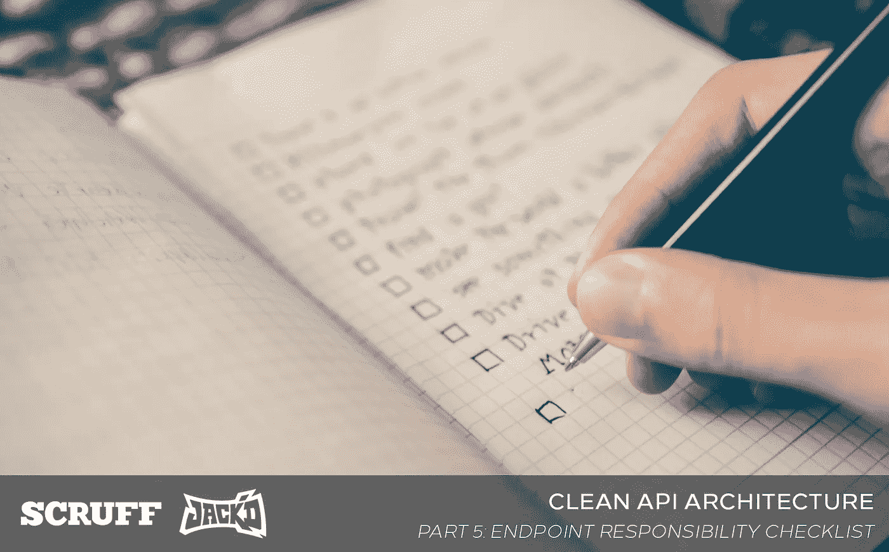
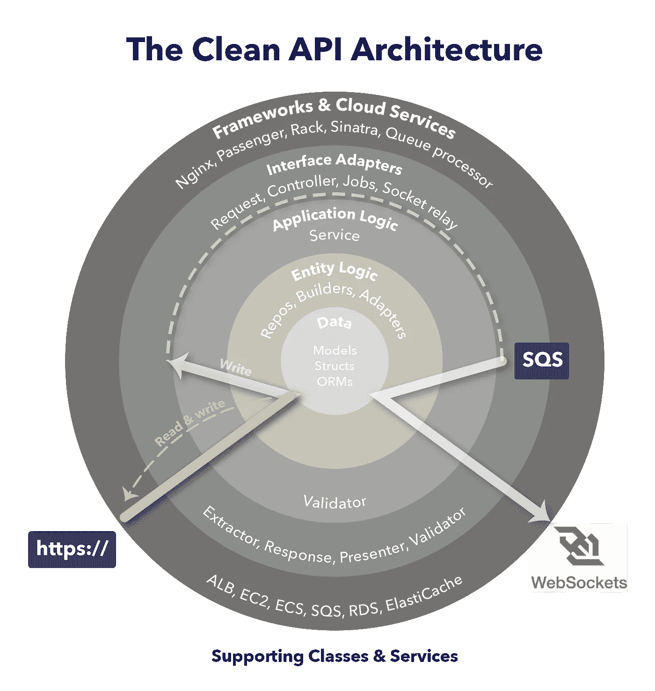
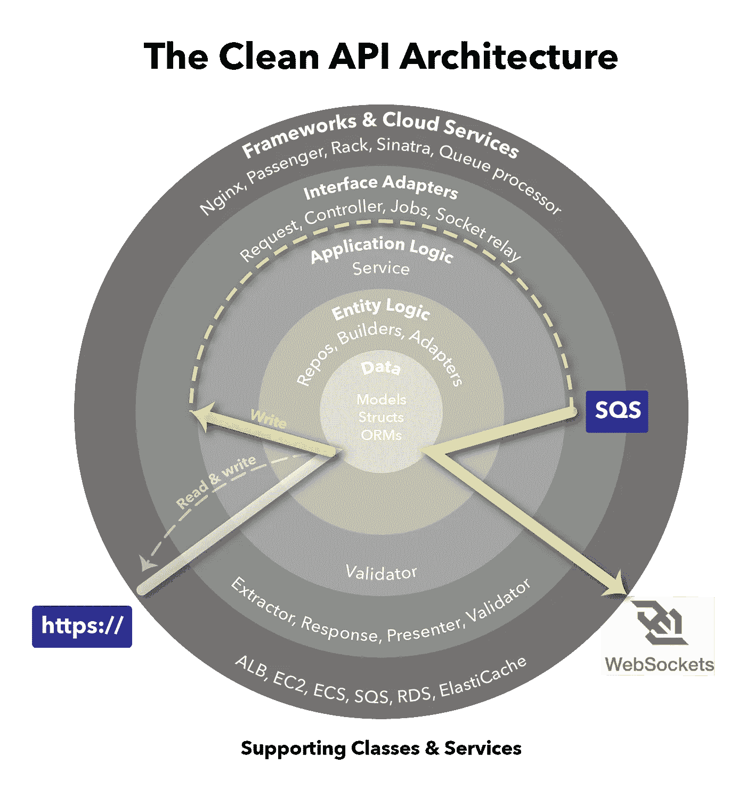

# 端点责任清单

> 原文：<https://medium.com/nerd-for-tech/the-endpoint-responsibility-checklist-d7763449f44a?source=collection_archive---------1----------------------->

## API 框架都应该做什么

🎅还列出了淘气和可爱的 APIs 图片由 [Unsplash](https://unsplash.com/s/photos/checklist?utm_source=unsplash&utm_medium=referral&utm_content=creditCopyText) 上的 [Glenn Carstens-Peters](https://unsplash.com/@glenncarstenspeters?utm_source=unsplash&utm_medium=referral&utm_content=creditCopyText) 拍摄

# API 端点是做什么的？

在我们关于 [Clean API 架构](/p/2b57074084d5/)的系列文章中，我们已经解释了如何在响应 HTTP 请求时涉及多个层次。概括地说，有两种类型的请求——一种是通过写入数据库改变状态的请求(POST/DELETE/PUT ),另一种是仅仅从数据库返回状态的请求(GET)。

*(为了简洁起见，当我们从现在开始说 POST 时，我们隐含的意思是 POST/DELETE/PUT)。*

对于获取和发布端点，您必须履行以下职责:

# 端点责任清单

*   🔲 **RESTful 路由**(基于动词和 URL 模式，我们应该执行哪个端点？)
*   🔲**控制流程**(命令我们执行，也处理错误)
*   🔲**记录**(写出调试和分析的请求信息)
*   🔲**参数提取和强制**(读取输入并存储在变量中)
*   🔲**语法验证**(输入的格式是否正确？)
*   🔲**语义验证**(输入是否符合我们的业务规则？)
*   🔲**认证**(哪个配置文件提出这个请求？)
*   🔲**授权**(这个配置文件可以访问请求的数据吗？)
*   🔲**演示**(如果正在返回数据，则将数据格式化为适合客户的正确格式)

# 编写端点责任清单

我们前面列出的写操作都需要更新像 Mysql 这样的 RDBMS 中的列。任何大规模管理过 RDBMS 系统的人都会告诉你，它们可能是不可靠的——糟糕的查询会导致其他请求变慢，模式更改会[锁定表](https://dba.stackexchange.com/questions/21075/way-to-prevent-queries-from-waiting-for-table-level-lock)或长或短的时间，磁盘变慢会导致查询变慢，从而导致线程池耗尽。

当你有太多的请求时。

为了防止潜在的数据丢失并减少这些场景对用户的影响，在我们的架构中，所有的写操作都被排队，并由运行在单独的机器(或单独的集群)上的任务执行。我们称这些机器为 **DBWriter** 机器**。**

除了读取端点的工作之外，写入端点的其他职责包括:

*   🔲**作业配置**(用必要的数据创建一个散列以在后台执行工作)
*   🔲**作业排队**(向队列中写入消息，如 [AWS SQS](https://aws.amazon.com/sqs/) )
*   🔲**队列处理**(从队列中提取作业配置并处理作业的 DBWriter 进程)
*   🔲**状态突变**(写入一个或多个数据源)
*   🔲**异步中继**(通过 WebSockets 或聊天集群向客户端返回写确认)

> 我们已经确定了端点的至少 14 项独立职责。

是的，这将是测试

# 连接回清洁

在我们之前的文章中，我们讨论了干净的 API 架构。我们现在将解释在我们的 Clean API 架构中，我们如何以及何时处理上面清单中的每一项职责。

## GET 请求的干净 API

让我们从在我们的 Clean API 架构中可视化地识别 GET 请求的执行路径开始。

用黄色突出显示的路径用于 GET 请求

该执行路径中的步骤可以总结为:

**🔵接收** →🟢 **验证(语法)** →🔴**验证(语义)** →🟢 **入队** →🟢 **响应**

请求在 API 服务器上处理。注意验证的两个阶段——一个语法阶段，一个语义阶段。验证后，该作业将排队并向客户端返回一个成功代码。如果失败，则没有作业排队，并向客户端返回一个错误代码。

## 发布请求的清理 API

用黄色突出显示的路径用于 POST 请求

当 API 服务器接收到 POST 请求时，它会将该请求发送到一个队列，在我们的例子中是 AWS SQS。稍后，在 DBWriter 服务器上，执行路径总结如下:

🟢Dequeue →🔴**变异** →🟢 **通知**

# 清单 x 执行路径

编写端点应该是

现在让我们将清单与 POST 请求的两个执行路径联系起来。

> 环绕🟢🔴🔵来自我们的执行路径；在每一项下，我们确定了它们针对✅清单的哪些部分。

## **路径 1:请求回执**

在 API 服务器上

1.  🔵**接收:**将请求路由到正确的**控制器**

*   宁静的✅路线
*   控制流量✅

2.🟢 **验证:**提取输入参数，验证它们的语法，并使用**参数**和**验证器来验证**请求中的概要文件**。**返回在服务层执行操作所需的输入。

*   参数提取和强制✅
*   认证✅
*   语法验证✅

3.🔴**验证:**使用**服务**根据业务规则验证输入

*   语义验证✅
*   授权✅

4.🟢 **入队:**配置**作业配置**并将作业入队。

*   职务配置✅
*   ✅的工作入队

5.🟢 **响应:**回传接收确认，在**响应**中带有 200 OK 状态码，表明写操作已经成功入队，可选 JSON 数据。

*   介绍✅

## **途径 2:请求处理**

在 DBWriter 服务器上

1.  🟢 **出列:**接收带有**作业**或**服务**的入队作业

*   队列处理✅

2.🔴 **Mutate** :通过服务中定义的操作改变数据库

*   状态突变✅
*   ✅伐木公司

3.🟢 **通知:**向客户端发回异步套接字消息，告知操作成功或失败。

*   异步继电器✅

# 接下来

在上一节中，我们定义了所有端点都必须完成的操作清单。然后，我们将该清单与我们的 Clean API 架构所建议的执行路径联系起来。现在我们要去[看看这在实践中是什么样子](/perry-street-software-engineering/clean-api-example-save-a-favorite-d45ca6aeba4c)。

# 本系列的更多内容

*   [web API 设计的视觉历史](/p/c36044df2ac7/)
*   [web API 执行流程的模式](/p/9d65232e8a24/)
*   [面向铁路的编程](/p/ad4288a273ce/)
*   [干净的 API 架构](/p/2b57074084d5/)
*   端点责任清单←你在这里
*   [代码示例:保存收藏夹](/perry-street-software-engineering/clean-api-example-save-a-favorite-d45ca6aeba4c)

# 你可能喜欢的其他系列

[**Android 活动生命周期被认为是有害的**](https://proandroiddev.com/android-activity-lifecycle-considered-harmful-98a5b00d287)**【2021】** Android 进程死亡，不可解释的 NullPointerExceptions，以及你现在需要的 MVVM 生命周期

[**Xcode 里的 Kotlin？安卓工作室**里的 swift](/swlh/kotlin-in-xcode-swift-in-android-studio-26a4ace6fc72)？ **(2020)**
关于在 iOS & Android 上使用 Clean + MVVM 实现一致架构的系列

# 关于作者

埃里克·西尔弗伯格(Eric Silverberg)是佩里街软件公司(Perry Street Software)的首席执行官，发行 LGBTQ+约会应用程序(LGBTQ+ dating apps)和 SCRUFF，在全球拥有 2000 多万会员。