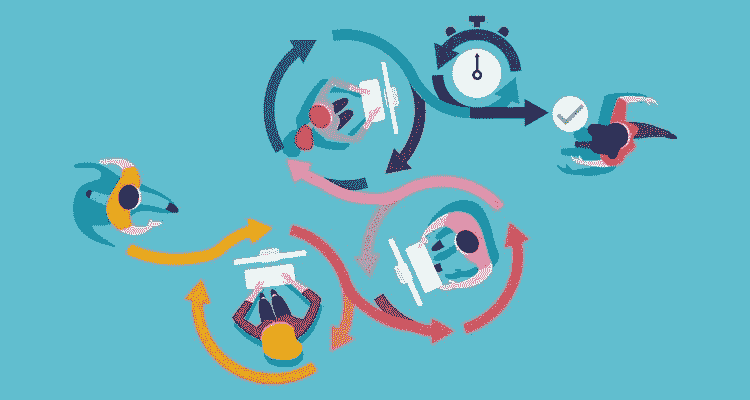

# DevSecOps 的精髓:联合多个团队

> 原文：<https://medium.com/nerd-for-tech/the-essence-of-devsecops-aligning-multiple-teams-28f026814d?source=collection_archive---------19----------------------->

面对现实吧！安全团队本身无法确保安全的开发生命周期。他们只能让球滚动起来，但是要保持软件开发的势头，DevOps 团队还需要走额外的一英里。

考虑到采用 DevSecOps 的任务中所涉及的不同角色，很容易想象将具有不同优先级、团队规模和技能组合的不同团队联合起来为同一个目标工作的难度。

这就是为什么我们需要清楚地设定每个团队的期望，以使过程尽可能容易理解。我们将关注 DevSecOps 的以下 5 个步骤，让您思考在每个步骤中增加协作的可能方法；

*   威胁建模
*   安全测试
*   脆弱性的优先顺序
*   漏洞补救
*   监视

**安全团队**

安全团队显然需要监督每个步骤中的活动，但我们看到最有附加值的是**威胁建模**部分。

尽管一开始听起来很累人，但威胁建模实际上是一项非常有趣的活动。

这实际上是安全和开发团队之间共享大量专业知识的地方，以在漏洞出现之前防止它们，它还允许安全团队更好地理解每个项目背后的软件架构，以帮助他们对在后期阶段的自动或手动安全测试中发现的漏洞进行优先排序。

在繁忙的日程安排中，为了腾出时间进行威胁建模活动，安全团队需要在其他步骤中尽可能地利用工具的自动化功能，尤其是在安全测试步骤中。

没有自动化，他们几乎不可能跟上当前的开发和开发速度，也不可能腾出时间进行更有成效的活动。

一旦他们将耗时且繁琐的任务自动化，他们就需要集中精力参加威胁建模会议并确定漏洞的优先级。

花在这些活动上的时间会很快得到回报**建立信任并赢得开发团队的尊重**。一旦软件开发团队知道他们只被分配了需要修复的真正积极的漏洞，他们也开始与安全合作，这导致了建立在相互信任和尊重基础上的积极的环境。

安全团队可以帮助开发团队的另一种方式是为不同类型的漏洞创建 SLA 级别，这将为双方明确最后期限，并设置与风险接受和风险管理相关的指导原则。

他们还可以创建内部安全库和补救知识库，供软件开发人员使用，以帮助他们及时补救漏洞并主动预防漏洞。这是大多数 AppSec 程序中被低估的活动之一，因为软件开发人员倾向于一次又一次地创建相同的漏洞。

所有这些活动将有助于创造一个友好的环境，让两个团队和谐地工作，密切合作。

**软件开发团队**

对于无缝的 DevSecOps 应用，软件开发人员有两点期望。

1.  通过参加威胁建模会议并遵循安全编码原则来防止漏洞
2.  根据商定的 SLA 级别修复漏洞

在孔杜克托，我们对他们还有一点期待。通过在组织中使用的缺陷跟踪器上输入评论来分享他们如何修复特定的漏洞。

通过这种方式，他们可以为补救知识库做出贡献，Kondukto 将在未来与从事相同类型漏洞工作的其他软件开发人员分享这一建议。

这使得内部补救知识库能够在安全和开发团队的共同努力下更快地增长。

关于在开发团队中创建的角色，以使安全性上升到他们的议程中，**产品安全工程师角色**在过去几年中已经成为趋势。

他们确保与安全相关的问题不是事后的想法，而是常规冲刺的固有部分。从威胁建模到执行安全审查甚至渗透测试，它们在软件开发的各个阶段发挥作用，并帮助开发团队在编写代码时考虑安全性，并及时修复漏洞。

虽然对许多公司来说，它们可能是一个昂贵的选择，但开发团队中的**安全冠军**提供了一种更实惠的方式。就像产品安全工程师一样，他们也是安全团队的主要联系人。

即使他们没有网络安全背景，也可以从对安全编码实践感兴趣的开发人员中挑选。他们在开发团队中推广安全编码原则，并在安全和开发团队之间架起一座桥梁。

**开发团队**

DevOps 团队需要参与到将安全测试与管道集成的过程中。

幸运的是，随着最新的一切如代码趋势，只需添加几行脚本，DevOps 团队就可以立即将安全测试集成到管道中。

但是，仍然需要共同做出以下决定:

*   **扫描的频率**；虽然有些项目可以在每次推送到主分支时进行扫描，但扫描可以由其他项目中的不同事件触发。
*   **设置安全标准**；可以选择某些重要程度高的项目，并且可以设置安全标准，以便在不符合标准时自动切断管道。通过这种方式，安全团队可以确保具有某些漏洞的项目永远不会进入生产环境，而开发运维团队则知道为什么构建会被破坏。
*   **管道中的最大等待时间**；某些项目的扫描可能需要太长时间，并且在扫描完成之前暂停管道可能不方便。对于这种情况，最大等待时间可以由双方决定，等待时间过后，扫描在后台运行时，管道可以继续运行。
*   **异步扫描；**某些不需要安全性来阻止开发运维的项目也可以由双方共同决定，自动扫描可以在这些项目中异步运行，而不会中断管道。

简而言之，**开发人员和安全团队之间的紧密协作**也是做出上述决策所必需的。一旦做出了决定，就可以更容易地创建自动化的工作流，而不会扰乱两个团队的日常工作。为了开始做出这些决定，我们需要尽快将这些团队召集到一起。