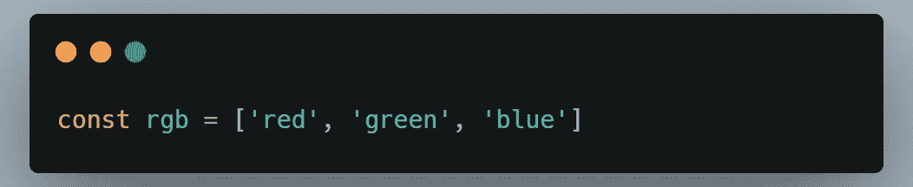
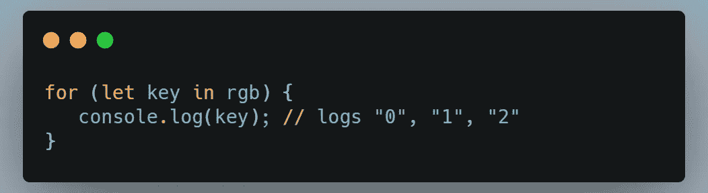
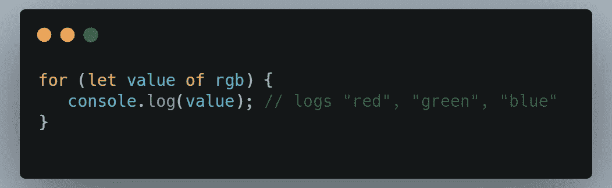

# JavaScript 中循环的本质

> 原文：<https://medium.com/nerd-for-tech/the-essence-of-looping-in-javascript-8098bb2add1a?source=collection_archive---------20----------------------->

*2021 年初学者学习的最佳编程语言*


由[克里斯托弗·高尔](https://unsplash.com/@cgower?utm_source=unsplash&utm_medium=referral&utm_content=creditCopyText)在 [Unsplash](https://unsplash.com/s/photos/information-technology?utm_source=unsplash&utm_medium=referral&utm_content=creditCopyText) 上拍摄的照片

JavaScript 是世界上最流行的编程语言。

JavaScript 是网络的编程语言。

JavaScript 很容易学。

因此，了解 JavaScript 中的循环和迭代非常重要。**循环**是一种编程元素，它重复一部分代码，重复设定的次数，直到所需的过程完成。重复任务在编程中很常见，而**循环**是**节省时间和减少错误的基本**。

JavaScript 中提供的循环类型有:

*   `for`-迭代元素固定的次数
*   `for/in`-迭代对象的属性
*   `for/of`-迭代可迭代对象的值
*   `while`-迭代元素，直到特定条件为真
*   `do/while`-也迭代元素，直到特定条件为真

# **1.for 循环**

重复`for`循环，直到指定的条件评估为假。

语法:

```
**for**([initialExpression];[conditionExpression];[incrementExpression])
     //code block to be executed
```

*   **initialExpression** :-通常初始化一个或多个循环计数器，也可以声明变量
*   **条件表达式** :-执行代码块的条件
*   **incrementExpression:-** 每次代码块执行后执行

*例如:*

```
for (i = 0; i < 5; i++) {
  text += "The number is " + i + "<br>";
}
```

首先将变量`i`设置为 0，然后循环运行，直到条件`*i<5*` 变为`*false*` *。*在每执行一次`*i*` 代码块后，就按*递增 1。*

# **2.for/in 循环**

`for...in`语句在一个对象的所有可枚举属性上迭代一个指定的变量。

语法:

```
**for**(variable **in** object)
    //code block to be exected
```

*举例:*

```
var student= {name:"Monica", class:7, Town:"Colombo"};

var text = "";
var x;
for (x in student) {
  text += student[x];
}
```

这个代码段的输出是`Monica 7 Colombo`，

`for..in`循环遍历学生对象。每次迭代返回一个**键(x)** 。密钥用于访问密钥的**值**。键的值是**学生【x】。**

**数组**中的 for/in 循环

在 javaScript 中,`for...in`循环也可以用来迭代数组的属性。

语法:

```
**for**(variable **in** array)
   //code block to be executed
```

# **3.for/of 循环**

`for...of`语句在一个可迭代对象(包括`array`、`map`、`set`、`arguments`等对象)上创建一个循环

*关于可迭代对象的更多信息:*

[](https://developer.mozilla.org/en-US/docs/Web/JavaScript/Reference/Iteration_protocols) [## 迭代协议

### 作为 ECMAScript 2015 的两个补充，迭代协议不是新的内置或语法，而是协议。这些…

developer.mozilla.org](https://developer.mozilla.org/en-US/docs/Web/JavaScript/Reference/Iteration_protocols) 

```
**for**(variable **of** iterable)
   //code segment to be executed
```

我知道你对`for...in`和`for...of`循环的区别感到困惑，因为它们看起来很相似。

**让我们考虑一下这两个循环的区别:**

这两种说法的主要区别是:`for...in`遍历属性名，`for...of`遍历属性值。

让我们考虑下面的数组，



我们先用`for...in`迭代一下，



正如您可能观察到的，`**for...in**`正在遍历数组的键，因此输出是`**"0", "1", "2"**`。

所以，现在让我们使用`**for...of,**`迭代同一个数组



如您所见，`**for...of**`只能迭代数组值，因此输出将是`**"red", "green", "blue"**`。

# **4.while 循环**

`while`循环执行，直到指定条件为`true`。条件变为`false`后，循环将终止。

语法:

```
**while**(condition)
   //code block to be executed
```

*示例:*

```
let i= 0;
let x = 0;
while (i < 3) {
  i++;
  x += i;
}
```

每次迭代`i`递增 1，并将该值加到`x`。所以，`x`和`i`取以下值。

1.  `i=1`和`x=1`；
2.  `i=2`和`x=3`；
3.  `i=3`和`x=6`；

之后，随着条件`i<3`变为假，循环终止。

# **5.do/while 循环**

`do...while`语句重复，直到指定的条件评估为假。

语法:

```
**do**
  statement
**while**(condition)
```

*示例:*

```
let i = 0;
do {
  i += 1;
  console.log(i);
} while (i < 5);
```

`while`和`do...while`循环的主要区别在于，如果开始时条件为`false`，则`while`循环不会执行。但是在`do...while`中，它在开始时条件为`false`时执行一次循环。

**结论**

循环提供了一种快速简单的方法来重复做某事。通过学习这些循环，你可以提升你的 JS 开发技能。

我希望你从这篇文章中学到了一些东西。

祝您愉快！😄