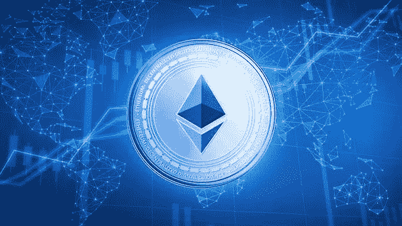

# 以太币的演变及其应用

> 原文：<https://medium.com/nerd-for-tech/the-evolution-of-the-ethereum-token-and-its-application-abffcbd13d19?source=collection_archive---------7----------------------->

使用任何当前令牌开发标准创建以太坊令牌的过程被称为“ [**以太坊令牌开发。**](https://www.turnkeytown.com/ethereum-token-development) “每种令牌标准都有明确的特征，定义了令牌的特性和操作。生成的令牌可以用于分散式交换、智能合约、Dapps、ico、sto 和其他项目。

尽管这些资产以偶像模式存在了很长时间，但它们让每个投资者和企业家都跑到了幕后。自从加密货币在这个炙手可热的市场中爆发以来，区块链网络、以太坊令牌开发和基于区块链的应用程序已经通过产生一种称为数字资产的革命性行为取得了进展。

比特币被认为是最有影响力的加密货币之一，也是所有加密货币中市值最大的先驱，但它受到的批评最少，这对他们来说是一个小小的挫折，因为它涉及到硬币或令牌的有限供应，最初的技术未能支持使用其原生令牌或智能合约创建平台或论坛，后来被称为以太坊技术(ETH)的临时技术使其变得可行。

与比特币竞争的加密货币以太坊以一种更具创造性的方式提供了答案。尽管智能合约的推出是由著名的以太坊技术推动的，但它的价值可能会随着比特币的价值下降。

以太坊令牌开发

那么，开发以太坊代币会是你在元宇宙的尖端投资吗？是的，这是一项数字投资，而不是实物投资，许多大型企业和组织都选择了这项投资。在这里，你几乎可以投资任何东西，包括 NFT、收藏品、P2E 游戏开发、虚拟现实平台等。而被称为以太币的原料可以用来启动所有这些东西。

创建以太坊令牌时需要注意的标准如下:

*   ERC-721 令牌开发
*   ERC-20 代币开发
*   ERC-223 令牌开发
*   ERC-777 令牌开发
*   ERC-827 令牌开发
*   ERC-865 令牌开发

如果你选择拥有它们，你可以咨询一家声誉良好的 ERC-托肯开发公司。例如，如果您选择开发 ERC-721 令牌，您可以咨询声誉良好的 [**ERC-721 开发公司**](https://www.turnkeytown.com/ethereum-token-development) 获得进入元宇宙的专家指导。通过以太坊区块链，标准可能会有所不同，但它们为你即将到来的岁月提供的标准永远不会是空的。

在这篇博客中，我们来谈谈 ERC20 令牌的优势和创建。

# **发展 ERC20 代币的好处:**

创建 ERC20 令牌有许多优点。以下是一些最重要的好处:

1.  ERC20 令牌提供了更高效、更快速的交易确认。
2.  ERC20 令牌交易一旦完成就不能更改。
3.  合同中断的可能性极小。
4.  开发人员会发现使用 ERC20 令牌实现和执行令牌非常简单。
5.  由于 ERC20 代币具有显著的流动性，它们可以立即转换成现金。
6.  他们保证交易没有风险。

# **你如何制作一个 ERC20 代币？**

创建 ERC20 令牌涉及以下阶段。

*   选择名称是创建令牌的第一步。你应该给你的令牌一个朗朗上口的名字。
*   令牌符号:对于令牌符号，您必须选择理想的布局。
*   总供应量:你必须详细说明拥有者已经分发的、目前在市场上使用的令牌的确切数量。
*   令牌的小数部分由令牌的 8 个小数位表示。
*   最后阶段；授权方现在将在他们的地址收到他们的代币余额。

# **结束:**

多亏了 [**以太坊令牌开发**](https://www.turnkeytown.com/ethereum-token-development) ，你可以瞬间进入元宇宙。这种广泛的选择有更高的可能性发展成为一个非常适合的公司模块，并可能为您提供未来的投资机会。