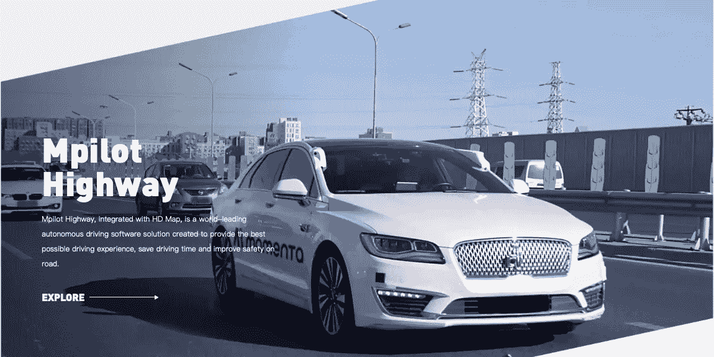
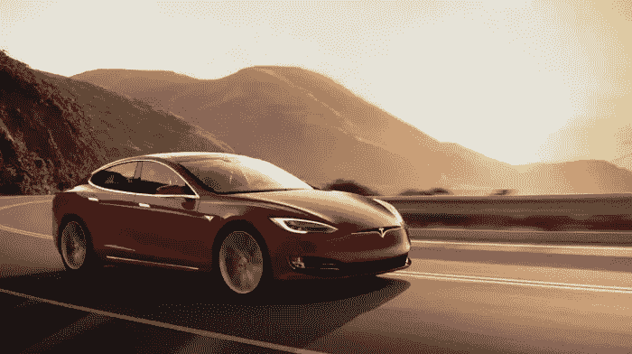

# 自动驾驶 L3 级悖论

> 原文：<https://medium.com/nerd-for-tech/the-first-half-and-second-half-of-competition-in-self-driving-industry-2021-part2-40f217b70376?source=collection_archive---------16----------------------->

来源:Momenta。人工智能

## 自动驾驶行业竞争的下半场

下半场竞争，科技公司和汽车企业需要“无缝互动”，不仅需要资本层面的合作，还需要兼容的硬件和架构，实现算法统一和数据共享。无论是 L4 技术能力的向下兼容，还是 L2 生产海量数据的向上反馈，这样的合作都与之前不同:**科技公司购车改装测试。**

比如，动量。AI 与 SAIC 汽车已经展开深度合作。在此之前，Momenta 已经通过统一的量产传感器方案打通了技术流和数据流。无人驾驶项目 MSD 比纯视觉驾驶项目 Mpilot 多了一个激光雷达作为安全冗余。

“考虑到汽车公司的战略诉求，目前最大的需求是给消费者更好的驾驶体验，不断完善算法。现在很多中国主机厂都在走这样的技术路线，我们认为这是从 L2 到 L4 的关键。”

## 汽车公司:试图绕过“L3 悖论”

为了真正实现无人驾驶的终极目标，所有玩家面临的共同问题是从 L2 过渡到 L3 和 L4，或者直接绕过 L3。

2014 年，国际汽车工程师协会(SAE)制定了驾驶辅助和自动驾驶系统的六个级别的描述，从 [**L0 自动化到 L5 自动化**](https://tinyurl.com/2bn3urz8) 。然而，自动驾驶公司 AutoX 的创始人表示，SAE 的分类标准已经不适用于日益增长的驾驶辅助功能。相反，许多汽车公司在宣传中“模糊”了 L2、L3 和 L4 的界限。

5 月，SAE 更新了自动驾驶的定义，定义了 L2 级别和 L3 级别的区别。新框架将 L0-L2 系统命名为驾驶员辅助系统，而 L3 至 L5 级别被视为“自动驾驶系统”。严格来说，本次更新后 L0-L2 将不再被命名为“自动驾驶”。

十年前，以 Waymo 为代表的一批硅谷自动驾驶技术公司，以 Robotaxi 的商业形态，直接向 L4 级别发起了猛烈的挑战；此外，特斯拉基于视觉感知的技术路线获取海量数据并迭代算法，试图捕捉 L3。

甚至特斯拉也失败了。

虽然 FSD model 3 在社交媒体上吸引了很多关注，但在 SAE 2021 国际汽车安全与测试大会上，我们了解到所有的汽车都是 L2 或以下级别， **L3 在技术法规领域**仍需改进。

来源:特斯拉 Model 3

目前真正符合规定的 L3 车型是本田汽车 3 月份推出的，搭载 L3 自动驾驶系统，**限量 100 辆。**

许可也是因为日本修改了 L3 的定义，即**认证的 L3 级车发生事故解除车企的产品责任**，但目前在其他国家事故责任应由车企还是司机承担还不清楚。

**这就是很多业内人士强调的“L3 悖论”，比 L4 更难实现。** L3 看似更容易实现，实际上在技术和法规上难度更大。

**简而言之，L3 是一个条件自动驾驶仪**。该系统已经具备自动驾驶的能力。当它请求人类干预时，人类驾驶员将接管驾驶任务。技术上，L3 为了实现人类驾驶员的进入和操作，要求车载传感器能够观察到足够远的距离，判断场景是否可以自动处理。但是在高速行驶的状态下很难实现。

感应距离是有限的。为了留下足够的反应时间，它需要感知至少 500 米的真实路况。另一方面，如果路况可以用机器处理，为什么不上 L4 级，直接把 L3 处理掉？

**更多信息:** [**德国全球首个无人驾驶法律允许 L4 级自动驾驶上路**](https://tinyurl.com/s6yva66e)

尽管如此，所有车企还是不愿意放弃 L3，直接原因就是对辅助驾驶的追求。辅助自动驾驶已经成为消费者衡量汽车智能的最重要标准之一。

面对尴尬的局面，车企也在尝试各种形式的过渡，比如增加人车互动。SAIC 辅助驾驶系统使用信号强度(类似于 WiFi)来显示“信心”。在复杂路况的情况下，系统单独处理的“置信度”越低，显示的“信号”数量就越少。通过这种方式，系统提醒驾驶员随时做好接管车辆的准备。

## 自驾车行业中的数据标注服务

自动驾驶的主流算法模型主要基于有监督的深度学习。它是一种算法模型，推导出已知变量和因变量之间的函数关系。需要大量的结构化标记数据来训练和调整模型。

在自动驾驶领域，数据标注场景通常包括变道超车、通过路口、无红绿灯控制的无保护左右转弯，以及一些复杂的长尾场景，如车辆闯红灯、行人过马路、路边以及违规停放的车辆等。

现在的人工智能也叫数据智能。在这个发展阶段，神经网络的层数越多，需要的标记数据量就越大。对于深度学习来说，数据只有贴好标签才有意义。

## 常见的数据标注类型包括:

*   2D 包围盒
*   [车道标线](https://tinyurl.com/u7u4me)
*   [视频跟踪标注](http://tinyurl.com/wmu4yfhh)
*   点标注
*   [语义分割](https://tinyurl.com/48w576p7)
*   三维物体识别
*   3D 分割
*   传感器融合:传感器融合长方体/传感器融合分割/传感器融合长方体跟踪

## 人工智能辅助工具

自动驾驶制造商很难在内部满足对高质量数据注释的快速增长的需求。

如今，一些人工智能辅助工具开始实践，在两个因素中脱颖而出。

*   降低成本:在人工智能辅助功能的帮助下，随着劳动力成本的下降，客户可以节省更多的钱。
*   减少时间:使用人工智能辅助工具可以提高效率数倍。

我们能摆脱人类劳动力吗？

答案是否定的

事实上，手动标记的数据在质量保证和数据异常方面更不容易出错。

**人类劳动力不能被一些具有基于人工智能的自动化功能的工具完全取代，特别是在处理异常、边缘情况、复杂的数据标记场景等方面。**

# 结束

将你的数据标注任务外包给[字节桥](https://tinyurl.com/2p96ptjk)，你可以更便宜更快的获得高质量的 ML 训练数据集！

*   无需信用卡的免费试用:您可以快速获得样品结果，检查输出，并直接向我们的项目经理反馈。
*   100%人工验证
*   透明和标准定价:[有明确的定价](https://www.bytebridge.io/#/?module=price)(含人工成本)

为什么不试一试呢？

来源:https://36kr . com/p/1258030785736450

**相关文章:**

1[Cruise 实现全无人驾驶汽车载客，它的商业测试还会远吗？](https://tinyurl.com/yk4vmcwh)

2 [不同车企在自动驾驶行业的布局路径不同](https://tinyurl.com/zyw8xen6)

3 [关于自驾行业你需要知道的事情](https://tinyurl.com/yc7c37s4)

4 [什么是激光雷达，什么是 3D 点云？](https://tinyurl.com/w3kav68k)