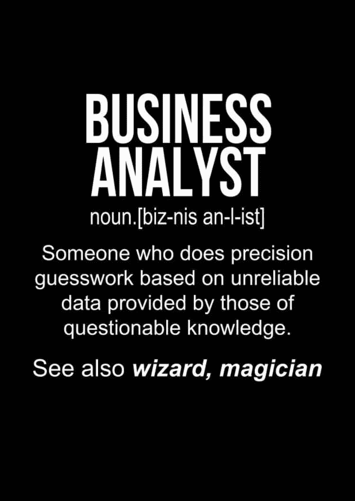

# 商业分析师实习是什么样的？

> 原文：<https://medium.com/nerd-for-tech/the-future-belongs-to-those-who-see-possibilities-before-they-become-obvious-john-scully-b961b770709c?source=collection_archive---------15----------------------->

"未来属于那些在可能性变得显而易见之前就看到它们的人."—约翰·斯考利

作为一名业务分析师实习生，我的职责之一是确保业务和技术团队在各种交付工作流中保持一致。作为两者之间的关键环节，分析师的工作是理解业务需求并将其转化为我们的技术团队，这对于确保我们为客户创造最佳体验至关重要。类似地，我的工作是用非技术团队成员和业务团队可以理解的语言来表达任何技术更新。

要成为一名有效的业务分析师，你需要精通上下文切换。业务分析的职责是了解业务何时需要变更，评估这些变更的业务影响，获取、检查和记录需求，并保持与相关利益相关者的沟通和需求交付。

我的日常工作节奏很快，充满了变化。没有一天是完全一样的。

**每日:**

*   我根据客户需求生成并评估了适当的自动化脚本，并自动化了业务流程。
*   我分析并验证了团队检测到的操作缺陷，以增强准确性。
*   我维护跨部门业务的业务技术流程。
*   我按照数据管理专家的指示，将所有收集到的数据的电子副本保存在一个组织良好的逻辑结构中。
*   我通过使用各种数据库促进数据管理，并就数据存档问题与项目人员和伙伴组织联络。

**每周:**

*   我为所有用户设计了业务案例，并准备了所需的自动化框架。
*   我与技术经理和区域专家合作，识别、组织和归档相关的一手和二手数据。
*   我创建了高级 excel 模型来分析当前的业务健康状况并预测未来的盈利/亏损。

**偶尔:**

*   我开发了复杂的系统来设计自动化网络，以便于利用外部资源创建复杂的产品。
*   我管理所有业务架构的最佳实施，确保客户和合作伙伴都满意。
*   通过评估组织目标、策略、用户项目和结果，我制定并建议了优化业务流程的信息技术策略、政策和程序。

我擅长解决问题，所以我在管理科学协会的商业分析实习非常适合我。我喜欢创造解决方案，考虑风险和商业影响。作为业务和技术团队之间的纽带，我看到了两个非常不同的角色，这让事情变得有趣。

你有分析能力，喜欢寻找更好的做事方法吗？如果你认为答案可能是肯定的，那么业务分析师的角色可能是你的一个好选择。暑期 BA 实习生是尝试这份职业的好方法，看看它是否适合你。