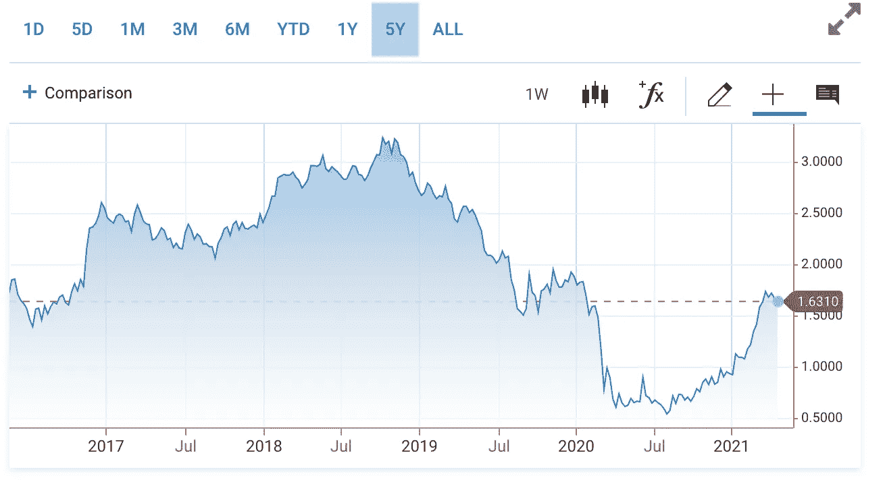

# 未来是多种货币

> 原文：<https://medium.com/nerd-for-tech/the-future-is-multicurrency-40dfbf07ab82?source=collection_archive---------8----------------------->

## 完全依赖一种货币的日子已经结束了

米歇尔·汉德森在 [Unsplash](https://unsplash.com?utm_source=medium&utm_medium=referral) 上的照片

*一如既往，这篇文章是为教育目的而作的。这既不构成财务建议，也不构成交易建议。过去的表现并不代表未来的结果。*

不要投资超过你能承受的损失。这不是财务建议；总是自己做研究:)

几个月前，我开始写[未来是疯狂的](https://jimmy-chang.medium.com/introducing-the-crazy-future-series-cb1701485647)，这是一系列记录我对未来 15-20 年时间框架的预测的文章。

我完全相信未来会比我们想象的更加陌生。

想一想——我父母那一代人，甚至我这一代人成长过程中遵循的规范不再被认为是铁定的。

工作不再是朝九晚五。我们正在做[9–9–6](https://en.wikipedia.org/wiki/996_working_hour_system#:~:text=It%20derives%20its%20name%20from,flagrant%20violation%20of%20Chinese%20law.)或者从事副业或者从事有时间限制的零工经济工作。

约会不再严格意义上的面对面。越来越多的人在网上寻找他们的伴侣——通过像 Tinder(我认为它的“向右滑动”机制改变了整整一代人对约会的看法)和 Hinge 这样的约会应用程序。

在 15-20 年前，我们可能*从未*预测到这样的趋势会发生。

不管怎样，这个系列很遗憾地消失了，但我又重新拾起了对多种货币未来的预测。

想象我向你扔硬币:

*   一个集中的网络，其中一个实体拥有对货币供应的单边控制权
*   看似无限的供给——仅在 2020 年就创造了总供给的 40%
*   自 2009 年以来，这枚硬币已经贬值了 24%
*   一枚你甚至不能持有的硬币——你必须让可信的中介为你保管它
*   自 BTC 诞生以来，其表现远远不如比特币
*   用于洗钱、恐怖融资和其他犯罪活动。事实上，将近 90%的犯罪活动

听起来有点像骗局，不是吗？

我刚刚向你描述了美元。

# **美元霸权**

人们开始意识到美元的故事。

是的，故事。

像任何货币一样，美元的价值来自于对其价值的共同信念——有点像价值的递归循环。

这种信念——被称为小说*智人*中的一个故事——是每个人对美国稳定的信任。主要是对美国政府的货币政策和法律结构的信任，以保留一个繁荣的做生意的地方。

作为一名美国人，我非常清楚美元作为全球储备货币给我个人带来的好处——这是近一个世纪前在[布雷顿森林会议](https://en.wikipedia.org/wiki/Bretton_Woods_system)达成的协议。

世界运行于美元之上——美元是一种无风险的价值储存手段，是世界商业分类账的记账单位，也是全球商业的交易媒介。

从全球商人到主权国家，每个人都想持有美元。

总部位于美国的公司之所以是世界上最大的，是有原因的:世界资本进入美国作为避风港，像机构投资办公室和风险投资公司这样的公司可以部署这些资本——美国的公司。

每个人都想持有被世界认为“无风险”的美国债务。

没有坏处。

在撰写本文时，10 年期美国国债的收益率目前为 1.631%。

想想吧。如果我是美国，我可以向你借 100 美元，我保证在接下来的十年里每年还你 1.63 美元。

10 年期国债收益率。来源:[美国消费者新闻与商业频道](https://www.cnbc.com/quotes/US10Y)

随着美联储公开希望将通胀率提高到 2%或以上，他们本质上是“通过通胀消除债务”——现在免费获得资金，未来支付更少。

欧盟以无风险利率购买美国债务，作为回报，以更高的利率从其公民那里筹集债务。积累和发行更多债务的良性循环。

# **变化来了**

美元霸权会随着中国经济的崛起而衰落吗？

虽然中国仍然不可思议地做多美元(是美国债务的第二大外国持有者，持有超过 1 万亿美元)，但中国仍在积极寻求美国从全球商业中脱媒。

首先，通过他们的“一带一路”倡议，非洲国家承担了以人民币计价的债务；其次，通过成为世界制造中心，并要求用人民币进行贸易。

当我问我在银行业工作了 30 多年的父亲，人民币是否会取代美元成为全球储备货币时，他说不会，因为“这是中国与世界的对抗”——世界资金进入美国作为避险资产，而中国独自努力捍卫人民币。

世界在美元的支持下团结起来，根据美元提高地方法定债务，有时甚至将他们的货币与美元挂钩。

去中介化将是艰难的。

如果不是人民币，美元会受到挑战吗？

回到我父亲的说法，我问自己，“有什么比美元更全球化？”

什么是超越政府政权的力量、超越民族国家的界限把人们团结起来的国际运动？

当然是互联网。

而什么是互联网原生版的钱？

密码。

仔细想想这个。

作为一个考虑健全货币政策的外国国家，与其受制于美联储的控制，而后者有权任意操纵货币供应，并有法律义务保护美国经济(而非全球经济)，为什么不受制于一种无人能控制的货币？

即比特币

想象一下这样一个世界，人们可以选择自己的价值储存方式，而不会受制于中央银行的陷阱。

想象一下那些央行破产的国家的生活会变得更好:委内瑞拉、土耳其和黎巴嫩。

土耳其里拉对美元的汇率随着时间的推移。来源:谷歌

甚至公司也开始意识到持有 BTC 国债的想法——纯粹是为了对冲美元或其他法定货币的通胀风险。

而这不仅仅是一个盲目鼓吹持有比特币的帖子。

世界人民可以从持有其他国家的货币作为对冲或交换媒介中获得巨大利益。

如果厄立特里亚的承包商要求以厄立特里亚纳夫卡支付工资，他们在全球互联网就业市场(例如，设计或软件工程等数字工作)的就业机会就会少得多。

然而，如果他们能以另一个国家的法定货币支付，比如 USDC 或特拉克罗，将会有更多的雇主对此感兴趣。

*注意:重要的是，这是无需许可的稳定币，而不是“真正的”菲亚特，因为通过银行获得“真正的菲亚特”比通过交易所兑换成当地菲亚特的稳定币成本更高*

蒙古的商人也是如此——他们将从“主要货币”中获得更多的利息和流动性。

因此，其他较小国家的公民可以参与日益紧密相连的全球经济。他们能够用另一个国家的风险调整投资组合来对冲本国的货币政策。

所有小人物的胜利——只是美联储没有:)

如果你认为这篇博文值得你花 5 分钟来阅读，请在下面鼓掌(最多 50 次)或者与一个会从这篇内容中受益的朋友分享。我讨厌乞讨，但我失业了，正在努力挣钱吃饭 🥺 *非常感谢！*