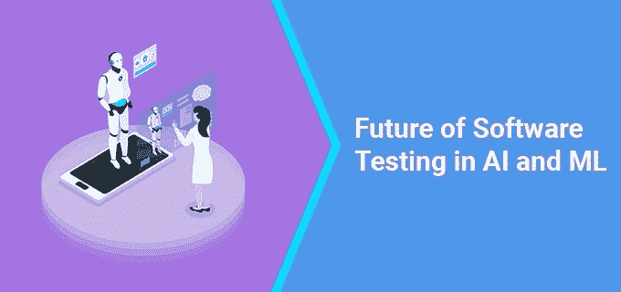

# 从人工智能和 ML 的角度看软件测试的未来

> 原文：<https://medium.com/nerd-for-tech/the-future-of-software-testing-in-terms-of-ai-and-ml-df5f88b79de5?source=collection_archive---------6----------------------->

## **目录:**

**1。** [**简介**](#43b8)

**2。**[**AI 和 ML 的软件测试前景如何**](#8ea7)

2.1 [更快、更轻松的测试](#a5d7)

2.2 [一致性测试](#1920)

2.3 [多层测试](#cde6)

2.4 [连续测试](#5cc1)

2.5 [更高的检测灵敏度](#8cfa)

**3。**[**AI 和机器学习在软件测试中的影响**](#6dff)

**4。**[**2021 年软件测试自动化中的 AI**](#158a)

**5。** [**基于人工智能的自动化测试系统**](#3725)

5.1 [申请](#87e5)

5.2 [应用工具](#df43)

5.3 [测试西格玛](#62e6)

5.4 [茄子艾](#5871)

5.5 [Test.ai](#f24e)

**6。** [**手工测试到此结束了吗？**](#d3c0)

**7。** [**最终想法**](#ed97)

# **简介**

人工智能是软件开发行业的时髦词。实现 [AI 和基于 ML 的应用](https://www.ubuntupit.com/best-machine-learning-applications-in-real-world/)在我们的日常生活中逐渐增多。无人机、智能汽车、智能手机是我们日常生活中使用的基于人工智能的应用程序的一些例子。智能手机是我们生活中必不可少的一部分。

毫无疑问，人工智能和机器学习正在改变商业运营，并帮助他们在长期内毫不费力地执行复杂的任务。许多组织采用人工智能和 ML 等现代技术，并开始考虑新领域如何受到该技术的影响。这可能涉及多个行业，包括客户服务和制造业。一旦你的企业开始很好地运用人工智能和人工智能技术，企业将获得新的知识，这将有助于他们适应不断发展的需求。

在这篇博客中，我们将从人工智能和人工智能的角度讨论软件测试的未来，以及人工智能和人工智能在软件开发中的影响。所以事不宜迟，让我们开始吧！

# **AL 和 ML 软件测试的未来**

现在，让我们快速浏览一下软件测试——软件开发服务中最重要的[组件之一，它使您的产品按照要求顺利运行，在某些情况下，它是一种在产品完成之前的整个开发生命周期中起着至关重要作用的方法。](https://www.tatvasoft.com/software-development-services/software-development-services)

人工智能和人工智能的趋势技术继续渗透我们的世界，验证这些系统的性能、可用性和安全性变得越来越重要。换句话说，测试对于 AI 来说至关重要。不幸的是，我们还没有看到基于人工智能系统的软件测试的进步。

**以下是人工智能和 ML 对软件测试有用的一些方法:**

## **1。更快更轻松的测试**

传统的测试方法完全依赖于人的努力，它是一种干预，由一组专门的开发人员和测试人员手动运行软件，并消除软件中出现的所有错误。但是在软件测试中实现 ML 技术，你可以自动化测试，而不需要投入时间、精力和人力。

## **2。一致性测试**

对相似的产品进行两次测试，你不确定两次测试的方式完全相同。使用传统的方法进行测试，而人类是出了名的不一致，不能像往常一样测试产品。所以为了克服这个问题，[基于 ML 的算法](https://www.dataquest.io/blog/top-10-machine-learning-algorithms-for-beginners/#:~:text=To%20recap%2C%20we%20have%20covered,%2C%20K%2Dmeans%2C%20PCA.)被一次又一次地在相同的过程中实现，而不用担心与基于 ML 的测试脚本的一致性。

## 3.多层测试

通过使用基于人工智能的应用程序，多层测试是可能的，而不需要用户界面。ML 软件测试系统实现到应用程序日志和产品监控系统日志。

## 4.连续测试

软件测试人员在一段时间内是可用的，如果你计划持续开发软件。基于 ML 的过滤测试系统部署连续测试，并在各种情况下检查您的产品。

## 5.更高的检测灵敏度

新的和现代的基于 ML 的验证工具有能力发现 UI 异常，而正常人的眼睛不能识别这些异常。

# **AI 和机器学习对软件测试有什么影响？**

AL 和 ML 测试框架可以很容易地识别危险，通过定期更新算法，发现软件中出现的微小错误变得可行。我们以人工智能和人工智能在过去的能力以及它的未来而闻名。特别是软件行业，在未来几年迟早会看到巨大的变化。

与 AI 和 ML 相关的技术训练有素，可以毫不费力地处理大量数据，并在没有人类支持的情况下评估测试。这只有通过人工神经网络和来自外部资源(如网络)的深度学习才有可能实现。

所有的软件测试人员和开发人员都不是来和 AL 和 ML 竞争的；他们在这里实现和增强基于人工智能和人工智能的工具。所以，在我看来，人工智能和人工智能的现代技术将在未来拓宽商业机会。组织希望以更高的速度发布他们的软件，这是令人无法容忍的。这里有一些你可能通过实现 AI 和 ML 在软件测试中看到的变化。

*   提高精确度
*   扩大测试的整体范围
*   提高软件质量
*   加快周转
*   增加测试的总长度

# **2021 年软件测试自动化中的人工智能**

由于新冠肺炎疫情，许多组织在 2020 年已经实现了 100%数字化，软件测试正在采取各种措施，从人工智能到机器学习，它随着技术格局的变化而不断前进。人工智能在软件测试自动化中非常重要，每个商业企业都需要在未来几年保持对应用测试游戏的掌控。

以下是 2021 年测试人员应该遵循的最佳测试自动化测试趋势。

*   可访问性测试
*   敏捷术语中的自动化测试
*   基于云的软件开发测试
*   基于云的测试工具
*   性能工程
*   基于人工智能的软件辅助
*   可观察性
*   API 端到端监控
*   所有数据
*   剧作家
*   DevOps 和敏捷的融合
*   区块链测试

# 基于人工智能的测试自动化系统

人工智能的发明是无法回避的事实。无论这些猜测是否属实，我们总是认为人工智能接管完整的测试方程的时机尚未成熟。让我们来看看它们是什么:

## 1.appadvance

Appvance 是一种工具，它使用机器学习对软件测试进行深入评估，并使用认知开发创建应用蓝图模式，并在很短的时间内生成各种测试用例。它还结合了测试设计器方面以及 AJAX 或 DOM 自动捕获。

## 2.Applitools

Applitools 是一个基于人工智能的产品的可视化测试系统，它有助于突出应用程序的可预测布局，并报告在 UI 中发现的区别，以便在几秒钟内执行界面相似性的即时自动化测试。

## 3.测试西格玛

TestSigma 是一种基于人工智能的一致自动化测试算法，它使用自然语言测试方法来编写高质量的自动化测试，并限制不必要的测试故障。测试团队可以继续使用传统的人工测试模型系统，将 AI bot 视为附加值，并减少工作量。

## 4.茄子 AI

茄子 AI 自动化系统借助智能算法贯穿软件始终。它不仅有助于找出小故障并解决它们，而且还提供了测试覆盖率以及结果的可视化图形表示。

## 5.Test.ai

Test.ai 自动化系统有助于识别软件的屏幕和元素，并部署应用程序来驱动测试用例，以及识别需要手动纠正的部分。

# 手动测试到此结束了吗？

在软件开发行业，尤其是对软件测试来说，人工智能是一个里程碑。这在人工测试人员中产生了关于他们工作的不确定性。过去最常用的测试方法之一是由软件测试人员实现的传统测试方法。但问题是，以后还会保持不变，按照同样的流程进行测试吗？答案是，它不会是相同的，将有重大的改进和设计测试策略所需的人工干预。在未来，人工测试和基于人工智能的软件测试将并存。然而，软件开发人员将需要更多的技能来在技术时代生存，他们应该能够识别 ML 是如何工作的。

# 最后的想法

随着 AL 和 ML 的最新趋势，软件测试变得更好。你可以通过从你现有的软件中窃取 ML 代码来进行维护和测试，如果你也在使用基于人工智能的应用，引入人工智能和 ML 会更好。软件开发人员不应该担心普通和无聊的任务，而应该开始关注更好的策略。

使用人工智能和基于 ML 的系统的主要目的是自动化测试，并使其在后端工作。有一些小的风险和安全管理、过程保证、监控关键方面，以及应用程序的文档，以使应用程序按照预测的那样继续发展。因此，在测试方面，人工智能和机器学习将使网络开发人员和公司更有效率，而不是让他们失业。

我们希望读完这篇博客后，你已经对软件测试在 Al 和 ML 方面有了一个清晰的概念。你计划在你的软件中加入基于人工智能和人工智能的算法吗？如果是这样的话，请随意访问下面的评论部分。