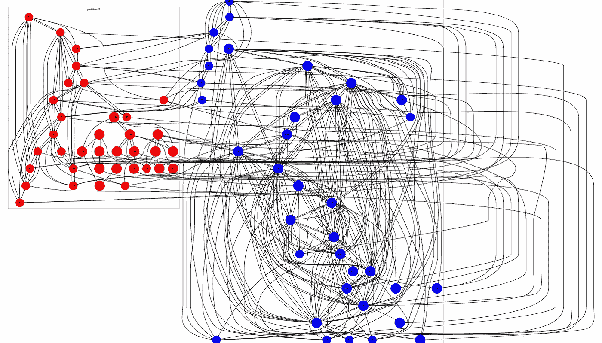

# 连接经济的游戏

> 原文：<https://medium.com/nerd-for-tech/the-game-of-the-connection-economy-ee132234783c?source=collection_archive---------24----------------------->

连接节点图

这个针对 Mbenda 的[动漫搜索引擎可以被更多地用作动漫创作者和制作人的营销工具，如果它也有一个功能，可以让你输入你最喜欢的角色说的句子，lipsynch 系统已经能够做到这一点。那么一个游戏或动漫角色，如果动漫或游戏迷不能轻松地使其扮演粉丝想要的角色，那么这个角色就像我们一样被设计成在墓地中结束。](/predict/animes-search-engine-for-mbenda-8aeba1527933)

Bits 的机会在于，它允许我们创建灵活和动态的对象，就像博客文章和 youtube 视频等动漫和游戏角色已经拥有的一样。这就是为什么个性化总是数字创造者和企业家的目标，但个性化不同于标准化，标准化是企业家基于持续创新经营企业的目标。

但是颠覆性的数字创业公司一旦找到了让他们获得大量用户群的动力，就会迅速上市以获得更多资金，并采用大公司试图有机增长或收购的思维模式，忘记建立这个独立的儿童创业公司，其任务是始终预测和发现新的创意和颠覆性的商业模式，团队保持创业文化，使这家新的大型科技公司获得大量用户群并上市。相反，提出新想法的努力留给了像我一样的其他无资金创业者，同时监督什么是最新的和流行的收购或背后解决方案的内部克隆。每一个社交媒体和通信应用程序都会试图购买俱乐部会所或在内部购买俱乐部会所。

类似 WhatsApp 的应用程序可以利用这个 Mbenda 动漫搜索引擎背后的想法，因为为什么不进一步使用表情符号呢？为什么如果我使用 WhatsApp、telegram 或其他通信应用程序发送这种声音，却没有这个动画甚至是漫画表情符号来充当我，说出我的声音或我的文字信息。是的，如果支持该解决方案的机器学习系统拥有足够多的您录制的语音，那么用消息应用程序发送的书面消息应该能够被您选择的默认语音或您自己的语音阅读。表情符号可以只是你的图像，可以很容易地被动画化。已经有这种技术可以扫描你并生成你的 3D 版本。那为什么花这么多时间创造一个游戏角色，为什么不自己玩呢？因为游戏玩家在游戏中没有被很好的代表，这是我所相信的，而女性的处境更糟糕，这是今天发表的这篇名为[Returnal and Why Games Need More Badass 中年女性](https://www.wired.com/story/returnal-why-games-need-more-badass-middle-aged-women/?utm_medium=social&utm_social-type=owned&mbid=social_twitter&utm_source=twitter&utm_brand=wired)的文章所指出的。

伟大的想法和才华无处不在，但赢家是那些将人们与帮助他们更容易实现目标的想法联系起来的人。要成为赢家，你应该具备同理心。

**PS:** 这是我一年来写的第 501 篇短文，也许是时候停止计算你的粉丝数量，开始建立我现在正在建立的这种连接引擎了，因为我们刚刚处于连接经济的起点，进入这个基于光速的连接经济还为时不晚。

什么是**连接经济**？**关系经济**奖励通过建立关系和培养**关系**创造的价值，而不是资产和“东西”，就像工业经济**一样。**[https://www.payette.com](https://www.payette.com/architecture-forum/the-connection-economy/#:~:text=What%20is%20the%20connection%20economy,%2C%E2%80%9D%20like%20the%20industrial%20economy.)