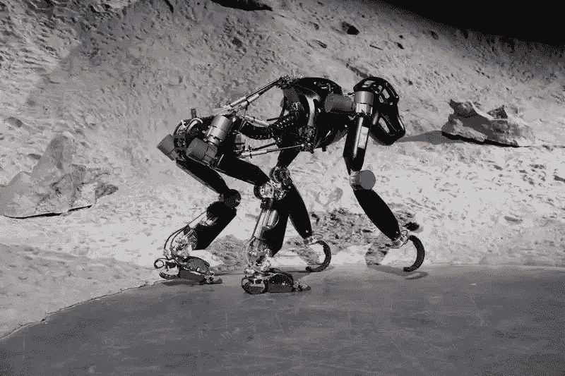

# 全球规模超过 100 亿美元，特种机器人可能成为黄金轨道

> 原文：<https://medium.com/nerd-for-tech/the-global-scale-exceeds-10-billion-usd-and-special-robots-may-become-the-golden-track-723fc345b86?source=collection_archive---------5----------------------->

https://m.elecfans.com/article/293439.html

## **2021 年，资本再次对机器人**投入巨大热情

先看看风投负责人。红杉资本已经连续三次增加对移动机器人公司 Hairou Innovation 的投资，并两次为 Mecamand Machine 注资。此外，源代码资本和婺源资本等知名风投也频繁涉足机器人领域。

## **四年后，机器人为什么会再次吸引大制造商和资本？**

目前，中国的一个重要背景是——人口老龄化、年轻人不愿意去工厂、劳动力成本不断上升以及对产品精细化的要求不断提高……这些问题让工厂意识到自动化解决方案的重要性。因此，我们看到，工业机器人仍然是最受欢迎的轨道从领域司。

根据《中国机器人产业发展报告(2021 年)》，预计今年中国工业机器人的规模将达到 445.7 亿元。

当然，对于每个细分轨迹，场景要求并不相同。例如，在清扫机器人领域，Yuli 创始人仲博曾经说过，在过去几年中，消费者更关心的是清扫机器人是否好。但现在，消费者正在寻找智能和易用性。此外，疫情期间无人操作的需求也推高了许多商业服务机器人的市场，如食品递送和清洁。例如，商用清洁机器人公司高县机器人公司在一年内完成了连续三轮融资。

## **下一站:向特殊环境过渡**

目前，国内工业机器人已广泛应用于国民经济的 47 个行业和 129 个行业在 2021 年世界机器人大会开幕式上，工业和信息化部副部长辛郭斌给出了这样一组信息。

毫无疑问，目前机器人技术的应用范围很广，从手术台、超市、办公楼、酒店和医院到工业物流、工业园区和客厅都有。未来全球机器人的发展趋势是，机器人技术将逐渐从由人类控制和管理的工作环境过渡到更具挑战性的现实生活中的工作环境，这些工作环境将超越人类的控制能力并与自动化联系更加紧密。

中国电子学会发布的《2021 年中国机器人产业发展报告》显示，2016 年以来，全球特种机器人产业年均增长 17.8%。2021 年全球市场规模达到 65.7 亿美元。到 2023 年，将超过 99 亿美元。在中国市场，2021 年特种机器人市场规模将达到 90.7 亿元，预计 2023 年将超过 180 亿元。

## 定制数据集

随着 AI 商业化进程的加快和 AI 技术在各行各业的应用，人们对特殊场景下的数据质量的期望越来越高。高质量的标签数据将是人工智能公司的核心竞争力之一。

如果说之前的算法模型使用的一般数据集是粗粮，那么算法模型目前需要的是定制的营养餐。如果公司想要进一步提高某些模型的商业化，他们必须逐步从通用数据集向前发展，以创建独特的数据集。

## NLP 服务

我们在电子商务、零售、搜索引擎、社交媒体等领域提供不同类型的自然语言处理。我们的服务包括语音分类、情感分析、文本识别和文本分类(聊天机器人相关性)。

ByteBridge 与全球 30 多个不同的语言社区合作，现在提供[数据收集和文本注释服务](https://tinyurl.com/2ew24t2p)，涵盖**英语、中文、西班牙语、韩语、孟加拉语、越南语、印度尼西亚语、土耳其语、阿拉伯语、俄语等语言**。

# 结束

将你的数据标注任务外包给 [ByteBridge](https://tinyurl.com/2ew24t2p) ，你可以更便宜更快的获得高质量的 ML 训练数据集！

*   无需信用卡的免费试用:您可以快速获得样品结果，检查输出，并直接向我们的项目经理反馈。
*   100%人工验证
*   透明和标准定价:[有明确的定价](https://www.bytebridge.io/#/?module=price)(包括人工成本)

为什么不试一试？

资料来源:https://www.robot-china.com/news/202111/30/68654.html