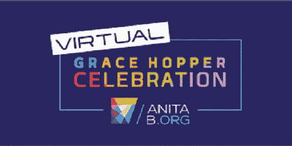

# 格蕾丝·赫柏庆典

> 原文：<https://medium.com/nerd-for-tech/the-grace-hopper-celebration-a35ffea5171a?source=collection_archive---------1----------------------->

## 充分利用 GHC 的分步指南

格蕾丝·赫柏庆典(GHC)是世界上最大的女性技术专家聚会。这是一次难忘的经历，充满了惊人的机会，以及专注于技术的特殊内容。妇女来到网络，学习，并找到社区。

今年(2021 年)它是从 9 月 27 日到 10 月 1 日虚拟举行的(感谢 Covid :/)。这四天可能是我一年中最美好的日子。我被选为 GHC 学者之一，这就更好了。GHC 有很多非常强大、鼓舞人心和赋权的主题会议、研讨会、讨论和招聘会。通过正确的努力，这个会议可以帮助你获得你一直期待的工作！在这篇文章中，我将尝试包括我在 vGHC'21 的经历中学到的东西，以及我希望在参加会议之前知道的一切。

为了更好地解释一切，我将会议分成了四个阶段。所以让我们开始吧！

## 第一阶段:申请奖学金

成为 GHC 学者有很多好处。所以任何想参加庆典的人都应该努力成为其中一员。奖学金申请截止日期因你申请的 GHC 类型而异(如 GHCI 美国、GHCI、GHC-EMEA)，所以你必须留意日期。

申请有很多问题，所以确保你有适当的时间来完成申请。它也有一些论文类型的问题需要回答。确保答案是你自己的，并反映出你在科技领域赋予女性权力的动机。它还需要你的大学教授的推荐。

## 第二阶段:会议筹备工作

有两种可能的情况:
1-你成为了一名学者并得到了门票
2-你买了门票。现在是开始为会议做准备的时候了。

***简历库:***

庆典前几个月，你会收到通知，说简历数据库开放投简历。这可能是会议最重要的部分之一。大约有 300 名赞助者参加了会议，他们将在评估他们的简历后与与会者取得联系。因此，请确保尽快提交更新后的简历。越早越好。(怎么强调都不为过)这一步非常重要，尤其是在面对面的会议中，因为公司会在评估简历后发出参加研讨会、面试和聚会的邀请。

***与招聘人员取得联系:***

公司将开始发送有关他们提供的职位、他们在活动前和活动期间的研讨会的信息。确保你报名参加这些活动，并对这些公司表现出兴趣。此外，在 LinkedIn 上与参加 GHC 的招聘人员取得联系(这对面试很有帮助！).

此外，确保遵循#ghc #vghc #ghc'21 这样的标签，因为所有在 LinkedIn 上发布空缺职位的招聘人员都会使用这些标签之一。这将有助于你保持更新，不会错过任何机会。

## 第三阶段:会议期间

会议充满了主题演讲、小组讨论工作坊和海报制作等有趣的活动。你可以在活动前查看一下议程，如果有座位限制的话，给自己预定一个座位。除此之外，还有一个所有与会者都期待的重大事件——***招聘会！！*** GHC 为与会者提供了数百家公司，2000 多个职位空缺，都在等待招募有才华的参与者。它主要由两部分组成- 1:1 会议和赞助商展位。

充分利用职业公平的 101 招:

*   尝试与你想面试的公司进行一对一的会谈。这些会议让你与招聘人员直接接触，并能帮助你给招聘人员留下好印象。
*   准备一次电梯推销，向招聘人员“推销”你自己，因为有些公司只提供 10 分钟的时间，你会想给人留下最好的印象。
*   一对一会议的名额很快就被预定了。所以，确保你在预订开始时就开始预订，以获得尽可能多的公司。
*   参观赞助商展位，与无法参加一对一会议的公司代表交谈。你可能要在这里排队，所以耐心点。
*   大多数公司都会提供一个单独的链接，让参观他们展位的人提交简历或申请空缺职位，所以要留意这些。
*   不仅如此，公司还向参观他们展位的人提供免费的好东西！！！确保你也收到了。我从 Citadel 和 Roblox 那里得到了好东西(耶！！)
*   招聘会也是建立关系网的最佳机会之一。确保你获得了尽可能多的招聘人员的 LinkedIn 详细信息。这在会后会有很大帮助。

那么，当你忙于接受面试和与招聘人员交谈时，不要忘记享受庆祝活动，因为 GHC 更像是一次经历而不是一次会议。确保参加你感兴趣的主题的研讨会，并参加主题演讲。相信我，你不会后悔的！

## 第四阶段:会议结束后

好了，现在你已经参加了会议，在 DJ 之夜玩得很开心，并且还在理解过去的四天，我们继续我们 GHC 之旅的最后一部分。这个阶段在决定你是否真正利用了会议提供的机会方面起着至关重要的作用。

人们需要记住以下几点:

*   向招聘人员发送个性化的 LinkedIn 连接请求，亲自与他们取得联系。
*   与 GHC 的学者们联系，因为正如我所说，GHC 是最好的交流机会，可以帮助你与世界各地的人联系。
*   会后至少一个月，公司会对你提交的申请或你在会上接受的面试发送跟进邮件。确保积极主动地回应这些信息。
*   还有，继续学习。你永远不知道你梦想中的公司什么时候会联系你。所以你可能要为此做好准备。

记住所有这些要点，我相信每个与会者都将能够充分利用这个大好机会。

感谢您的阅读！我希望这篇文章能帮助你更好地准备参加下一届 GHC。万事如意！你可以在 [LinkedIn](https://www.linkedin.com/in/bhavini-singh-0420561b5/) 上找到我。

如果你喜欢这篇文章，点击拍手按钮，让我知道你是否已经计划参加 2022 年格蕾丝·赫柏庆典！