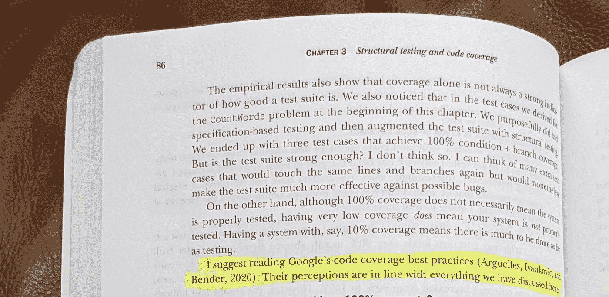
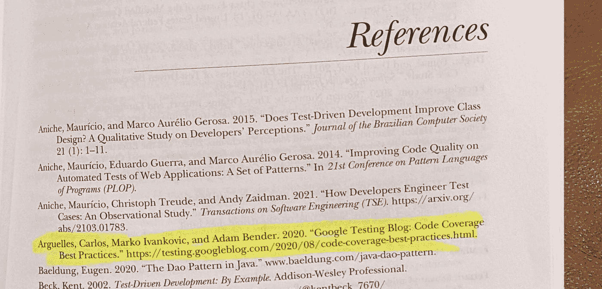

# 伟大的代码覆盖了 21 世纪的圣战

> 原文：<https://medium.com/nerd-for-tech/the-great-code-coverage-holy-wars-of-the-21st-century-6fb11e7acce4?source=collection_archive---------0----------------------->

## 25 年来在微软、亚马逊和谷歌测试软件的经验教训

回到亚马逊(我 2009-2020 年在那里工作)，偶尔，一个可怜的不知情的灵魂会在一个大型内部讨论组*中提到可怕的词语*代码覆盖率*。*每一次，这两个看似无辜的词都会引发一场圣战，激情迸发，堪比“vi 对 emacs”不管最初的评论是*支持*报道还是*反对*报道。接下来的 [centithread](https://www.urbandictionary.com/define.php?term=centithread) 会被许多通常无用的教条式电子邮件攻击。

自从 2012 年[我创建了一个全公司范围的工具，帮助亚马逊在测量覆盖率方面更加自律以来，我一直是代码覆盖率领域的代言人。这个工具开始改变一些围绕单元测试和代码覆盖的文化，所以它被杰夫·贝索斯本人授予了一个 Just Do It 奖。然后，在亚马逊的最后六年，我是 Builder Tools 的首席工程师，该组织拥有所有公司内部的工程生产力工具。其中一个用代码覆盖信息扩充了代码审查工具，这样当您审查您的同行的代码变更时，您可以看到被覆盖的行。在拥有工具和驱动文化的这段时间里，我已经看到了代码覆盖的好、坏和丑陋。](https://carloarg02.medium.com/16a5818a57a5)

因此，有一段时间，我试图在小组讨论中调解一些强烈的意见，并将谈话从学术转向更务实、可操作的话题。最终，我意识到我在一遍又一遍地说着同样的话。我开始记录这些谈话要点。他们通常试图弥合两个阵营之间的分歧:承认反对覆盖人群的一些担忧是合理的，但为支持覆盖人群提供一些实用、有用的方法。

大约两年前，我离开了亚马逊，加入了谷歌。在我第一次与我的主管一对一的谈话中，我描述了这些谈话要点。她笑着说，“我们在这里有相同的论点，你应该在白皮书中写下你的想法。事实上，你甚至可以在我们的外部博客上发布它！”我知道所有的谷歌测试博客，因为我已经关注它十年了。我很兴奋，因为现在我在这里工作，我有机会在这里发表我的想法，因为它被业内成千上万的工程师阅读。

所以我记下了我的观点，并在谷歌内部广泛分享了这份白皮书。不出所料，我收到了大量的反馈，有些有用，有些没用。起初，我对这些评论有点不知所措，不确定我能不能调和足够多的评论来发表它并获得广泛的支持。

还有另外两位高级工程师(Adam 和 Marko)对文档提出了一大堆意见。我们三个在很多细节上有分歧，但我可以看到有共同点的空间，因为我们有很多共同的基本观点和期望的结果。我是谷歌的新员工，在疫情偏远而孤独地工作，很高兴见到谷歌员工，所以我安排了 1:1 的时间和他们聊评论。显然，他们有着同样的热情，他们聪明又博学，他们像我一样对这个空间进行了长时间的深入思考。

这让我想到了今天我博客中的一个要点。虽然*写一个关于写博客的博客*看起来很傻，但我确实认为这个“制作”的故事有一些可取之处。所以开始了。我坚信，如果你想创造一个更好的*任何东西*(白皮书、代码、设计、政策……)**你需要寻求*不同的*意见**，因为【a】它迫使你更好地阐述你的观点，并且【b】有时这些不同的意见最终会改变你自己的观点。另一方面，你会一次又一次地看到糟糕的政客身边围满了应声虫，因为那样生活会更轻松。但是伟大的人身边都是挑战他们的人。

因此，尽管我对处理我收到的所有评论的前景感到不知所措，但我知道，如果我选择寻求异议和推动共识这条更艰难的道路，我最终会得到一篇更强有力的文章。亚当、马尔科和我继续会面了几个星期，并继续通过电子邮件和谷歌文档交换意见。他们慷慨地贡献了他们的时间，在这个过程中，我们成为了朋友，我们变得互相信任，互相学习。最终的文档是我们合作的结果，而不是我最初的个人工作，所以我想让他们成为我的合著者。我们在 2020 年 8 月发表了它。

我以为我的故事到此为止了，但是我最近才知道 Mauricio Aniche 的书[有效的软件测试:开发者指南](https://www.amazon.com/Effective-Software-Testing-developers-guide/dp/1633439933)
中提到了这个博客。顺便说一下，这是一本很棒的书，我真的很高兴看到我的名字在一本留给后代的书中被提及！

事不宜迟，以下是白皮书的全部荣耀:

> **代码覆盖最佳实践**
> 
> **最初发表于 2020 年 8 月 7 日星期五** [**谷歌测试博客**](https://testing.googleblog.com/2020/08/code-coverage-best-practices.html)
> 
> **由** [**卡洛斯**](https://www.linkedin.com/in/carlos-arguelles-6352392/)**[**马尔科**](https://www.linkedin.com/in/ivankovicmarko) **和** [**亚当**](https://www.linkedin.com/in/theadambender/)**
> 
> **我们花了几十年的时间在各种非常大的软件公司中推动软件测试计划。我们一直提倡的一个领域是使用代码覆盖数据来评估风险和识别测试中的差距。然而，代码覆盖率的价值是一个有强烈意见的高度争论的话题，也是一个令人惊讶的两极分化的话题。每当在任何一大群人中提到代码覆盖率时，似乎无休止的争论就会接踵而至。当人们安全地躲在各自的营地里时，这些往往会使谈话偏离任何有成效的进展。这篇文档的目的是给你一些工具来引导不同领域的人找到共同点，这样你就可以向前迈进，并且务实地使用覆盖信息。我们提出了代码覆盖领域的最佳实践，以有效地处理代码健康。**
> 
> **代码覆盖为开发人员的工作流程提供了显著的好处。这并不是测试质量的完美衡量标准，但它确实提供了一个合理、客观、符合行业标准的衡量标准和可操作的数据。它不需要大量的人工交互，它普遍适用于所有产品，并且业界有大量工具可用于大多数语言。你必须理解，这是一个有损的间接指标，将大量信息压缩成一个数字，因此它不应该是你唯一的真实来源。相反，将它与其他技术结合使用，以创建对您的测试工作的更全面的评估。**
> 
> **单独的代码覆盖率是否会减少缺陷，这是一个开放的研究问题，但是我们的经验表明，增加代码覆盖率的努力通常会导致工程优秀文化的改变，从长远来看，这将减少缺陷。例如，给予代码覆盖优先权的团队倾向于将测试视为头等公民，并且倾向于将更强的可测试性融入到他们的产品设计中，这样他们就可以用更少的努力实现他们的测试目标。所有这些反过来导致编写更高质量的代码(更模块化，API 中更干净的契约，更易管理的代码审查，等等)。).他们也开始更加关心自己的整体健康状况，以及工程和运营方面的卓越表现。**
> 
> ****高代码覆盖率并不能保证高质量的测试覆盖率。**专注于让数字尽可能接近 100%会导致一种虚假的安全感。这也可能是一种浪费，燃烧机器周期，并从现在需要维护的低价值测试中产生技术债务。由于遗漏的测试而将坏代码推向生产的情况可能发生，因为(a)您的测试没有覆盖特定的代码路径，这是一个很容易通过代码覆盖分析识别的测试缺口，或者(b)因为您的测试没有覆盖一个有代码覆盖的区域中的特定边缘情况，这是代码覆盖分析难以或不可能捕捉的。代码覆盖并不保证被覆盖的行或分支已经被正确测试*，它只是保证它们已经被测试执行。注意复制/粘贴测试仅仅是为了增加覆盖率，或者添加没有什么实际价值的测试，以符合数字。一个更好的技术是[突变](https://research.google/pubs/pub46584/)测试，用来评估你是否充分运用了你的测试所覆盖的行，以及是否充分断言了失败。***
> 
> *****但是低代码覆盖率确实保证了产品的大部分区域在每一次部署中完全没有经过自动化测试**。这增加了我们将坏代码推向生产的风险，因此应该引起注意。*事实上，代码覆盖数据的很多价值并不是强调覆盖了什么，而是强调了没有覆盖什么。****
> 
> ***没有放之四海而皆准的“理想代码覆盖率”。您想要/需要的一组代码的测试级别应该是以下各项的函数:( a)代码的业务影响/关键程度；(b)您需要触摸/更改代码的频率；您期望代码生存多长时间，它的复杂性，以及域变量。我们不能要求每个团队都有 x%的代码覆盖率；这是一个商业决策，最好由拥有特定领域知识的产品所有者做出。任何达到 x%代码覆盖率的要求都应该伴随着基础设施投资，以使测试变得容易，例如将工具集成到开发人员的工作流程中。请注意，工程师可能会开始像对待复选框一样对待您的目标，并避免增加超出目标的覆盖范围，即使这样做是谨慎的。***
> 
> *****一般来说很多产品的代码覆盖率都低于这个栏；我们应该致力于全面显著地提高代码覆盖率。**尽管没有“理想的代码覆盖率”，但在 Google，我们提供了 60%为“可接受”，75%为“值得称赞”，90%为“模范”的一般指导方针然而，我们喜欢远离广泛的自上而下的命令，并鼓励每个团队选择对他们的业务需求有意义的价值。***
> 
> *****我们不应该纠结于如何从 90%的代码覆盖率达到 95%。**增加代码覆盖率超过某一点的收益是对数的。但是我们应该采取具体的步骤来达到 30%到 70%,并始终确保新代码满足我们期望的阈值。***
> 
> *****比被覆盖的行的百分比更重要的是人类对没有被覆盖的实际代码行(和行为)的判断**(分析测试中的差距)以及这种风险是否可接受。没被覆盖的比被覆盖的更有意义。在代码评审过程中对未覆盖的特定代码行进行务实的讨论，比对任意目标数字进行过度索引更有价值。我们已经发现，将代码覆盖率嵌入到您的代码审查过程中会使代码审查更快更容易。并非所有代码都同样重要，例如测试调试日志行通常不那么重要，所以当开发人员不仅可以看到覆盖率数字，还可以看到作为代码审查的一部分而突出显示的每个覆盖行时，他们将确保覆盖最重要的代码。***
> 
> ***仅仅因为你的产品代码覆盖率低并不意味着你不能采取具体的、渐进的步骤来改进它。继承一个测试和可测试性都很差的遗留系统是令人畏惧的，你可能觉得没有能力扭转它，甚至不知道从哪里开始。但至少，你可以采纳“童子军规则”(让露营地比你发现时更干净)。随着时间的推移，逐渐地，你会到达一个健康的位置。***
> 
> *****确保覆盖频繁变化的代码。**虽然高于 90%的项目范围目标很可能是不值得的，但是 99%的每次提交覆盖率目标是合理的，90%是一个较低的阈值。我们需要确保我们的测试不会随着时间变得越来越差。***
> 
> *****单元测试代码覆盖率只是拼图的一部分。**集成/系统测试代码覆盖率也很重要。并且您的管道中所有来源(单元和集成)的覆盖范围的聚合视图是最重要的，因为它让您更全面地了解当您的代码在您的管道中进入生产环境时，有多少代码没有被您的测试自动化执行。您应该知道的一件事是，虽然单元测试在执行和评估的代码之间有很高的相关性，但是集成测试和端到端测试的一些覆盖范围是偶然的，不是有意的。但是合并来自集成测试的代码覆盖可以帮助您避免这样的情况:您有一种错误的安全感，即使您没有在单元测试中覆盖代码，您也认为您在集成测试中覆盖了它。***
> 
> ***我们应该阻止不符合代码覆盖标准的部署。团队应该讨论并决定哪种门控机制对他们有意义。但是，你应该小心，不要把它变成一个必须填写的复选框，因为它可能会适得其反(达到指标的压力几乎永远不会产生预期的结果)。有许多可用的机制:针对所有代码的覆盖的入口与仅针对新代码的覆盖的入口；选择一个特定的硬编码代码覆盖率，而不是从以前的版本开始，忽略或关注代码的特定部分。然后，作为一个团队致力于维护这些。代码覆盖率的下降违反了应该阻止代码被检入和进入生产。***

*** [## 代码覆盖率最佳实践

### Carlos Arguelles，Marko Ivankovi 和 Adam Bender 我们已经花了几十年的时间来推动软件测试……

testing.googleblog.com](https://testing.googleblog.com/2020/08/code-coverage-best-practices.html)***