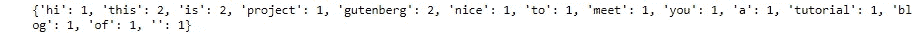
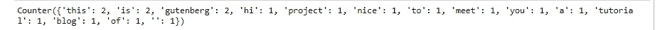
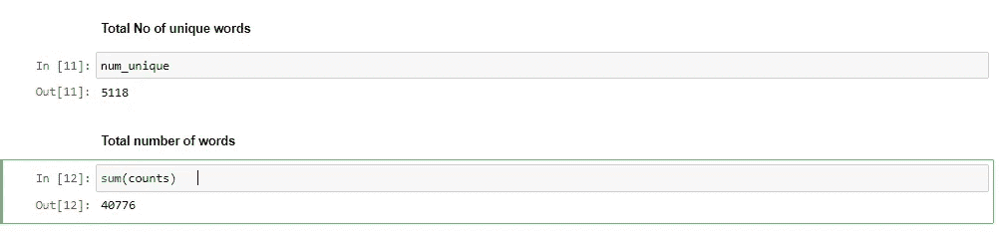
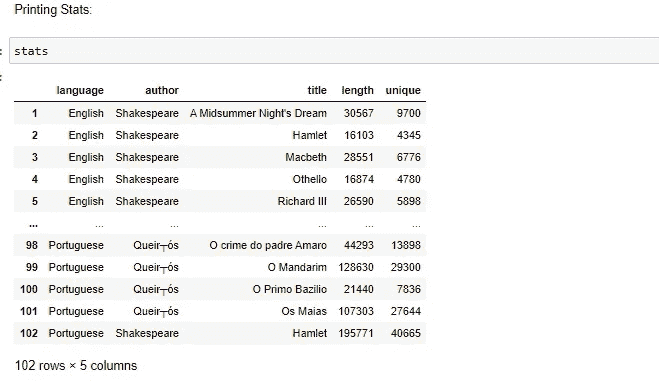
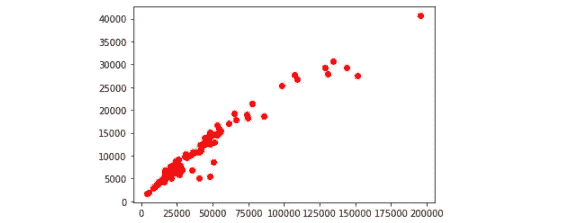
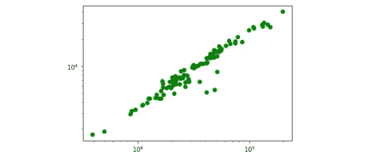
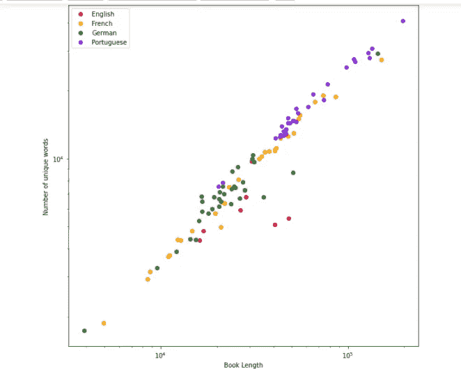

# 古腾堡计划:自然语言处理

> 原文：<https://medium.com/nerd-for-tech/the-gutenberg-project-natural-language-processing-1fc77616b298?source=collection_archive---------8----------------------->

## 自然语言处理初学者完全指南古腾堡项目


图像参考:[去飞溅](https://unsplash.com/photos/hhZEaVS5QMo)

# 关于古登堡计划:

> 古登堡计划是一项将文化作品数字化和存档的志愿者工作，旨在“鼓励电子书的创作和发行”。它由美国作家迈克尔·s·哈特于 1971 年创建，是最古老的数字图书馆。其收藏的大部分物品都是公共领域书籍的全文。
> 
> 这里有 6 万多本书。
> 
> 项目链接:【https://www.gutenberg.org/ 

# 我们的任务:

> 所有作者或语言的书面文本中的模式并不相同。这使得语言学家可以研究语言的起源或文本的潜在作者，而这些特征并不直接为人所知，如美国革命的联邦党人文件
> 
> 在这个博客中，我们将研究来自不同作者和不同语言的图书集中的单本书的属性。更具体地说，我们将研究书的长度，一些独特的单词，以及这些属性是如何通过语言或作者而聚集在一起的。

***我们开始吧:)***

## 定义字数:计算句子中的字数

```
text = "Hi, welcome to the project Gutenberg."
```

让我们定义一个函数来计算一个句子中的单词。

```
def count_words(text):
    """Count the number of times each word occurs in text. Show number count in dictionary.Skip punctuation.Lower case""" 
    #adding docstring to functionword_counts = {}

    for word in text.split(" "):          #splitted the words with blanks and do a loop over loop
        if word in word_counts:
            word_counts[word] += 1
        else:
            word_counts[word] = 1
    return word_countsprint(count_words(text))
```


输出:作者的图像

## 解决问题

看字典，我们目前的程序的一个明显的缺点是它包括像句号或句号这样的标点符号，它不认为大写是单词的一部分。这将导致字数的膨胀。

为了解决这些问题，我们首先要把文本变成小写。

处理标点符号有点复杂。我们的策略是首先指定我们想要跳过的所有标点符号，然后遍历该容器并用空字符串替换每个标点符号。

```
text = "Hi, this is Project Gutenberg. Nice to meet you. This is a tutorial blog of Gutenberg. "def count_words(text):
    """Count the number of times each word occurs in text. Show number count in dictionary.Skip punctuation.Lower case"""  #adding docstring to function
    text = text.lower()
    skips = [".",",", ":", ";","'",'"']      #fixing the problem
    for ch in skips:
        text = text.replace(ch,"")word_counts = {}
    for word in text.split(" "):          #splitted the words with blanks and do a loop over loop
        if word in word_counts:
            word_counts[word] += 1
        else:
            word_counts[word] = 1
    return word_countsprint(count_words(text))
```



输出:作者的图像

能够像我们刚刚做的那样编写自己的计数例程是很有用的。

然而，计算对象的频率是一个非常常见的操作，Python 提供了一个所谓的计数器工具来支持兔子计数。我们首先需要从 collections 模块导入它，该模块提供了许多额外的高性能数据类型。

## 更新快速代码:使用计数器功能

```
from collections import Counterdef count_words_fast(text):
    """Count the number of times each word occurs in text. Show number count in dictionary.Skip punctuation.Lower case"""  #adding docstring to function
    text = text.lower()
    skips = [".",",", ":", ";","'",'"']
    for ch in skips:
        text = text.replace(ch,"")word_counts = Counter(text.split(" "))
    return word_countsprint(count_words_fast(text))
```



输出:作者的图像

```
count_words_fast(text) == count_words(text)   #True but now faster
```

输出:真

count_words_fast(text)等于 count_words(text ),但现在要快得多

## 阅读整本书

> *字符编码是指计算机如何对某些字符进行编码的过程。在这种情况下，我们将使用所谓的 UTF-8 编码，这是网络的主导字符编码。*

你可以从古腾堡计划网站下载任何一本书。在这篇博客中，我特别提到了莎士比亚的书。

也可以从这里下载我参考的书:[https://github . com/shelvi 31/Project-Gutenberg-Language-Processing](https://github.com/shelvi31/Project-Gutenberg-Language-Processing)

```
def read_book(title_path): 
    """Read a book and return it as a string""" 
    with open(title_path,"r",encoding = "utf8") as current_file:            
        text = current_file.read() 
        text = text.replace("\n","").replace("\r","") 
    return text
```

输入从古腾堡网站下载的 utf8 文件的位置

```
text1 = read_book(r"C:\Users\Shelvi Garg\Desktop\Code\data-science\BooksPython\English\shakespeare\Romeo and Juliet.txt") 
print(len(text1))
```

输出:169275

使用查找方法:我正在寻找我知道在我的书里存在的几个单词

```
ind = text1.find("in a name")        
print(ind) 
sample_text1 = text1[ind : ind +1000] 
sample_text1
```


输出:作者的图像

# 计算词频统计

我们想知道在给定的书中有多少独特的单词。我们还想返回每个单词的频率。

```
def word_stats(word_counts):
    """ return number of unique words and word frequencies"""
    num_unique = len(word_counts)
    counts = word_counts.values()
    return (num_unique,counts)
text1 = read_book(r"C:\Users\Shelvi Garg\Desktop\Code\data-science\BooksPython\English\shakespeare\Romeo and Juliet.txt")
word_counts = count_words(text1)
(num_unique,counts) = word_stats(word_counts)
```



作者图片

# 同时阅读多个书籍文件

```
import os
book_dir = (r"C:\Users\Shelvi Garg\Desktop\Code\data-science\BooksPython")os.listdir(book_dir)
```

输出:['英语'，'法语'，'德语'，'葡萄牙语']

我有 4 个文件夹，每个文件夹都有不同语言的书籍，即“英语”、“法语”、“德语”、“葡萄牙语”

我们首先想要生成一个包含在我们的“BooksPython 目录”中的目录列表。由于这些目录将对应不同的语言，我将调用循环变量 language

它读取了我的 BooksPython 目录下的 4 个子文件夹中的所有书籍。

# 读取多个文件

## 在我们的代码中使用 Pandas 数据框架:

我们首先要生成一个包含在“Books”目录中的目录列表，因为这些目录对应不同的语言，我们将调用循环变量 language。我们将:

*   学习如何浏览文件目录并一次读入多个文件/书籍
*   简单使用 pandas，它为 Python 提供了额外的数据结构和数据分析功能

```
import pandas as pd 
stats = pd.DataFrame( columns = ("language", "author","title", "length","unique"))   #table with these 5 coloumns 
title_num = 1  
for language in os.listdir(book_dir): 
    for author in os.listdir(book_dir + "/" + language):**# we need to add the new directory that we're currently in which is the language. We can do this by concatenating strings.**for title in os.listdir(book_dir + "/" + language + "/" + author):**#our first for loop is looping over languages.The second for loop is looping over authors.And the third, the innermost for loop, is loopingover different titles, different books.**

            input_file = book_dir + "/" + language + "/" + author + "/" + title 
            text = read_book(input_file) 
            stats.loc[title_num] = language , author.capitalize() , title.replace(".txt","") , sum(counts) , num_unique 
            title_num += 1 
            (num_unique, counts) = word_stats(count_words(text))
```



作者图片

## 绘制我们的统计数据

我们可以很容易地从 pandas 表中提取特定的列，使用我们给这些列指定的名称。

```
import matplotlib.pyplot as plt
plt.plot(stats.length, stats.unique, "ro")
plt.show();
plt.savefig("gutenberg1.pdf")
```



输出:作者的图像

## 使用 matplotlib 的日志记录:

```
plt.loglog(stats.length, stats.unique, "go")
*plt.show()
plt.savefig("gutenberg2.pdf")*
```

输出:



作者图片

# 根据书本语言绘制

## 让我们为不同的语言使用不同的颜色来构建一个情节。

```
plt.figure(figsize = (10,10))
subset = stats[stats.language == "English"]
plt.loglog(subset.length,subset.unique,"o",label = "English",color = "crimson")
subset = stats[stats.language == "French"]
plt.loglog(subset.length,subset.unique,"o",label = "French",color = "orange")
subset = stats[stats.language == "German"]
plt.loglog(subset.length,subset.unique,"o",label = "German",color = "forestgreen")
subset = stats[stats.language == "Portuguese"]
plt.loglog(subset.length,subset.unique,"o",label = "Portuguese",color = "blueviolet")
plt.legend()
plt.xlabel("Book Length")
plt.ylabel("Number of unique words")
plt.savefig("language_plot.pdf")
plt.show()
```



输出:作者的图像

找到完整代码参考我的 Jupyter 笔记本:[https://github . com/shelvi 31/Project-Gutenberg-Language-Processing](https://github.com/shelvi31/Project-Gutenberg-Language-Processing)

*……如果你喜欢这个博客，别忘了留下一些由衷的掌声:)*

你可以在 [LinkedIn](https://www.linkedin.com/in/shelvi-garg-3a7421108/) 上联系我