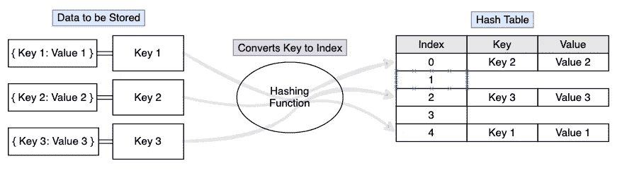
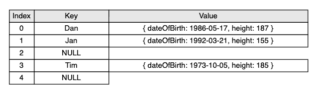
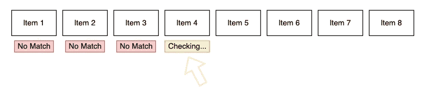
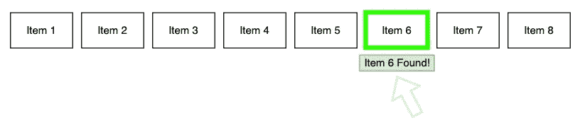
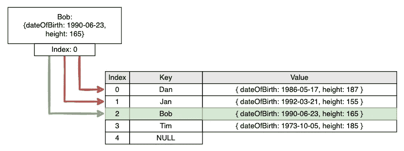
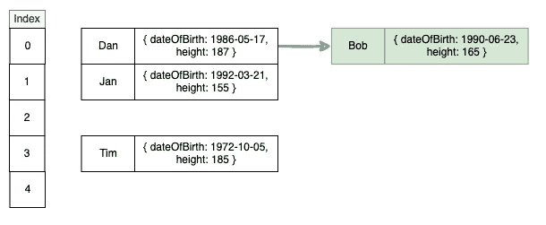

# 哈希表:友好的邻居数据结构

> 原文：<https://medium.com/nerd-for-tech/the-hash-table-your-friendly-neighborhood-data-structure-68186fbf5a08?source=collection_archive---------12----------------------->


与拉杰在 [Unsplash](https://unsplash.com?utm_source=medium&utm_medium=referral) 公路旅行的照片

考虑到所有编码语言使用的通用数据结构，很少有像哈希表这样重要的。尽管在概念上相对简单，但许多聪明人多年来已经设计了这个概念的实现，以实现更快、更精简、更易访问的数据存储策略。

在本文中，我将介绍什么是哈希表，它是如何工作的，以及在算法编写工作流中实现它的一些巧妙方法。

## 基本结构和操作

哈希表建立在**“字典”**的概念上，因为我们存储和维护一组数据，每个数据都有一个**键**，我们可以引用它来执行三个主要功能之一:

*   插入(一个项目)
*   删除(一项)
*   搜索(关键字)-返回带有相应关键字的项目或报告它不存在



存储示例

当将项目插入哈希表时，将哈希函数应用于该项目的关键字，并且生成与该项最终将被存储的哈希表相对应的索引。

当我们的项目被设置为`key=>value`对时，这是最有用的，在这里键可以被转换成一个索引号。

基本散列函数的常见实现将从项目的关键字中导出一个整数值，并使用具有散列表长度的模(%)运算符来确定应该存储该值的索引。例如，如果我们的条目的关键字是人名，我可以将姓名中的字母转换成一个整数，方法是将它们的 ASCII 码值相加，然后使用模操作符和 5(我们的目标哈希表的长度)来导出一个索引来存储该条目。

*   Dan - D=068，a=097，n=110。(68 + 97 + 110) % 5 = **索引 0**
*   Tim - T=084，i=105，m=109。(84 + 105+ 109) % 5 = **索引 3**
*   Jan - J=074，a=097，n=110。(74 + 97 + 110) % 5 = **索引 1**

也许丹在这样的物体上有出生日期和身高:

```
{
    Dan: {
        dateOfBirth: 1986-5-14, 
        height: 187
    }
}
```

我们用于在哈希表中派生目标索引的键仍然是字符串“Dan ”,该对中的值是一个包含 Dan 详细信息的对象。如果我们想采用面向对象的方法，这个数据也可以是一个类的实例。

将对象存储在哈希表中后，我们得到了如下内容:



存储示例 1

请记住，这些数据并不按照其内容的任何部分进行排序，事实上，当导出的索引值是“均匀随机的”时，哈希表的效果最好。当每一段数据被放置在哈希表的任何桶中的概率相等时，存储被优化。

这使我们进入下一步，快速检索数据。想象一下，需要通过传统数组中的键来查找特定的数据。

`array.find("Item 6")`



数组遍历

我们将遍历数组，检查每一项，直到我们找到匹配的关键字。这是非常低效的，在最坏的情况下会运行 O(n)次，其中 n 是数组中的项数。

现在，让我们想象一下寻找相同的项目，但项目可以告诉我们它自己在数组中的索引，所以我们知道在哪里寻找。

```
index = item6.indexarray[index]
```



索引检索

这要高效得多，但是我们通常不会在对象中硬编码位置索引。这就是散列函数的用武之地。使用这个键，我们可以通过将这个键传递给我们的散列函数来导出我们需要在哪里寻找我们需要的数据的索引。在理想情况下，这将以常数时间 O(1)运行，这意味着无论哈希表的大小如何，它总是在相同的时间内返回信息。

这太棒了！但它也提出了一些可能的问题，需要优化以使我们更接近完美的算法。

## 处理碰撞

这种从某个函数派生索引的想法最普遍的问题是，当两个不同的键被传递到函数中时，可能会返回相同的索引。让我们回到第一个例子。

我们有`“Dan”`、`“Tim”`和`“Jan”`的钥匙。通过我们的散列函数将它们的 ASCII 码加在一起，并使用模函数将它们放入 0 到 5 之间的索引中，它们各自得到自己的索引。太好了！现在，如果我们想将 Bob 添加到哈希表中会怎么样呢？

*   `Dan => **index 0**`
*   `Tim => **index 3**`
*   `Jan => **index 1**`
*   Bob - B=066，o=111，b=98。(66 + 111+ 98) % 5 = **索引 0**

啊哦，Bob 和 Dan 都从我们的散列函数中返回了`0`。我们现在要干嘛？有两种流行的解决方案:

*   **线性探测，**有时称为开放式寻址
*   **链接**，或闭合寻址

**线性探测**

开放寻址本质上意味着不能保证存储的项将位于哈希算法返回的精确索引处，因此当存储或从哈希表中检索时，所有索引都是“开放”的。在存储阶段，如果目标索引已经被占用，算法将检查哈希表中的下一个可用索引，并将数据存储在那里。



线性探测存储

*   **尝试 1:** 我们检查目标索引 0，看到它已经被 Dan 占用。
*   **尝试 2:** 我们继续检查下一个索引，1。这个也是简的，
*   **尝试 3:** 最后我们继续检查索引 2，我们有一个可用的位置来放置 Bob。

我们需要经历这个过程，从目标索引开始，在存储和检索数据时遍历下面的槽。

开放式寻址可能容易受到“初级聚类”的影响，在初级聚类中，许多关键字输出相同的地址，并分布在更大的索引范围内。在这个例子中，查找新添加的 Bob 对象需要检查另外两个插槽，然后才能找到正确的数据。我们也许可以通过一些不同的策略来优化它:

*   **加 3 再散列-** 我们可以决定每隔三个槽检查一次下一个可用的索引。
*   每当我们遇到被占用的槽时，我们可以平方距离来向前看。(*失败尝试*)。
*   **双重散列-** 在双重散列中，当发生冲突时，第二散列算法被应用于密钥。

## 链接

另一种流行的避免冲突的方法是链式或封闭寻址。使用这种策略，我们可以使用一个存储在索引号上的链表。



链式存储

当存储时，我们检查目标索引 0，发现它被占用了，但是将我们的条目添加到一个链表的末尾。Dan 条目现在指向 bob 条目，在查找过程中，我们只需导航到索引 0 并检查另一个条目，就可以得到我们需要的数据。

同样，根据特定情况的需要，您可以选择一种实现而不是另一种。

## 我们如何编写“完美的”散列函数？

从理论上讲，如果我们确切地知道我们需要存储多少条数据，我们就有可能编写一个完美地填充哈希表的算法，但是因为我们并不是生活在一个完美的世界中，所以最好遵循一些准则来尝试并满足这些主要目标。

*   最大限度地减少冲突——散列函数越随机，在实现过程中冲突就越少。
*   均匀分布——我们越接近哈希表中每个索引的一段数据，越好。
*   易于计算——哈希函数会运行很多次，所以计算越简单越快越好。
*   解决任何冲突——任何哈希表都需要一个清晰的策略来处理崩溃几率为 0%的冲突。

# 结论

哈希和哈希表几乎无处不在，几乎在我们每天工作和交互的每个系统中都有使用。它们让我们能够索引大量数据，并使用数据本身计算数据的存储位置。花时间优化算法的冲突处理可以进一步提高数据结构的效率。

如果你正在准备编码面试或者解决复杂的算法，把散列表放在工具箱的最上面的抽屉里，并且在可能的时候实现它，这总是很重要的。

非常感谢您的阅读和快乐编码！