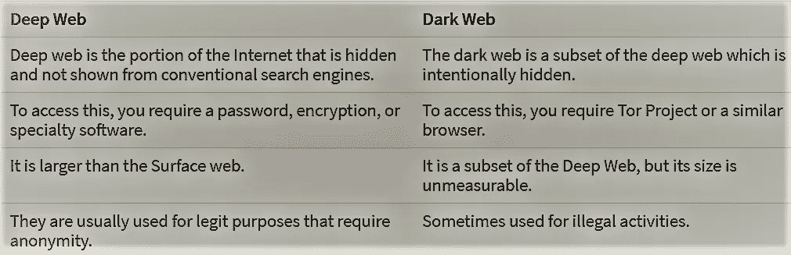
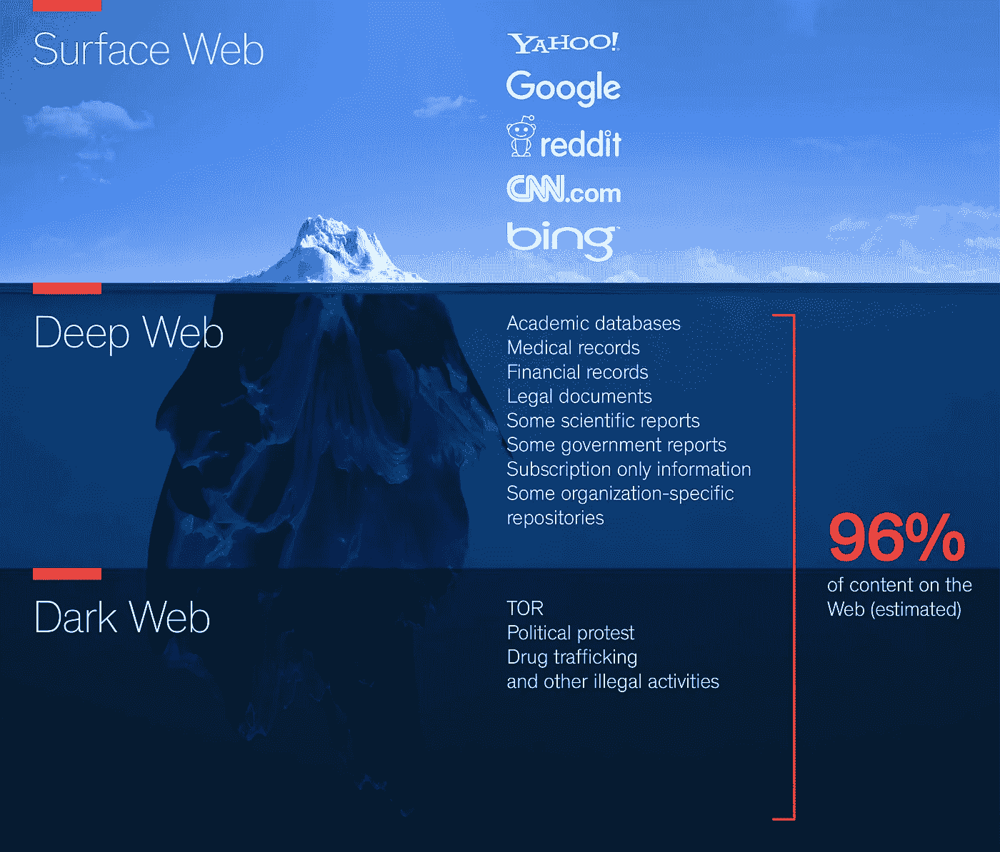
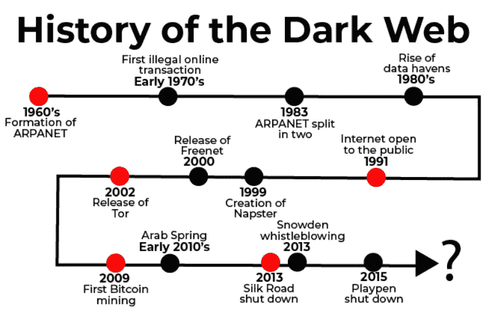
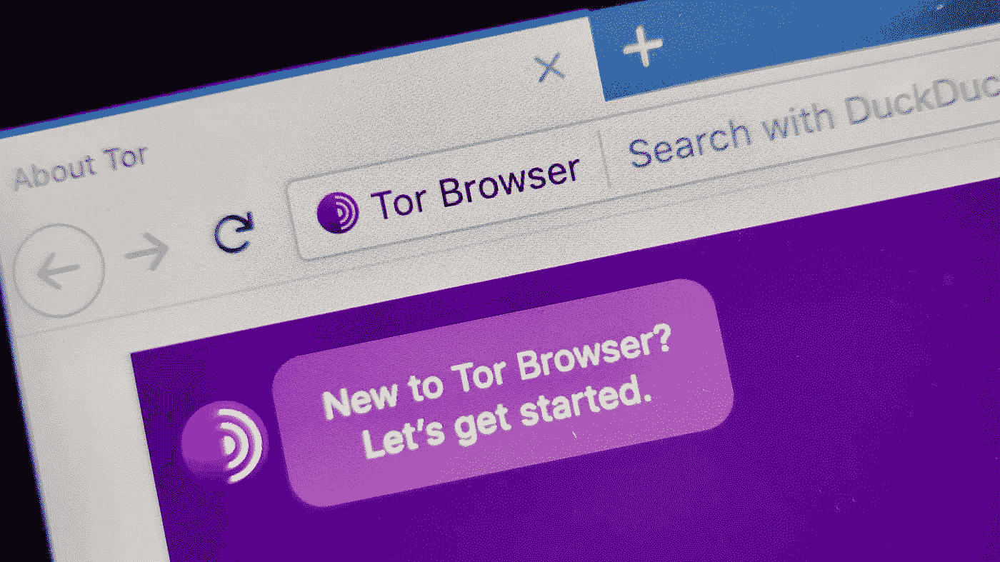
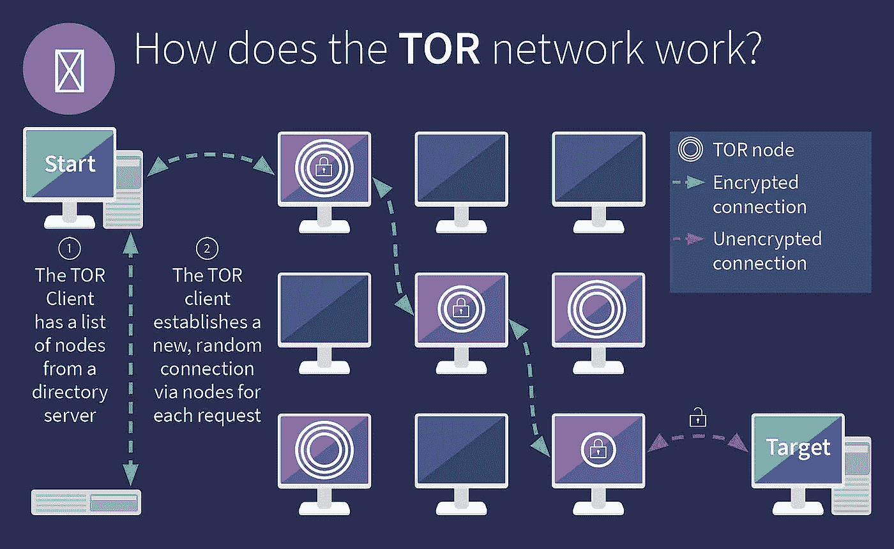

# 隐藏的互联网

> 原文：<https://medium.com/nerd-for-tech/the-hidden-internet-4c239cb3bbd6?source=collection_archive---------0----------------------->

## (黑暗网络的秘密)

> **黑白网络差异&互联网**

**互联网**是全球所有联网计算机的物理连接。

*   **阿帕网**(高级研究计划局网络)
*   ARPANET 是第一个具有分布式控制的广域分组交换网络，也是第一个实现 TCP/IP 协议组的网络之一。阿帕网的创建是为了让人们更容易访问计算机，改进计算机设备，并为军方提供更有效的通信方法。

web 是运行在物理互联网表面的软件。因此，它的软件层主要用于在所有其他计算机之间共享信息。

*   该软件类似于文件传输协议(FTP)、电子邮件交换协议等。所以网络是一种媒介，在这里你可以很容易地把你的文件和信息从一台电脑转移到另一台电脑。
*   Chrome，Safari，Bing 都是我们浏览网页的浏览器。
*   web 浏览器知道如何与 web 对话，询问页面并向用户提供信息。

> **差 b/w 深&暗网**

关键区别 b/w 深层—暗网

*   众所周知，互联网可以分为三个主要部分，但是等一下，这三层之后还没有结束…它比你想象的还要深！！

**0 级-普通网页**

*   一切都是可及的

**一级表面网**

*   所有信息都是公开的，所有人都可以使用

**二级-贝吉网**

*   FTP 服务器
*   加载的 Web 服务器
*   谷歌锁定结果
*   监狱诱饵色情
*   蜜罐
*   互联网的大部分
*   在这一点之后，使用代理是必须的！

**第三级-深层网络**

*   黑客
*   禁书/禁片
*   伪造文件
*   财务记录
*   审查制度
*   私有企业数据库
*   科学实验

需要 TOR 才能进入 3 级！！

**四级——包机网**

*   这一级分为两个主要部分

1) TOR 级访问

2)特殊级别访问

*   Tor 浏览器无法到达这里。所以，有一种特殊的方法可以达到这种程度，叫做“**闭壳系统**”。

该系统包含:

*   用于人工智能测量的机器
*   AI 和 GGGEQP 处理器
*   晶体功率控制器
*   天气变化装置
*   隐藏的 HAARP 项目
*   亚特兰蒂斯的隐藏研究和坐标
*   恐怖/谋杀/毒品网络
*   全球人口贩运网络
*   超级计算机和人工智能等。等等。
*   所有类型的网站要么在个人服务器上，要么在私人服务器上。正常的电脑和互联网可能不足以达到这种程度。
*   到目前为止，这些描述构成了 Deep Web 的 80%。那么剩下的 20%呢？
*   之后，你有使用量子技术的设备，并且需要非常高类型的大气。
*   直到现在的一切都被证明是存在的。但是过了 4 级，就没有任何方法或研究可以进入玛丽安娜网了。

**5 级玛丽安娜网**

*   这是迄今为止已知的最危险的级别之一。这个名字取自世界上最深的洞，**马里亚纳海沟。**
*   根据调查，这个地方可能存在，也可能不存在。然而，根据最普遍的共识，这是最安全的数据所在的地方。最常见的“马里亚纳网络”是存放最安全数据的军事网络。
*   要访问马里亚纳网站，你必须面对某种算法&计算机无法完成的计算。为此，你必须致力于量子计算、秘密算法和计算。
*   其中一个传言是，我们可以在需要量子计算机的“**聚合镰状细胞衍生物**”的帮助下访问“**马里亚纳群岛网络**”。
*   量子计算是不公开的，因为它需要一些极端的功能才能工作，所以正常人不能上网。
*   所以我的问题是，
*   如果暗网有类似合同杀手、毒贩、比玛丽安娜网包含的更糟糕的内容，那它甚至比暗网更深？？没有人知道这是否存在，但听起来很酷耶！有没有类似玛丽安娜的网和它下面的东西？或者这一切只是一个笑话，一个传说，或者是像**蝉 3301 或光照派这样保密的东西？**

*   ARPANET(高级研究计划局网络)是 20 世纪 60 年代创建的一个实验性计算机网络。它是互联网的前身，后来被称为黑暗网络。
*   从技术上讲，暗网是深度网的一个子集，因为它也不能公开访问。
*   暗网是深度网的一小部分，深度网是互联网中隐藏在公众视野之外的部分。黑暗网络是网络世界非法活动和巨大秘密的中心
*   在这里，用商业搜索引擎是找不到网站的&互联网的这一部分是隐藏的&包含未编入索引的网站。
*   这种黑暗网络的网站只能通过特殊类型的浏览器访问，这些浏览器使用 IP 掩码来隐藏访问者的身份。
*   它代表 internet 中包含不可索引网页的部分，
*   因此，商业搜索引擎(Chrome、Bing、safari)无法找到它们，它们也没有链接到 Surface Web 上的其他页面。它也有其他术语，如 Deep net，一个隐藏和不可见的网络，研究人员估计 Deep Web 占互联网的 96%。

> **我们根据活动将暗网分为两个区域，**

1)法律活动

*   数据库和虚拟学术图书馆
*   期刊论文
*   只是匿名浏览网页
*   由于一些个人原因，用户更喜欢不被跟踪。
*   许多组织也做一些实践来检查他们的隐私 Deep Web，如警察的网络部门、安全顾问、武装部队、政治家、媒体等。

2)非法活动

*   包括被归类为非法或犯罪活动、诈骗的每一个行为，这就是形成黑暗网络的原因，如…
*   网络钓鱼诈骗
*   暗网市场
*   非法色情
*   黑客组织
*   恐怖主义
*   融资
*   社交媒体犯罪
*   比特币服务
*   人口贩运
*   洗钱
*   非法武器

> **TOR(洋葱路由器)**

[torproject](https://medium.com/u/e26469d96760?source=post_page-----4c239cb3bbd6--------------------------------)

*   TOR 是一种允许用户匿名在线交换信息的浏览器。它在不同的路线之间跳跃连接，所以他们很难追踪哪一个形成匿名。
*   Tor 可以通过隐藏用户的身份来管理这一点，每次都通过添加一些加密层来通过世界上 3 个不同的服务器反弹连接，因此名称是 ONION。
*   对于用户来说，主要是像谷歌、必应和雅虎这样的知名浏览器，是更方便的上网方式。但是暗网包含了一些隐藏的网页，无法在谷歌上被索引。所以在这个空间里，你必须连接 TOR 才能访问内容。

> 60 个最大的深层网站= 40*整个表层网站！！

*   所以，你可以想象黑暗网络所包含的深度和数据。

*   Tor 浏览器在 TCP 层以不同的方式工作，通过套接字连接使用通信技术。
*   当一个新用户通过 Tor 浏览加入网络时，Tor 与特定网络上随机选择的几个节点建立虚拟电路连接。
*   之后，大约 10 分钟，它使用这个虚拟电路，然后创建一个新的电路，等等…

该电路主要有 3 种节点:

1.  **入口节点**:接收输入流量的第一个节点。
2.  **中间节点**:该节点将数据从一个节点逐行传递到另一个节点。
3.  **出口节点**:最后一个节点，向开放的互联网传递流量。

*   当一个用户/源请求访问一个特定的网站时，Tor 用几层加密该请求并将其发送到入口节点，并通过分布在世界各地的随机选择的一些中间节点进行传输。
*   每次跳转到一个节点时，当前节点在将加密的请求传递到下一个中间节点之前，会从加密的请求中删除一层加密。
*   当请求到达出口节点时，后者删除所有剩余的加密层，并将原始的未加密请求发送到公共互联网上的 web 服务器。
*   通过这种机制，关于源的所有信息都丢失了，并且用户的身份仍然是不明确的，并且可能只返回到电路中的最后一个节点。
*   Tor 还允许用户在不暴露主机服务器位置的情况下部署网站，这些网站使用扩展名**。洋葱"**不能在 Tor 网络外处理和渲染。这些是允许用户匿名浏览并使其成为用户间安全通信手段的一些主要特征。
*   没有 Tor，暗网依然存在。Tor 只是一个黑暗的网络浏览器，就像如果 chrome 明天被关闭，那么互联网仍然存在。

> **为什么所有的黑网站主要包含。洋葱顶级域名？**

*   顶级域名如。洋葱是为隐藏服务保留的。
*   互联网工程任务组(IETF)宣布。洋葱作为一个特殊用途的可用顶级域名([见 RFC 7686](https://tools.ietf.org/html/rfc7686) )，有助于实现保密性强的匿名服务&匿名。

> **结论**

*   TOR 可以帮助你保护你的数字隐私&你可以匿名浏览互联网。Tor 也有一些弱点和漏洞，但它仍然是保护你的数字身份和隐私的最好的浏览器之一。
*   使用 TOR 访问黑暗网络并不违法，但请自担风险并采取必要的安全措施，

1.避免使用你的个人信息

2.禁用脚本

3.使用 VPN 服务

4.不要使用 HTTP 网站

5.务必加密您的数据存储

6.盖住或断开网络摄像头镜头。

7.定期更新您的系统。

> ***感谢阅读……*😊😊**