# 基于格的密码学背后的思想

> 原文：<https://medium.com/nerd-for-tech/the-idea-behind-lattice-based-cryptography-5e623fa2532b?source=collection_archive---------1----------------------->

## 或者晶格如何对密码学有用？

对量子计算机可能破解我们现有密码标准的担忧并不新鲜。随着时间的推移，这种恐惧越来越真实。

> “如果大规模量子计算机被制造出来，它们将能够破解目前使用的许多公钥密码系统。这将严重损害互联网和其他地方数字通信的保密性和完整性。”— [NIST 后量子密码术](https://csrc.nist.gov/projects/post-quantum-cryptography)

在这种背景下，出现了定义新的密码学标准的需求，即使量子计算机存在，这些标准仍然是安全的。

为此，美国国家标准与技术研究所(NIST)已经启动了一个流程，征集、评估和标准化一种或多种抗量子公钥加密算法。提交过程从 2016 年开始，到 2017 年结束，从那以后已经进行了几轮评估(目前是第三轮)，其中对提交的算法进行了标准化分析。标准草案将在 2022 年至 2024 年间出台。更多信息[在这里](https://csrc.nist.gov/projects/post-quantum-cryptography)。

基于格的密码学领域是后量子密码学中分析得最好的领域之一。这个名字来源于这样一个事实，即这个加密方案是建立在格子周围的数学问题上的。但是它是如何工作的，最重要的是，它背后的想法是什么？

# 介绍

为了理解基于格的加密的主题，我们需要看一些数学基础。

## 矢量

矢量表示既有大小(距离)又有方向的量。向量可以有不同的维数。最直观的是二维或三维空间中的向量。

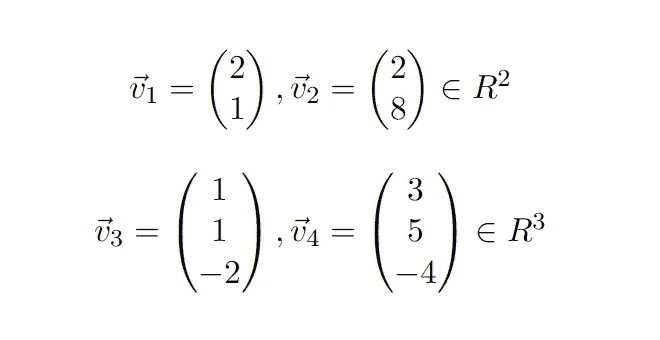

二维和三维空间中的向量示例

## 基础

基是可以用来复制给定空间中任意一点的向量的集合。对于二维空间，以下向量的组合形成基础。

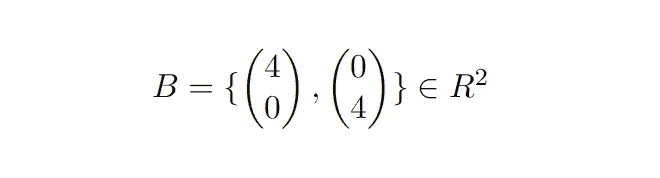

二维向量空间中基的示例

通过组合这两个向量(线性组合)，可以创建由该基形成的空间中的任何点。要通过线性组合创建点(12，8)，第一个向量必须乘以 3，第二个向量必须乘以 2。

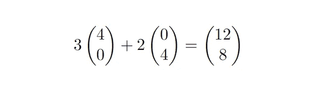

基础向量的线性组合来创建一个新点

需要注意的是，对于给定的空间，基数不是有限的！对于上面的例子，单位向量的基础描述了相同的空间，并允许我们像以前一样生成相同的点。除了由单位向量的倍数形成的基之外，所有其他线性独立向量的组合也在给定空间中形成基。

## 格子

简单地说，一个点阵可以被认为是任何规则排列的点的网格。这个网格无论如何都不是有限的。更确切地说，晶格描述了一种延续到无限的模式。

格的最重要的性质之一是给定格的所有点都由整数坐标组成。

格是由向量的基来描述的。下图显示了一个二维点阵。两个矢量 *b1* 和 *b2* 的基形成这个点阵。

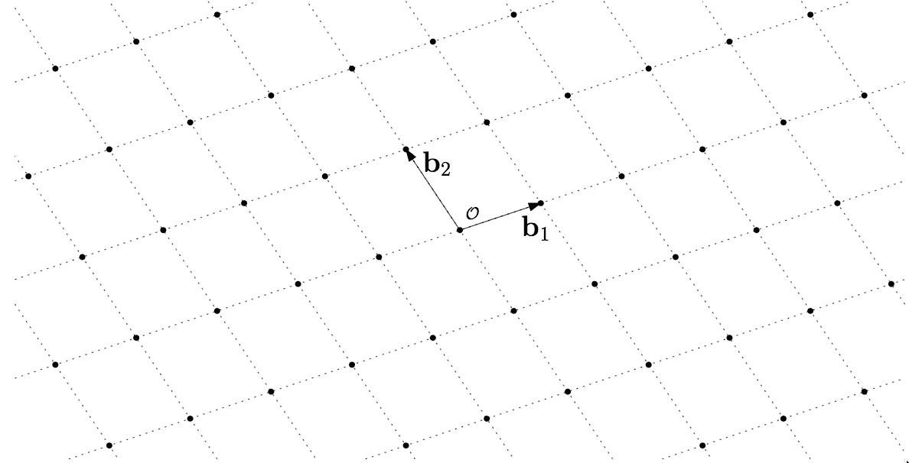

图片来自 Douglas Stebila 的“后量子密码学导论和带错误的学习”([来源](https://summerschool-croatia.cs.ru.nl/2018/slides/Introduction%20to%20post-quantum%20cryptography%20and%20learning%20with%20errors.pdf))

正如已经提到的，描述一个格子没有有限数量的基底，下一张图显示了与上面相同的格子，但是有不同的基底。

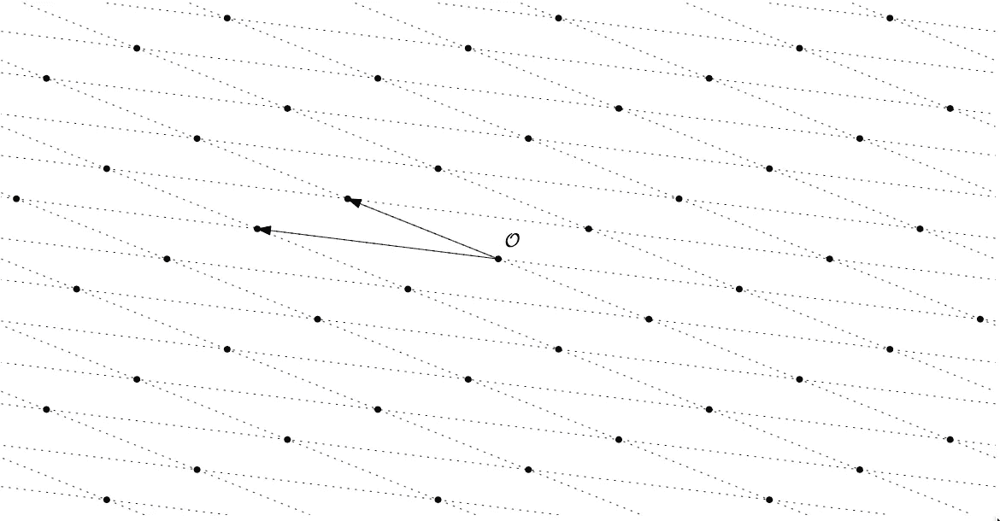

图片来自 Douglas Stebila 的“后量子密码学导论和带错误的学习”([来源](https://summerschool-croatia.cs.ru.nl/2018/slides/Introduction%20to%20post-quantum%20cryptography%20and%20learning%20with%20errors.pdf))

与可视化的图像不同，点阵也可以具有高于两个维度(三个、四个，直到 *n* )。

# 这个想法

现在我们知道了格是什么样子，我们将更仔细地看看格的属性，这些属性使它们对密码学如此有趣。

## 糟糕的基础

考虑下面描述一个特殊晶格的基础。

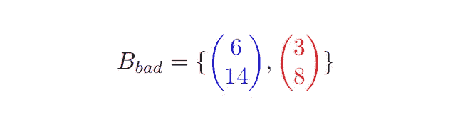

这个基础可以称之为“坏基础”。但是为什么不好呢？通过看一下近似的用例，我们可以理解为什么会这样。

给定一个实数点 *(11.6，4.2)* 。近似问题要求给定网格的最近点挑战这个点。

这个问题可以用求解线性方程组的高斯消去法来解决。

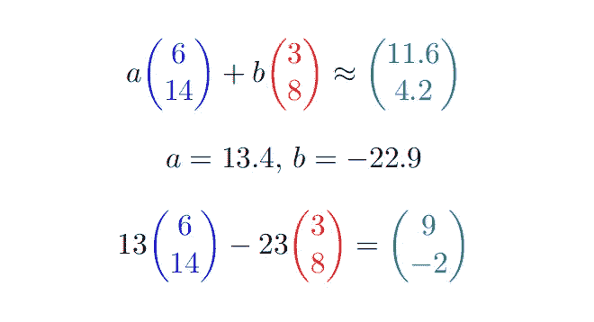

线性方程组的结果对于 *a* 和 *b* 是实数。问题是我们不能用这些值来计算格点。如前所述，格仅由具有整数值的点组成。因此，我们需要将实数向上或向下舍入为整数。这个决定并不容易，但凭直觉，我们会四舍五入到最接近的整数，因为这将给我们最接近的结果。

通过将 *13.4* 向下舍入到 *13* 并将 *-22.9* 向下舍入到 *23* ，最近格点的结果为 *(9，-2)* 。

看用给定的基生成的网格，计算出的最近点与网格的实际最近点相差甚远。绿色三角形标记点 *(11.6，4.2)* ，绿色圆点标记计算点 *(9，-2)* 。

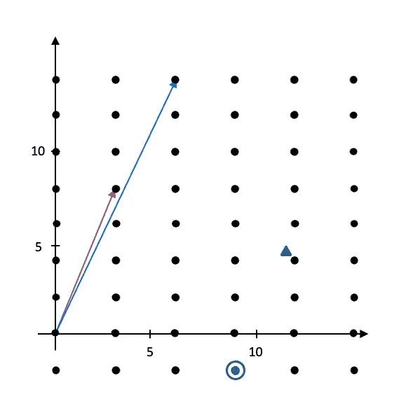

由“不良基础”创建的点阵图像

通过执行所有可能的强力舍入实数的选项，可以改进计算。对于给定的示例，有四种可能的舍入选项。对于每个坐标，我们可以向上或向下取整。变化的数量可以通过 2 的坐标数的幂来计算。例如，有以下组合:

*   起来，起来
*   向上，向下
*   向下，向上
*   下去，下去

考虑一个维数为 100 的点阵，为找到最近点而必须测试的组合等于 1 . 267 . 650 . 600 . 228 . 229 . 401 . 496 . 703 . 205 . 376。测试所有这些组合的时间太长，对于找到最近点来说不切实际。

## 良好的基础

给定的基础可以被认为是“良好的基础”。

与上面的“坏基”相比，这个基由相对较短长度(欧几里德距离)的向量组成，这两个向量具有彼此正交的性质，即它们彼此垂直。

通过观察与前面相同的近似问题，我们可以理解，为什么这个基础被认为是好的。

和以前一样，对于 *a* 和 *b* ，结果是实数。舍入到最接近的整数给出点 *(12，4)* 作为以此为基础进行计算的网格的最接近点。

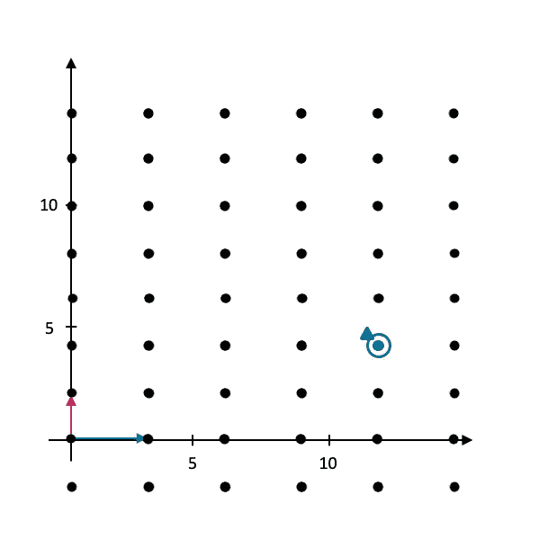

由“良好基础”创建的点阵图像

这实际上是格中最接近给定点的点(11.6，4.2)。所以结论是，给定基底的质量(基底是“好”还是“坏”)对找到晶格中实际最近点的可能性有显著影响。

近似问题也正式称为最近向量问题。

## 最近向量问题

> 给定某个格点的“坏基”和随机选择的点 P，CVP 要求找到最接近的格点来挑战 P

# 如何使用这个进行加密？

> 下面的模式将展示基于格的加密系统背后的思想。这种形式不安全！这只是为了说明的目的！

该模式遵循非对称密钥加密模式，用公钥加密，用私钥解密。

## 键

作为公钥，我们用一个“坏基”来描述一个特定的格。

对于私钥，我们使用“好基”来描述由“坏基”创建的相同格。

## 加密

为了演示给定方案的加密功能，值 14 和-24 将用格型方案加密。为了更好地说明，您可以将 14 和-24 视为某些字母的编码，例如 14 =“h”和-24 =“I”，因此我们将加密消息“hi”。

要加密消息“hi”(14，-24)，我们需要执行三个步骤。

1.  首先，我们需要在给定的网格空间中编码我们的消息。为此，我们对基进行计算，得到的点就是我们的消息在这个特定网格空间中的表示。
2.  第二，必须创建一个小值向量。这些坐标应该随机生成。这个“错误向量”用于在第一步的消息表示中添加一个错误。
3.  通过添加误差向量，我们创建了一个不属于晶格的点，但是接近原始点。这个点现在形成了可以与接收者共享的加密消息。

对于每个新消息，错误向量被重新生成，因此每次都是不同的，因此在该过程中没有确定性。此外，误差向量必须很小，否则解密将无法正常工作。想象一个每个点都有相同间距的晶格，如下图所示。每个点的周围是一个空间，对于该空间，非晶格点被舍入到相应的晶格点。在两个格点之间的中间是一个假想的边界，它定义了舍入改变最近格点结果的标记。

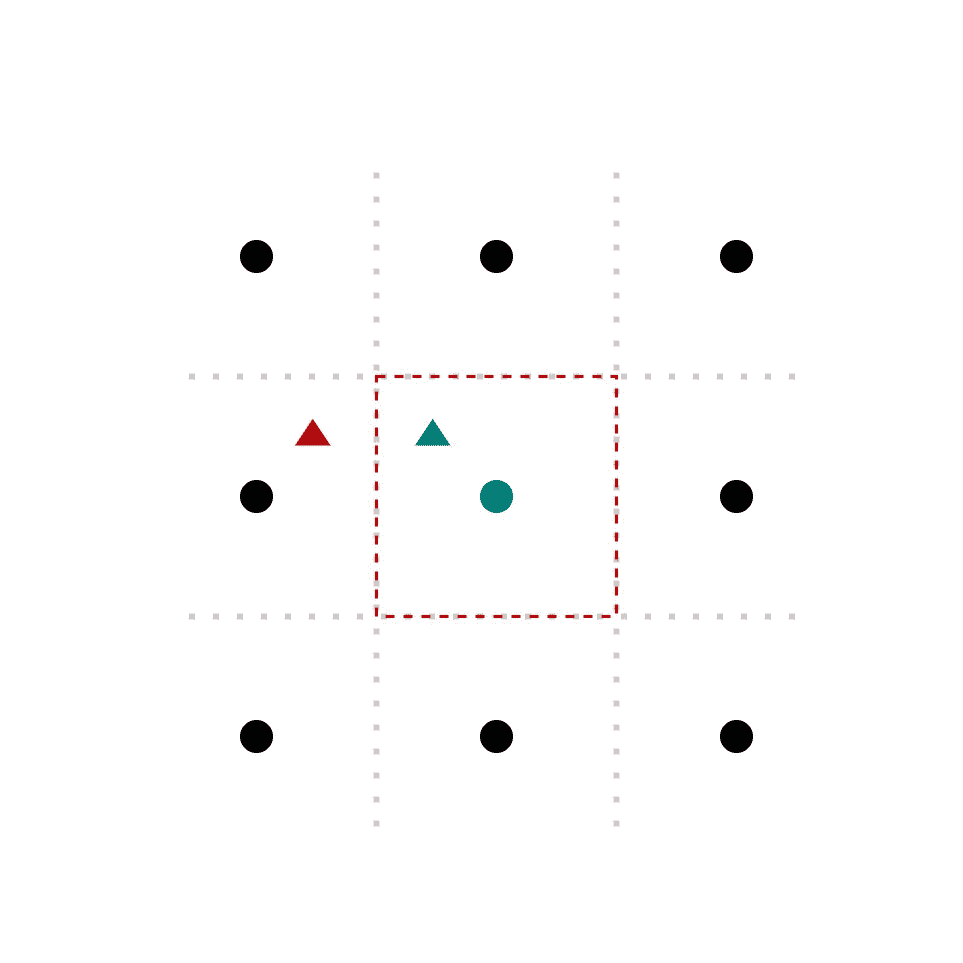

在此图中，红色区域中的所有点，如绿色三角形，都被舍入到绿色网格点。如果该点在红色矩形之外，则最近的晶格点会改变。因此，误差向量必须非常小，以至于通过将其添加到当前格点，结果点仍然是虚拟红色矩形的一部分。

## [通信]解密

加密消息后，是时候展示解密是按预期进行的了。对于解密，我们必须使用加密的消息和私钥(“良好的基础”)。

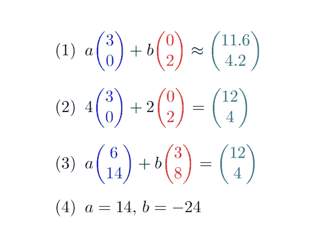

1.  首先，我们将使用私钥计算给定非格点的最近格点，它代表加密的消息。为此，我们需要用高斯消元法求解线性方程组。
2.  在将 *a* 和 *b* 的结果四舍五入到最接近的整数后，我们现在可以计算实际最接近的格点。
3.  现在我们知道了实际的最近格点，我们可以用这个信息来解密信息。为此，我们需要用公钥解另一个线性方程组。
4.  该系统的 *a* 和 *b* 的结果形成解码的消息。如果我们将两个字母的值解码回来，我们就正确地解码了消息“hi”。

## 安全性

一般来说，基于格的加密的安全性，因此对于上面的例子来说，是基于两个困难的问题。格基密码的基本问题是最短向量问题。

> 短向量问题(SVP)是关于寻找最近的，但不是相等的，关于格子上给定点的格子点。

与最短向量问题密切相关的一个问题是最近向量问题。

> 给定给定格的“坏基”和不在该格中的随机点 P，最近向量问题(CVP)要求与挑战 P 最近的格点。

对于给定的“坏基”，最近向量问题(CVP)很难求解。这由两个证明来说明。首先， [Miklós Ajtai](https://dl.acm.org/doi/10.1145/276698.276705) 证明了最短向量问题(SVP)是 NP 难的。后来， [Goldreich 等人](https://www.sciencedirect.com/science/article/abs/pii/S0020019099000836?via%3Dihub)表明，SVP 的任何硬度都意味着 CVP 的硬度相同。

为了更好地说明，将“差的基础”转化为“好的基础”的难度可以用最短向量问题(SVP)来描述。为了将由彼此不正交的长向量组成的“差基”转换成由彼此几乎正交的短向量定义的“好基”，必须定义一种算法，该算法解决将长向量转换成相同基的短向量。这个算法也将解决最短向量问题。找到一种算法来确定给定网格相对于非网格点的最近点，而不将“坏基”转换成“好基”，这将解决最近向量问题(CVP)。