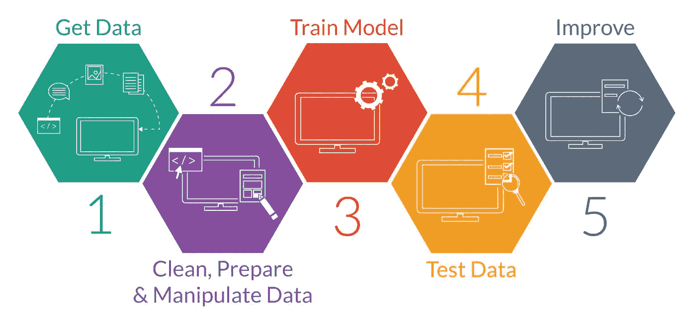
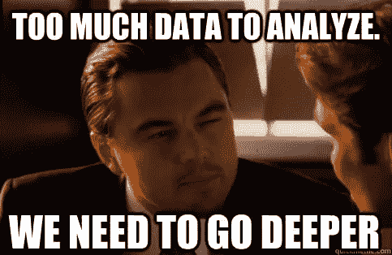
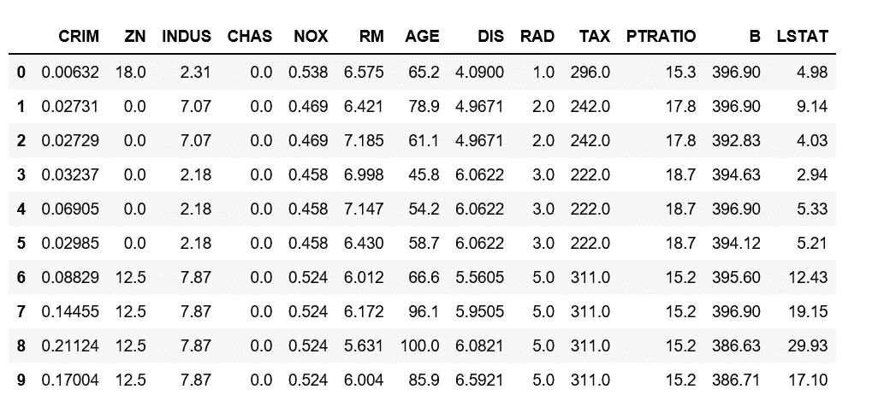
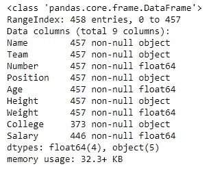
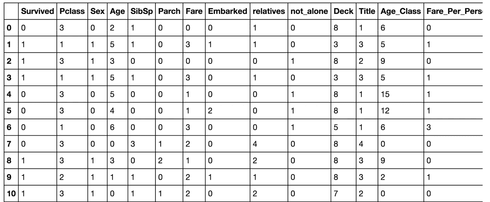
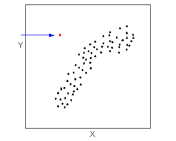
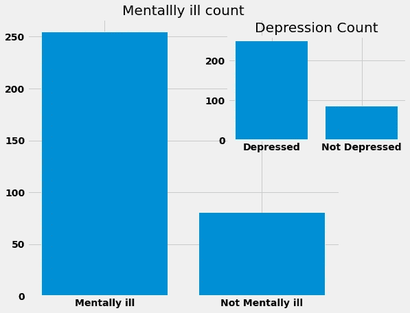
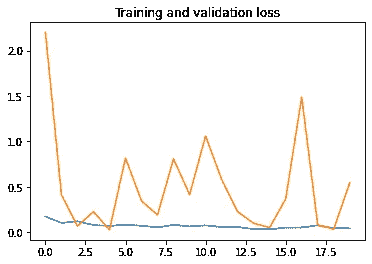

# 机器学习项目的理想工作流程

> 原文：<https://medium.com/nerd-for-tech/the-ideal-workflow-for-your-machine-learning-project-9df1a7125b17?source=collection_archive---------0----------------------->

当我们开始一个新的机器学习项目时，我们高度强调训练和测试模型，而不是理解数据。在将数据拟合到模型中之前，获取**‘带有数据的数据’**非常重要。

大多数投入生产的机器学习模型都严重失败，原因有很多。一些最常见的原因是训练和测试数据的数据分布不同，训练数据中的意外情况，如异常值、缺失值、方差问题等。当用**真实世界**和**看不见的数据**测试时，它们的表现真的很差。所以如果你想要一个成功的 ML 模型投入生产，你必须做的不仅仅是训练和测试，你必须记住很多事情

**在这篇博客**中，我已经 ***总结了*** 你在从事机器学习项目时应该注意的所有事情，从数据清理和分析 ***到*** 选择正确的模型和超参数调优。

**免责声明:**本帖高度偏向**正常** **表格数据**。我没有包括与时间序列数据相关的问题，如数据泄漏、NLP 数据(如符号化)、图像数据(如增强、图像大小调整等),并且我将互换使用数据的词语*“特征”和“列”,因为它们在这里表示同一个事物。*

# 数据

我们首先需要的是**数据**。Kaggle 和 UCI ML 知识库是获取现成数据的最好地方。 [Scikit-learn](https://scikit-learn.org/0.16/datasets/index.html) 和 [tensorflow](https://www.tensorflow.org/datasets) 在库中内置了可供使用的数据集集合。

现在让我们说，你想用机器学习解决一个问题，而你需要的数据类型在互联网上没有现成的形式。在这种情况下，你必须**制作自己的数据集**。为此，您应该熟悉从 web 上抓取数据，然后将其转换为文件。 [**这篇博客**](https://www.digitalocean.com/community/tutorials/how-to-scrape-web-pages-with-beautiful-soup-and-python-3) 也提供了一个制作你自己的数据集的好见解。

一旦你把数据组织成表格，就该对其进行分析了。

我们还有很长的路要走，所以去喝杯咖啡，然后坐上车吧！！！

浏览数据:从浏览数据开始总是好的，比如查看一些行以获得数据的概览。

# 现在让我们分析我们的数据的特征

1.  了解您将在数据集中处理的值的类型非常重要，如整型、浮点型、对象型。您可以在 pandas 中使用 **info()** 方法来实现这一点。

2.然后，您可以使用 pandas 中的**描述方法**获得数据集所有数字特征的统计概览，如平均值、中值、最小值等。

3.检查数据集中的空值。用熊猫可以通过 **isna()** 方法来完成。现在，如果你的数据集有**缺失值**，你需要找到解决问题的方法，否则它会在预测过程中严重影响你的机器学习模型。

# 处理缺失值

**1。删除缺少值的行**

处理缺失数据的最简单策略是删除包含缺失值的整行。Pandas 提供了 [**dropna()函数**](http://pandas.pydata.org/pandas-docs/stable/generated/pandas.DataFrame.dropna.html) ，可以用来删除丢失数据的列或行。

**2。预测缺失值**

我们可以通过将缺失值的所有数据放入测试集中，使用 ML 算法(如回归)来预测缺失值。

**3。替换丢失的值**

我们还可以用列数据的平均值或中值替换缺失值。通常**中值比平均值**更受欢迎，因为特征中的异常值(我们将在帖子中进一步讨论)会对平均值产生很大影响，但只会对中值产生轻微影响。

***“如果数据集中的任何特征有大量缺失值，以上三种方法都没有用。在这种情况下，唯一正确的做法是从数据集中删除该列。***

# 特征选择

现在，您拥有的数据集可能包含许多特征，并且很有可能少数特征或在某些情况下大多数特征对我们的分析和 ML 模型没有用处。**如果盲目使用所有特性进行训练，效果会很差。**所以你应该很清楚哪些功能要删除，哪些要保留，即功能选择。

一些常用的特征选择方法是

**1。删除具有大量相似值的要素(低方差问题)**

**取自 chrisalbon.com(检查他的酷机器学习闪存卡)**

在您的数据中，有些情况下某个要素的值会重复多次，例如 1，1，1，1，1，1，0，2，1，1，1，1，1，1，1…。这种类型的特征具有非常低的方差，并且对于你的机器学习模型几乎没有任何用处。最好的办法是放弃它们。现在，您可以通过做所有的数学运算来手动计算特性的方差，或者使用 [**sklearn 的方差阈值**](https://scikit-learn.org/stable/modules/generated/sklearn.feature_selection.VarianceThreshold.html) **方法**用几行代码来完成。

**2。删除默认情况下无用的功能**

我们通过一个例子来理解这一点。这是著名的泰坦尼克号数据集，在给定其他特征如性别、年龄等的情况下，你必须预测乘客是否幸存。当您对该数据集进行分析时，您知道诸如年龄、性别、乘客亲属的号码等特征在决定谁将被给予逃离溺水泰坦尼克号的高优先级方面起着重要作用，而诸如票号、登船(乘客登上泰坦尼克号的港口)等列与他们是否幸存无关，因此这些特征可以被丢弃，并且不需要在训练期间包括在模型中。*(在选择数据集之前，您应该非常清楚这些特征的含义，这样您就可以在训练模型时了解它们的有效性)*

**3。卡方检验法**

***卡方*检验是一种非常著名的方法**，用于发现数据集中每个特征与目标标签之间的依赖关系。它*仅用于分类特征。如果你想知道**测试** [背后的深层数学原理，请点击这里。](https://machinelearningmastery.com/chi-squared-test-for-machine-learning/)*

Sci-kit learn 有一个内置的方法，可以使用*卡方*测试从您的数据集中计算 k-best 特征，这可以在几行代码中完成您的工作。有关参考资料[，请点击此处](https://scikit-learn.org/stable/modules/generated/sklearn.feature_selection.chi2.html)。

对于**特征选择**，还有各种其他方法，如套索回归等。

*您也可以使用 **PCA 减少特征数量。***

# 特征缩放

大多数情况下，数据中的不同特征可能具有不同的量值。例如，在杂货店购物数据集的情况下，我们通常以克或磅为单位观察产品的重量，这将是一个较大的数字，而产品的价格可能是美元，这将是一个较小的数字。许多机器学习算法在其计算中使用数据点之间的欧几里德距离。拥有两个具有不同数值范围的特征将让具有更大范围的特征支配算法。

**特征缩放:**是一种将固定范围内的数据中存在的独立特征标准化的技术。它是在数据预处理期间执行的，以处理高度变化的幅度或值或单位。

最常用的特征缩放技术是**均值归一化**。当我们想要将我们的值限制在两个数字之间时，通常是在[0，1]之间，就使用它。标准化公式:

还有其他的特征缩放方法，如**最小-最大缩放器**等，尽管没有严格的使用规则，并且大量使用均值归一化。

**什么时候做特征缩放？**

特征缩放对于计算数据之间**距离的机器学习算法至关重要。如果不进行缩放，则在计算距离时，具有较高值范围的要素开始占主导地位。一些算法的特征缩放至关重要:**

*   像 **KNN、** **K-means** 这样涉及欧几里德距离度量计算的算法需要特征缩放
*   执行**主成分分析(PCA)** 时，缩放至关重要。PCA 试图获得具有最大方差的特征，对于高量值特征，方差是高的，并且使 PCA 向高量值特征弯曲。
*   我们可以通过缩放来加快**梯度下降**的速度，因为θ在小范围内下降很快，在大范围内下降很慢，并且当变量非常不均匀时会低效地振荡到最优值。

下图解释了要素缩放如何加速梯度下降:

# 离群值问题

*“观察结果与其他观察结果相差甚远，以至于让人怀疑它是由不同的机制产生的”——霍金斯(1980)*

一个迷因开始

**数据集异常值的最常见原因:**

*   数据输入错误(人为错误)
*   测量误差(仪器误差)
*   实验错误(数据提取或实验计划/执行错误)
*   自然(不是错误，数据中的新奇)

## 如何检测异常值？

1.  **Z 分数——该分数有助于了解数据值与特征平均值的差距**。更具体地说，Z 得分告诉我们一个数据点距离平均值有多少标准差。例如，Z 值为 2 表示观察值高于[平均值](https://statisticsbyjim.com/glossary/mean/)两个标准偏差，而 Z 值为-2 表示低于平均值两个标准偏差。Z 得分为零表示值等于平均值。

*Z 得分= (x 均值)/标准差。偏差*

**。**用于发现异常值的**标准截止值(阈值)**是+/-3 或更远离零的 Z 分数**，即如果一个值的 Z 分数大于或等于 3，则它是异常值**。

**2。散点图**

检测异常值的简单方法是使用散点图。通过数据可视化可以很容易地识别异常值。

检测到异常值后，可以用各个要素的中值替换它们。

# 数据可视化

数据可视化通常被认为是显而易见或不重要的事情，这是由于其固有的主观性。但是人们忘记的是，数据可视化是**技术**和**非技术**人员之间交流的媒介。当你想向不太了解数据科学的 CEO 解释你的项目时，你可以通过图表而不是 Python 代码来传达你的结果和结论。

Matplotlib 和 seaborn 非常适合小型和基本的可视化，但是随着您的深入，您还可以学习 d3.js 一个用于数据可视化的 javascript 库。

我在一些项目中做的一些基本的数据可视化:

# 为您的问题选择正确的机器学习模型

现在出现了**大困境**。针对你的问题选择哪种机器学习模型？困惑，困惑，困惑！！！

当谈到选择正确的模型来解决您的问题时，有如此多的变化。每个类别**有监督的**和**无监督的** ( *还有一个类别是半监督的，基本上处理本文没有讨论的生成网络*)有很多种类可供选择。为了选择正确的模型，你应该熟悉所有最大似然算法的优缺点，如 SVM、KNN、树、回归、神经网络等。它需要对模型背后的数学有很好的理解。

**提示:**许多有经验的数据科学家常说的一句话是 ***【保持简单】*。**你并不总是需要神经网络来解决每一个问题。你可以通过简单的回归和基于聚类的算法获得很好的结果。我们很多人都有一个坏习惯，试图用复杂的模型或深度神经网络来解决其他问题。

我绝不是说简单的最大似然模型比神经网络更好，我的意思是你不必对所有其他问题都使用神经网络。)

**在选择能给你带来最佳效果的型号时，要记住一些基本的事情:**

1.  **训练数据的大小:**对于非常大的数据集或具有许多特征的数据集，神经网络或提升树可能是一个很好的选择。而较小的数据集可能更适合回归、朴素贝叶斯或 KNNs。**总说深度神经网络对数据饥渴**。

**2。数据的复杂性:**例如，决策树、神经网络、多项式回归适用于数据形状复杂的情况，而线性回归、线性 SVM 等线性模型适用于数据集在某种程度上可线性分离的情况。

**3。维度:**拥有一个包含大量特征(高维度)的数据集在传统的 ML 模型中会成为一个大问题。在当今的大数据世界中，它还可以指当您的数据具有大量维度时出现的其他几个潜在问题。

如果我们有大量的特征和较少的观察，那么在训练过程中就有很高的过度拟合的风险。**当我们有太多的特征**时，观察变得更难聚类，过多的维度导致每个观察都与其他观察相距甚远**。**这将严重影响基于距离的算法，如 **KNN，K-means，**等。

高维度的问题可以通过避免基于距离的算法或者**使用 PCA 减少特征数量来解决，特征选择**如前所述。

**4。输出的准确性和/或可解释性**

*大问题* - > **模型精度增加，模型的复杂性/可解释性增加。**

> *"* 只要复杂的模型得到适当的验证，那么使用一个为解释而非预测性能而构建的模型可能是不合适的。

***准确性胜过可解释性:***

*假设您正在处理医疗数据，并且您确实需要项目具有良好的准确性，因为您的模型在医疗诊断过程中的错误预测可能会非常有害。因此，在这种情况下，你会选择最复杂的模型，它通常会给出最好的准确性，你最不关心它的可解释性。*

*应该更加重视预测性能和准确性，但是考虑到项目的业务目标，模型的可解释性(解释)也是您应该注意的事情。*

# *超参数调谐*

*在机器学习中， ***模型参数*** 是分类器或其他 ML 模型在训练过程中会自行学习的训练数据的属性。例如，权重和偏差，或者决策树中的分裂点等。*

****模型超参数*** 反而是*支配整个训练过程*的属性。它们包括决定网络结构的变量(例如，隐藏单元的数量)和决定如何训练网络的变量(例如，学习速率)。在训练前*设置模型超参数。**我们的工作是调整超参数，使我们的模型在 train/val 数据上达到最佳精度，并且在看不见的测试数据上也能很好地工作**。**

## ***调优策略***

*优化超参数的两种最著名的方法是:*

*   *网格搜索*
*   *随机搜索*

1.  *网格搜索:在网格搜索中，我们尝试超参数值的**预设列表**的每个组合，并评估每个组合的模型。我们记下所有可能的超参数组合的精确度，然后选择给出最佳结果的组合。*简而言之，我们对所有可能的超参数组合进行强力运算。**
2.  *随机搜索:随机搜索是一种技术，其中使用超参数的随机组合来为构建的模型找到最佳解决方案。它尝试一系列值的随机组合。*

****既然你已经知道了网格搜索和随机搜索，那么问题来了，什么时候使用哪一个？****

***避免神经网络中的网格搜索:**如上所述，网格搜索意味着基本上尝试所有组合，在包含如此多超参数的深度神经网络中，它可能非常耗时且昂贵。因此，在神经网络中，随机搜索优于网格搜索。*

*而在**基本 ML 模型**中，如线性回归等，有几个超参数需要调整，使用网格搜索，即在所有参数上进行强力搜索，会很方便。*

*在 Sci-kit learn 的帮助下，查看 [**this out**](https://scikit-learn.org/stable/modules/grid_search.html) 中关于基本 **ML 模型**中超参数调整的代码示例。*

*对于 **NNs** 中的超参数调谐，最好且最简单的方法是使用 **sklearn 包装器**和 **KerasClassifier** 。马修·斯图尔特的这本笔记本很好地解释了这一点，或者你也可以查阅官方文档。*

**现在，您已经选择了最佳模型和超参数，您的模型可以进行一些预测了。用于计算您的模型对测试数据预测的准确性:**

1.  ****分类模型:*** *你可以使用* ***混淆矩阵或者****ROC 曲线来检查准确率。**

****2。回归模型:MSE*** *是最佳选择。**

## *结论*

**

*一旦你成功了，你就释放了你项目的全部潜力。您对数据集和问题有着深刻的理解，您已经建立了整个培训/评估基础架构，并对其准确性有了很高的信心，您已经探索了很多，并以您预测的方式实现了每一步的性能改进。暂时就这样了。如果您有任何疑问，请随时通过 [**Linkedin**](https://www.linkedin.com/in/kaif-kohari-a34433190/) 联系我。*

**

*如果你喜欢这个博客，别忘了留下一些掌声，和其他可能会觉得有用的人分享。*

*一些更好的博客帖子:*

1.  *[训练神经网络的方法](http://karpathy.github.io/2019/04/25/recipe/)*
2.  *[超参数调谐指南](https://towardsdatascience.com/simple-guide-to-hyperparameter-tuning-in-neural-networks-3fe03dad8594)*
3.  *[特征工程](https://towardsdatascience.com/feature-engineering-for-machine-learning-3a5e293a5114)*