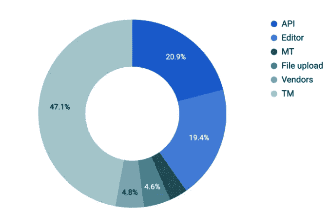

# TMS 的重要性——更深刻的见解

> 原文：<https://medium.com/nerd-for-tech/the-importance-of-a-tms-a-deeper-insight-4e9bca7c6f7c?source=collection_archive---------18----------------------->

向组织的其他部门强调翻译管理系统(TMS)对于本地化的价值通常是一项艰巨的任务。关于本地化的[值有很多资源和数据。但是缺少的是 TMS 带来的好处的一些优点。](https://www.transifex.com/blog/2021/what-is-localization/#The_Importance_of_Localization_in_Business_Strategy)

我们最近对客户如何利用 Transifex 进行了匿名分析，数据显示:

*   您已经翻译的内容占所有翻译的 47%
*   使用 TMSs 提供的自动化工具，翻译工作量增加了 20%
*   TMS 在线翻译环境(CAT 工具)支持额外 19%的翻译
*   [机器翻译服务](https://www.transifex.com/blog/2021/what-is-machine-translation/)在提供新翻译服务方面获得了 4%的信任

请继续阅读，了解翻译管理系统带来的更多价值。

# 分析的❤️:翻译数据

为了更好地了解翻译是如何进行的，我们求助于自己平台上的数据。我们对人们使用该平台本地化内容的不同方式感兴趣。可能的方式包括:

*   通过 API 将翻译发送到 Transifex TMS。这些翻译是在 Transifex 之外的工具中完成的，要么使用外部编辑器，要么通过集成完成，比如 [Zendesk Integration](https://www.transifex.com/zendesk-integration/) 。
*   使用存储在翻译记忆库中的预先存在的翻译。该功能被称为 TM 填充，并且仅当原始字符串/源字符串 100%匹配时才翻译内容
*   使用其他服务来执行翻译，如供应商或机器翻译(MT)服务
*   上传翻译文件，这意味着外部非自动化服务已经提供了翻译。

为了确保我们将分析本地化的现代方法，我们将样本缩小到过去 30 天内完成的翻译。数据安全性和匿名化对于 Transifex 来说非常重要，因此所有数据都被聚合和匿名化，完全专注于翻译执行方式的数量。

# 数据分析

如前所述，我们将重点放在聚合的匿名数据上，以突出翻译类型的数量。就翻译量而言，Transifex 在 30 天内处理了 746 万份翻译。

汇总数据的明细显示在下面的饼图中。

虽然大量的翻译是通过编辑器或 API 完成的，但有趣的是[翻译记忆库](https://www.transifex.com/blog/2021/translation-memory-software/)遥遥领先。47.1%是第二大常用工具的两倍多——这正好表明软件工具可以产生多大的影响。第二种最常见的添加翻译的方法是通过 API，有 20.9%的翻译是通过这种方式添加的。

第三种方法是通过编辑器有 19.4%。这是指翻译人员使用我们的编辑器通过任何方式完成翻译，无论是通过传统方式还是利用我们的工具。

由于翻译记忆库(TM)是由以前的公司翻译填充的，所以几乎一半的新翻译是由先前存在的翻译的聚合杠杆作用产生的！拥有翻译记忆库并正确使用它，公司可以获得以下好处:

*   翻译填补了与 TM 中已有内容相匹配的新内容。这种[填充可以在 Transifex 中设置为自动](https://docs.transifex.com/translation-memory/enabling-autofill)和接近实时的工作，并且——如上所述——占您新翻译需求的一半。这里增加的唯一成本是您的 TMS 服务成本，不需要翻译或供应商。
*   使用以前的翻译作为译者在编辑器中工作的指导点，编辑器也大量用于翻译。通过[的建议标签和索引功能](https://docs.transifex.com/translation/using-translation-memory-and-concordance-search)，可以在 Transifex 编辑器中使用 TM。

转到翻译的 API 使用，我们可以清楚地看到本地化过程中自动化的需要。API 的使用需要集成，因为集成利用 API 调用来交换数据。

本质上，这意味着需要进行一定的开发，以便正确地设置自动化，并让它自己发挥作用，而不需要亲自干预。阅读数据的一个安全假设是，20%的翻译是通过 Transifex TMS 提供的工具自动完成的。

所提供工具的质量和有效性是编辑器使用中的一个关键因素，因为翻译人员和审阅人员对更快地提供精确的翻译感兴趣。

使用编辑器进行翻译的替代方法是使用另一个 CAT 工具，并上传包含翻译的文件。

检查上面的图表，我们可以看到尊重领域在翻译偏好方面排名第六，即文件上传占新翻译的 4.6%。这里的一个假设是，使用 Transifex 的人对所提供的编辑器工具的信任几乎是外部编辑器的四倍。

# 关于供应商和机器翻译

供应商指标反映了有多少公司使用了订单向导来获得其内容的翻译—占所有翻译的 4.8%。通过订购翻译，您可以将内容作为文件发送给供应商，让他们为您处理所有的本地化工作。

这个百分比反映了当前正在发生的向更持续的本地化工作流的转变，这不能通过有序翻译来表示。

取而代之的是翻译供应商(LSP)和公司签订主服务协议(MSA ),这种关系是持续的。

最后，机器翻译(MT)占所有翻译的 3.2%。尽管这一比例很小，但与其他翻译来源的比例相当。这反映出人们越来越相信机器翻译是一种高质量的翻译选择。

您可以通过查看我们与 Quora 举办的最新网络研讨会[本地化策略和工作流程](https://www.transifex.com/blog/localization-strategy-workflow-hacks-webinar-highlights/)的亮点，了解更多关于供应商和机器翻译的信息，以及它们在未来将如何影响本地化工作流程。

# 结论

综合上述所有指标和数据(因为这些指标和数据反映了 TMS 的实际使用情况),我们可以清楚地看到 Transifex 如何为至少 88%的通过 TM、API 和自动化或编辑器执行的新翻译做出贡献。

TMS 更大的好处是收集和控制所有需要本地化的内容所需的粘合剂。无论您是使用集成、提供的编辑器、API，甚至是选择的供应商，TMS 都站在 it 的中心，通过翻译记忆库等工具使内容在内部和之间可用，从而节省您的时间和金钱。

[**原博文发表于本页面**](https://www.transifex.com/blog/2021/the-importance-of-a-translation-management-system/) **。**