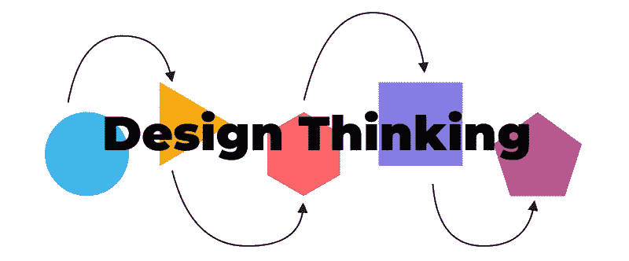
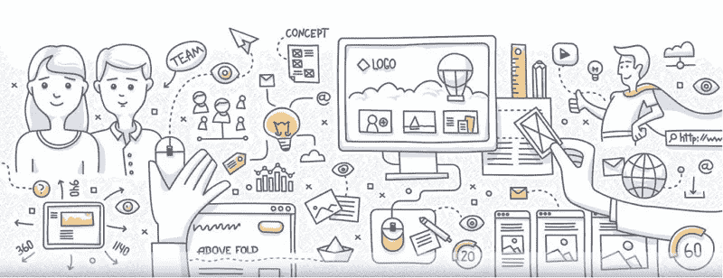
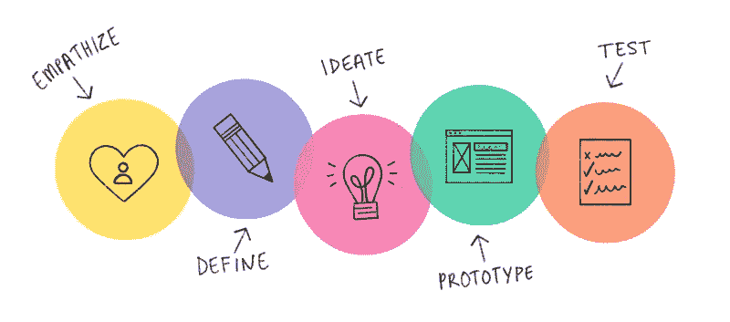
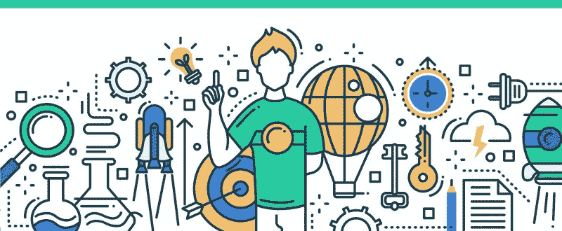
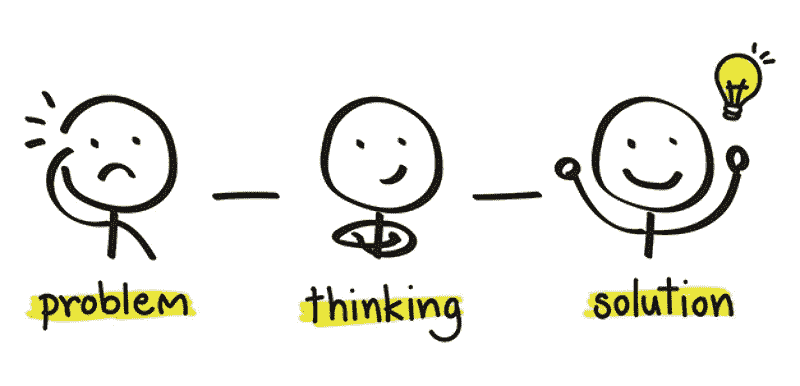

# 让 UX 更美好的设计思维

> 原文：<https://medium.com/nerd-for-tech/the-importance-of-design-thinking-for-ux-6bc90d82d0ed?source=collection_archive---------22----------------------->

[设计思维](https://bit.ly/2OKlPqd)是 1969 年诺贝尔奖获得者[希尔伯特·西蒙](https://www.nobelprize.org/prizes/economic-sciences/1978/simon/biographical/)在他的著作[人工科学](https://g.co/kgs/na5izc)中提出的一种思想。简单来说，就是跳出框框思考，或者改变思维方式，找出解决问题的方法。在他的书中，赫伯特阐述了设计思维与改善未来的联系。

这一理念有助于我们通过五个步骤从逻辑上创造创新的解决方案。因此，在本文中， [Wondershare Mockitt](https://bit.ly/3ewCXuz) 将讨论设计思维过程的五个阶段。它与 UX 设计的关系和它的目的，以及 UX 设计师为什么要在设计思维上投入时间？

# 设计师基于解决方案的思维

设计思维是所有公司的一部分，无论它们属于哪个行业，因为它是一个迭代的、非线性的、以用户为中心的过程。因此，它使设计师能够提出基于解决方案的想法，而不是基于问题的想法。

这是 UX 设计师的框架，他们把它作为解决问题的工具。这种基于解决方案的思维让设计师们想出了超越边界的非凡创新。

设计思维过程有五个步骤，即移情、定义、构思、原型和测试。设计师逻辑上使用这些步骤，并重复它们，以提出一个以用户为中心的问题解决方案。

# **设计思维的五个阶段**

***感同身受***

设计思维过程的起点是换位思考，关注用户的需求。在这个阶段，你要站在用户的角度去洞察用户和他们的需求。你需要了解人们的生活规律，他们的需求和想法等等。最好的方法是进行采访和调查。

这个阶段的经验法则是避免对用户需求的假设。你的重点应该放在采访和调查的信息上。很难避免假设，但是为了一个好的 UX 设计，你必须这样做，因为假设会导致无用的产品。

正如我们之前讨论的，这是一个困难的步骤，你不能根据一两次采访就得出需求，所以你应该重复这一步，以获得对问题有用的解决方案。

***定义***

在这一步，你根据设计思维第一步的信息定义一个真实的问题，做一个问题陈述。

在这一步，你的焦点也必须坚持用户的需求并定义问题陈述。不要在这个阶段考虑产品或组织。在原型和测试之后，你可能会回到这一步来完善你的问题陈述。

这里最好的建议是不要犹豫精炼你的陈述，永远不要假设它是完美的。与其面对产品的失败，不如回到这一步来提炼。

*这是第三阶段，在了解用户需求和问题陈述之后。在这里，你将开始跳出框框思考。是创意和头脑风暴的阶段。你可以使用许多构思技巧，如头脑风暴、思维导图和角色扮演场景，来形成尽可能多的想法。*

*不要去想这些想法是否可行。在此之后，你会缩小你的想法向前迈进。你可以开始研究这些想法，以得出最终的产品。没有必要在现阶段只决定一个可行的方案。*

****原型****

*设计过程的第四阶段是关于实验和将你的想法转化为有形的产品。因为在这一步你有不同的想法，所以在最初阶段就计划好你的花费。最终你将不得不丢弃大部分的原型。*

*这是最关键的阶段，因为你在构思，并努力确保在最终设计中没有任何遗漏。UX 设计师使用专业的原型制作工具来获得最终产品的真实视图。*

*一个原型可能会失败，所以与其担心它，不如再做一次，因为一个失败的原型比实际产品的失败要好。*

****测试****

*在用户身上测试你的原型，确保它是否是一个可行的解决方案，这是设计思维的最后阶段。*

*但这并不是设计思维过程的终点。在洞察之后，你将重新定义你的问题陈述，以获得解决问题的可行方案。*

*这是你验证原型的机会，所以不要向用户解释设计，而是给他们机会，让他们自己去理解。它会帮助你完善问题陈述。*

# *UX 设计思维的目的？*

**

*UX 设计师必须投入一些时间和精力来了解设计思维过程，因为理解我们为其提供解决方案的人是一项挑战，你不能冒险忽视真正的问题。*

*严格来说，这是一个以用户为中心的过程，促使你从用户的角度看待问题。这个阶段你只考虑现实问题，不指望产品。*

*设计思维专注于寻找解决方案，而 UX 设计帮助我们设计这些解决方案。一个好的 UX 设计包括三个主要属性:有用性、可用性和合意性。*

*UX 设计思维的目的是让设计师能够创造革命性的创新。思考过程中涉及的步骤使设计师学习速度很快，并在任何阶段迭代以完善解决方案。因此，它降低了与新想法和产品相关的风险。*

# *设计思维在工作中的好处*

**

*设计思维最好的一点是它不是一个线性模型，所以你不必遵循一个简单的过程。你可以回到某一点来完善你的想法或问题，以确定产品设计中的问题和不足。*

*所有企业都有一系列永无止境的目标和新产品的推出。新产品的形成会花费巨大的成本，如果失败，会造成损失。所以，设计思维让你免于损失，因为它专注于解决人们需要的问题。直接节约成本是设计思维投资回报的一部分，产品不仅对人有益，对公司也有益*

*   *它提高了转化率。*
*   *它提高了客户保持率和忠诚度。*
*   *它降低了客户支持成本。*

# *包裹*

*设计思维是 UX 设计师创造创新的方式，因为它使他们能够适应用户的鞋子。它的五个步骤帮助他们关注真正的问题。这个过程的非线性和反复性增强了你的创造力和思维。因此，设计师可以看到他们的创造力，满足他们的业务目标和用户需求。*

*感谢您花时间阅读这篇文章。[了解更多关于 Mockitt 的信息](https://bit.ly/3ewCXuz)*

*我们为 UX 初学者创建了一个[终极指南](https://bit.ly/2OLPPlW)，它收集了来自多个 UXers 的知识、经验和建议。*

*订阅我们的 [YouTube](https://www.youtube.com/channel/UCESxamaRS8nOGpWYvP1VSqA) [脸书](https://www.facebook.com/mockitt) [Instagram](https://www.instagram.com/wondershare.mockitt/)*

**原载于*[*https://mockitt.wondershare.com*](https://mockitt.wondershare.com/ui-ux-design/design-thinking.html)*。**