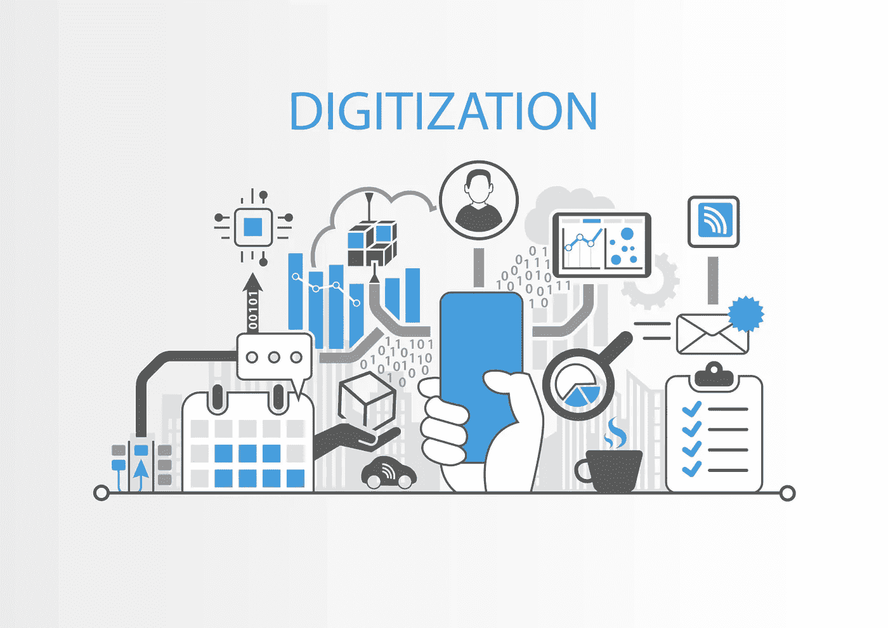

# 文档数字化对您业务的重要性

> 原文：<https://medium.com/nerd-for-tech/the-importance-of-document-digitization-for-your-business-b215010ef910?source=collection_archive---------0----------------------->

纸质记录会很快淹没小型办公室，尤其是在较小的组织中。此外，保存在纸上的文件越多，跟踪重要文档就变得越困难。

另一方面，从纸质文件转换到数字文件可以节省时间和金钱。数字化的纸质文档比相同大小的纸质文件占用的空间少得多。数字文件也更安全，因为它们更容易备份。在查找信息时，数字报纸通常更便于搜索。

让我们先了解一下什么是文献数字化。

## 什么是文献数字化？

文档数字化是指使用各种工具和技术将纸质文档转换为数字文件，计算机系统可以使用这些工具和技术来自动化操作或工作流程。据说这是创建数字公司最关键的步骤之一。多种文档捕获和文档扫描仪解决方案可用于数字化业务文档。看看你如何使用文档捕获软件扫描和上传你的文档。他们可以从公司范围的文档中扫描、记录和分类数据。这些信息也可以电子方式保存在服务器上，并且可以在所有公司域中访问或共享。当需要时，文档扫描和 OCR 技术通过允许更快的数据检索来帮助企业提高效率。

然而，并不是所有的文献数字化技术都同样有效。确保你在 2022 年使用最好的[文档捕获软件](https://www.dynamsoft.com/web-twain/overview/)来数字化文档。现代文档扫描 SDK 不仅仅是一个数字文件柜。它们将为您的公司节省时间和金钱，同时也使数据在最佳状态下更有价值和更易访问。这里有几个将你的商业文件数字化的好理由。

## 对“纸张”问题刨根问底

许多公司的日常运营仍然由纸质和手工流程主导。几乎所有的事情都涉及到写作，从数据录入到月结单。使用文档扫描软件，可以检索任何数字文档中的文本，并将其转换为可搜索、可编辑的格式。结果，以前锁在纸面上的信息的导入、编辑、存储和查找变得更加容易。

## 使用数字存档，您可以提供长期存取

企业范围内的文件可以使用像 [TWAIN 扫描仪](https://www.dynamsoft.com/web-twain/overview/)这样的技术进行扫描、归档和编目。数据也可以以电子格式存储在服务器上，并在所有业务领域之间访问或共享。