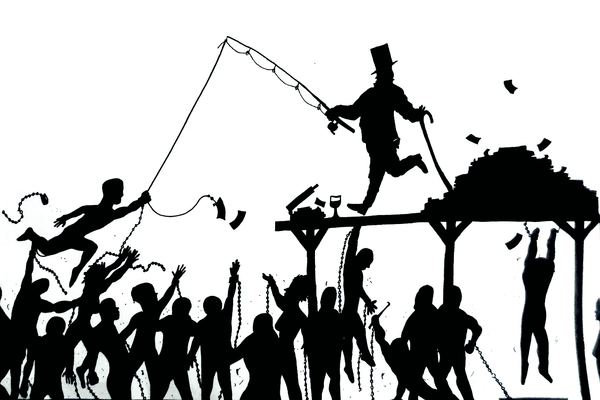

# 互联网卡班仆人领导陷阱

> 原文：<https://medium.com/nerd-for-tech/the-internet-kaban-servant-leader-trap-bed1c6c7788d?source=collection_archive---------9----------------------->

## 今天由互联网推动的影响者和明天的区块链组织

图片来自[卡拉·沃克](https://walkerart.org/collections/artists/kara-walker)

在我们生活的互联和有线世界中，我已经发现了一个危险，即中断驱动平台的规模不断增长，这些平台是通过使用几种方法来利用你的注意力，这些方法利用了我们在认知科学、社会学和网络效应方面取得的进展，但我也发现了随后一周的另一个危险，即越来越多的有影响力的人受益于通信工具的民主化，以建立渴望做这些人希望他们做的事情的人的部落。他们能够将人们分组，并让他们在一个基于团队的环境中工作，通常是远程的(成本有效的),目的是切割一些对这个世界或这些忠诚的人可能有用也可能没用，但肯定对有影响力的部落领袖有益的东西。在这种类型的部落中，所有成员通常都被有影响力的人视为领导者，而有明显的证据表明，如果必须做出决策，一个群体的所有成员不可能同时都是该群体的领导者，除非有一个决策过程，其中每个成员的声音都具有相同的权重。在这样的背景下，仆人领袖的绿叶概念在我看来还有另一层含义: ***按照我领导你的方式为我服务或者成为我的仆人领袖***

这些影响者的主要受众是像你和我这样的人，他们愿意通过使用互联网的力量以及这些影响者用来让我们相信他们是我们的领导者的信息和通信的便捷性，采取一种远离工业技术统治的个人方式，因为他们在给定的时间点为我们提供了我们眼中的重要信息，当时我们遇到了困难，我们正在寻找解决方案。 *(1)自我和团队企业家(通常是年轻人)、自由职业者(年轻人和对目前工作不满意的员工)、未能在他们工作的组织内发挥领导作用的关键高管以及将利用互联网进行第二次体验的退休专业人士是这些互联网推广影响者的目标人群。*

因为他们很早就抓住了从一个信息被大型媒体公司收集和挖掘的世界到这个开放的信息世界的转变，这个开放的信息世界是由搜索引擎驱动的，搜索引擎通过使用关键字和链接以及人们的行为来过滤和建议信息，他们被这个计算机和算法的网络所推动，并与数百万人联系在一起，其中一些人因为地位而急切地准备为他们免费工作，但主要是因为这种行为是给定这种观众的预期(见 1)。这些人通常认为他们可以利用影响者的声音来提高自己的声音，展示他们的作品，并在专业上获得更多的关注。这就是职业关系网，它通常是我在这里描述的一个陷阱的核心，对于我所描述的观众来说，这是一个陷阱。

由于这些受众中的大多数人都在寻找工业体系之外的替代途径，这些互联网推动的领导者往往表现出反体系、反工业主义和反资本主义的形象和心态，以配合这些有影响力的人告诉自己的故事。但是，一个扁平的组织层级结构是否易于指数增长和提高生产率是一个值得问的问题。

另一种选择是认真做你自己的工作，不要追随任何互联网推广的领导者，但我不是说你应该避免倾听和阅读他们，而是你应该承认你是你想要实现的事情的领导者，如果它成功了，这将主要是因为你或因为这个人与组织之间区块链连接的新互联网时代， ***区块链连接*** 在一开始就有明确的条款和未来结果，并且在给定初始条款内的元素的情况下，可能在未来具有适应性。

Kaban 对于个人和组织来说是一种很好的方法，我对这些丰田管理人员、流程、运营和组织的方式很感兴趣，因为它们都是可以改进的很好的工具，但我认为这种**区块链组织**将需要新的管理方法。我正在研究这套新的方法，我认为你也应该这样做。但是要小心那些通过互联网提升的有影响力的人。

PS:**我并没有假装领导任何人，而是学习、构建并向世界传播有趣的科技创意，我承认，在此之前，除了这些廉价的文字，我还传播过任何有价值的东西。但是非常感谢你阅读我的文章，如果你想教我什么，请告诉我。**

Kara walker 的特色图片，她真的值得一篇来自 greyio 心脏实验的文章

访问卡拉·沃克[网站](https://walkerart.org/collections/artists/kara-walker)