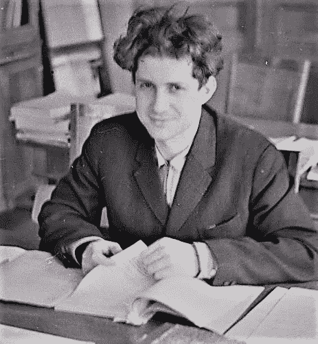
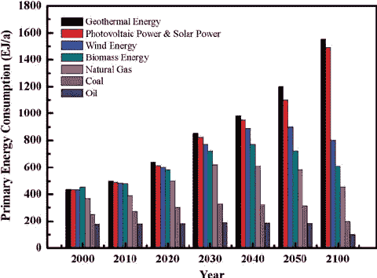

# 卡尔达舍夫尺度——成为宇宙的终极存在

> 原文：<https://medium.com/nerd-for-tech/the-kardashev-scale-becoming-the-ultimate-beings-in-the-universe-f84a1c23d123?source=collection_archive---------14----------------------->

当你想到“文明”这个词时，你会想到什么？你如何描述一个文明是什么或者它意味着什么？是的，你猜对了！它一般是一群人利用可利用的资源，以有组织的方式生活在一个社会中。它可能包含任何数量的智慧生物。但是，等等！如果文明的规模扩大了呢？它们必须消耗多少能量？如果他们母星的能量不足以让他们的文明生存下去呢？似乎有点可怕吧？别担心。我们的文明还没有达到能源消耗的水平，而且我们还没有发现那种文明。现在，卡尔达舍夫等级被用来根据能源消耗对文明进行分类。让我们看看效果如何。

尼古拉·卡尔达舍夫

卡尔达舍夫等级基本上是一种描述一个文明的技术进步的测量方法。它是以一个文明消耗的能量来衡量的。它是由俄罗斯天体物理学家尼古拉·卡尔达舍夫在 1964 年提出的。

最初，卡尔达舍夫将文明分为三类:

一个**1 型文明**(也被称为行星文明)是一个可以利用他们星球所有能量的文明，大约是 10 ⁷瓦。根据著名天文学家卡尔·萨根的说法，我们的文明大致是 0.7 型文明，接近 1 型文明。

一个**2 型**文明(也被称为恒星文明)可以利用其母星的所有可用能量。这包括建造像戴森球一样的巨型结构。

一个**类型-3** 文明(也被称为银河文明)将利用他们居住的银河系的所有资源。

我们人类文明还没有达到 1 型文明。物理学家加来道雄说，如果我们以每年 3%的速度增加能源消耗，我们可能在大约 300 到 400 年后达到 1 型。很明显，这些年来我们的日常能源消耗一直在稳步增长，我们距离达到第一类文明已经不远了。

来源:[https://www . researchgate . net/figure/The-resources-demand-changes-in-The-last-100-years-The-structure-of-The-world-energy _ fig 3 _ 274163681](https://www.researchgate.net/figure/The-resources-demand-and-changes-in-the-structure-of-world-energy-in-the-last-100-years_fig3_274163681)

我们可以像第 4 类或第 5 类文明那样进一步扩展。酷吧？我们只能想象这些文明能做什么，比如他们能利用宇宙的能量，或者他们能改变物理定律，或者他们也能创造和毁灭宇宙。我们称他们为神更好！

想象一下随意创造和毁灭宇宙吧！它甚至一想到它就让我毛骨悚然！！！

所以，题目就讲到这里。祝您愉快:)