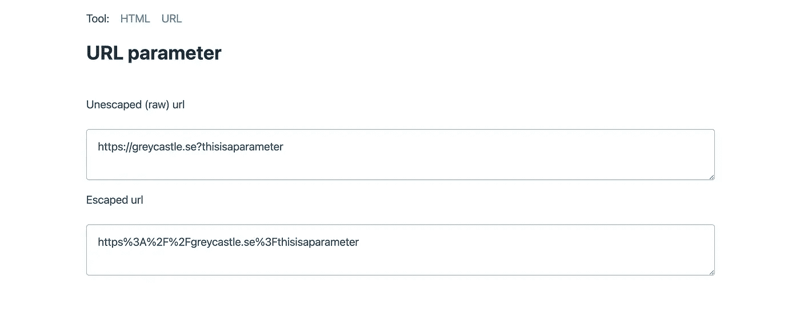
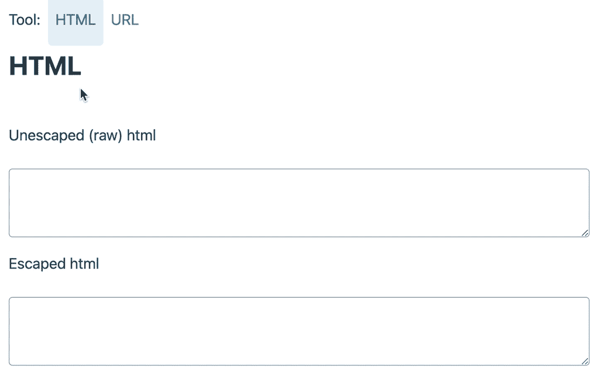

# 上次我在谷歌上搜索编码工具时

> 原文：<https://medium.com/nerd-for-tech/the-last-time-i-googled-an-encoding-tool-18e9839f5c6f?source=collection_archive---------6----------------------->

我闪亮的新编码工具示例

今天，我再次在谷歌上搜索，以获得一个 HTML 片段的快速编码，并显示在我创建的网页中。

我已经做了一百次了，每次我似乎都在一个新的工具上着陆，但是他们都有一些共同之处。

*   他们很慢
*   它们看起来像 90 年代的东西
*   他们堆满了我不需要的东西

那我需要

1.  找出两个字段中的哪一个要添加内容
2.  我需要切换到解码或编码模式，因为我总是以错误的方式结束
3.  我需要按下一个按钮进行转换
4.  我需要更新我的代码，并再次按下以进行调整

一定有更好的方法？它实际上只是几行 javascript。所以我做了一个更好的方法。

打开[https://ddikman.github.io/encode-tools/](https://ddikman.github.io/encode-tools/)你有超文本标记语言和网址编码，没有一个按钮可以按下(除非你需要找到另一个工具，对不起，我没有解决这个现成的..还没有)

实时使用、编码和解码 HTML 和 URL 的示例

这个工具非常小。风格上基于美妙的 [pico CSS](https://picocss.com/) ，使用 [JQuery 对 HTML](https://stackoverflow.com/a/25207/479632) 进行编码，并且使用内嵌的 [VueJS](https://vuejs.org/) 非常容易构建。

查看存储库并帮助添加更多编码器！

 [## git hub-ddi kman/encoder-Tools:无需按下按钮即可对浏览器中的内容进行编码和解码的工具

### 有一天，我厌倦了在谷歌上搜索编码 html，找到一页又一页的工具，这些工具在你弄清楚之后就可以工作了……

github.com](https://github.com/ddikman/encode-tools/) 

书签和享受！