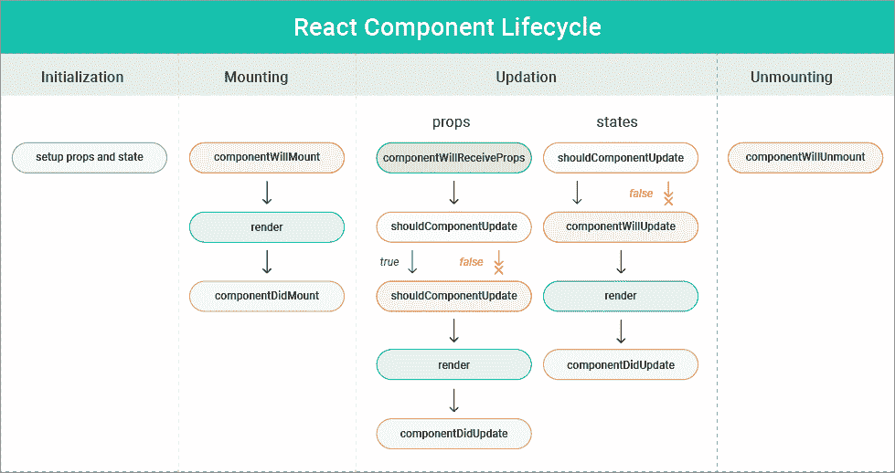
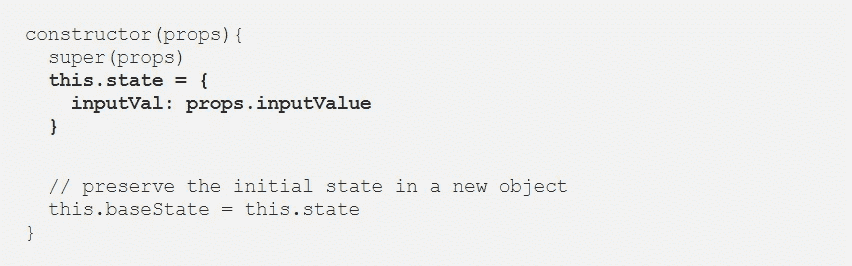

# 组件的生命周期反应

> 原文：<https://medium.com/nerd-for-tech/the-lifecycle-of-components-reactjs-86a562c6e725?source=collection_archive---------1----------------------->

每一个 React 组件都有自己独特的生命周期，也就是我们所知的一系列方法，它们在组件存在的不同阶段被调用。React 组件经历了生命周期的四个不同阶段，如下所示。

1.  *初始化*
2.  *挂载*
3.  *更新*
4.  *卸载*

## ***初始化阶段***

React docu 将此称为反模式，在初始化阶段，组件是用给定的属性和状态构造的，这是在组件类的构造函数中执行的。

JSX 主要依赖三种数据，

1.  “错误”:这是当系统中有错误或渲染中有错误时显示的标准消息。
2.  “加载”:加载是指应用程序获取 API 数据的时候。
3.  “用户”:从 API 中检索的数据也很重要。

## ***贴装阶段***

然后在渲染的挂载阶段由 render 方法本身返回 JSX。这一阶段有 3 种主要方法:

1.  getDerivedStateFromProps()；
2.  render()；
3.  componentDidMount()

**getDerivedStateFromProps():**这是一个静态方法，在生命周期中很少使用。只有当组件的状态依赖于随时间的动态变化时，才使用此方法。

**render():** Render 就是在这种状态下把组件挂载到浏览器上。这是一种经典的方法，每次提供相同的输入时都会给出相同的输出。这是 ReactJS 编码框架中广泛使用的标准函数。

**componentDidMount():** 这是在组件及其子组件在 DOM 中呈现后执行的最后一个 ReactJS 钩子方法。使用这个组件可以有效地访问 DOM。您还可以使用其他几个可以合并到最终输出中的库进行初始化。您还可以在此方法下进行正确的 API 调用，以便能够以正确的方式检索数据。

## ***更新阶段***

更新是指更新组件状态并重新绘制应用程序的阶段。在这个阶段调用了 5 个方法

1.  getDerivedStateFromProps()
2.  shouldComponentUpdate()
3.  渲染()
4.  getSnapshotBeforeUpdate()
5.  componentDidUpdate()

**shouldcomponentdupdate():**方法告诉程序更新时的渲染状态。如果正在更新新的道具或规则，则可以完成或跳过渲染。这对于正确编码很重要，因为程序中也有不断发展的状态。将方法更新为 true/false 是正确的方法。这里的默认值是 true，可以根据代码进行更改。

**getSnapshotBeforeUpdate():**这是在前一个方法返回 true 的答案时执行的。如果在返回响应之前需要进行一些预先的计算，那么它将用于准备即将到来的渲染。对于更复杂的程序，也可以使用这种方法。

**componentDidUpdate():** 当更新的组件也在 DOM 中被更新时，就会执行这个命令。然后，您可以启动新的库来重新加载，这样您就可以在整个过程中维护一个更新的程序。

## **T5【卸载阶段】T6**

在卸载的最后阶段:顾名思义，卸载是组件生命周期的最后一步，在这一步中，组件被从页面中删除，以通过卸载产生结果。在这个阶段只调用了一个方法，

**componentWillUnmount():** 这是生命周期中的最后一个方法，因为它与核心卸载和从 DOM 中删除有关。组件的清理也在这里执行。当用户想从浏览器中清除程序时，这也用于注销用户。

**参考文献**

[https://www.cuelogic.com/blog/reactjs-lifecycle](https://www.cuelogic.com/blog/reactjs-lifecycle)