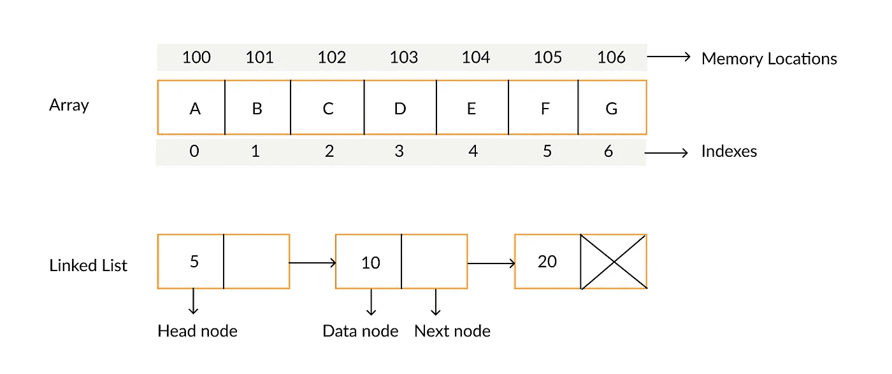
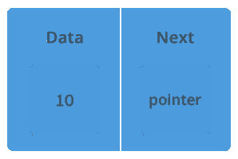

# 链表数据结构

> 原文：<https://medium.com/nerd-for-tech/the-linked-list-data-structure-4fe93ec01f94?source=collection_archive---------33----------------------->

什么是链表？乍一看，您可能会认为这是某种奇特的数组。虽然它们确实非常相似，但是还是有一些关键的不同之处，这些不同之处会影响我们何时使用它们。为了更好地理解这种数据结构，我们将探究什么是链表，以及为什么我们会选择使用链表而不是传统的数组。

所以说真的，什么是链表？

维基百科将链表数据结构定义为:“*数据元素的线性集合，其顺序不是由它们在内存中的物理位置*给出的(比如一个数组)。*相反，每个元素都指向下一个*这是链表最基本的概念之一。列表中的每个节点都指向/链接到下一个节点。而在数组中，每个元素都用一个索引来标识，该索引可用于直接访问数据。

数组和链表的可视化比较

为了打破这个概念，你可以把链表想象成一个寻宝游戏。一旦你找到了第一条线索，可能会有少量的宝藏告诉你，你是在正确的轨道上，这代表了节点持有的数据。在你到达终点之前，还会有一条线索指引你寻找下一个地点或线索。这些线索代表了由形成列表的链接性质的节点持有的指针。

链表结构的可视化

参考上面的图片，我们可以看到链表中的第一个节点被称为 head，像列表中的所有其他节点一样，它可以保存任何有效的数据类型以及指向下一个节点的指针。这个链继续向下，直到我们到达列表中指向 null 的最后一个节点，这表明它确实是最后一个。

链表中单个节点的可视化

单个节点内的指针通常被称为 next，因为它指向下一个节点。这可以被认为是一个地址，告诉系统在哪里寻找链中的下一个数据。重要的是要记住，链表中的每个节点**必须**包含一个指向另一个节点或空值的指针，以便加强这个数据结构的链接性质。

现在我们已经清楚地了解了什么是链表，让我们来定义一下使用链表的利弊。

# **优点:**

*   可以很容易地在链表中添加或删除节点。由于链表的顺序是由指向下一个节点的指针或链接定义的，我们可以简单地改变指针链接的位置，而不是重新组织整个数据结构。
*   动态数据结构。链表是动态的，这意味着它们可以在运行时增长和收缩，所以我们不需要定义链表的初始大小。
*   链表的动态特性也减少了内存浪费，因为它可以释放运行时不使用的内存。

# **缺点:**

*   这种数据结构的链接性质使得遍历困难而缓慢。如果你想在一个链表中找到一个特定的值，你必须**从开始处开始，沿着每个单独的节点，直到你到达包含该值的目标。**
*   内存使用，与数组相比，在链表中存储节点需要更多的内存。这是因为一个节点不仅会保存一些数据，还会保存指向下一个节点的指针。因此需要更多的内存空间。

列出了优缺点之后，链表和数组之间的区别就变得更加清晰了。

链表更适合需要操纵数据结构的操作，因为我们可以很容易地插入和删除节点。当迭代一个数据结构时，我们很可能更喜欢使用数组，因为当访问第一个和最后一个之间的值时，我们有一个方便的索引可以使用。我们也不局限于只从第一个值开始访问数据，就像我们访问链表一样。

总之，与数组相比，链表数据结构有一些关键的不同，这使得它更适合执行不同的任务。这些任务包括我们不知道我们的列表需要多长，或者我们是否需要在运行时不断改变数据结构的大小。现在你已经对链表有了更好的理解，你可以开始更深入的主题了，比如双向链表，甚至循环链表！

# 参考资料:

*   维基百科（开放式百科全书）
*   [https://en . Wikipedia . org/wiki/Linked _ list #:~:text = In % 20 computer % 20 science % 2C % 20a % 20 Linked，其中% 20together %代表%20a%20sequence。](https://en.wikipedia.org/wiki/Linked_list#:~:text=In%20computer%20science%2C%20a%20linked,which%20together%20represent%20a%20sequence.)
*   教程要点
*   [https://www . tutorial point . com/data _ structures _ algorithms/linked _ list _ algorithms . htm](https://www.tutorialspoint.com/data_structures_algorithms/linked_list_algorithms.htm)
*   thecrazyprogrammer
*   [https://www . the crazy programmer . com/2016/11/advantages-missions-linked-list . html](https://www.thecrazyprogrammer.com/2016/11/advantages-disadvantages-linked-list.html)
*   极客论坛
*   [https://www.geeksforgeeks.org/data-structures/linked-list/](https://www.geeksforgeeks.org/data-structures/linked-list/)
*   黑客地球
*   [https://www . hackere earth . com/practice/data-structures/linked-list/single-linked-list/tutorial/](https://www.hackerearth.com/practice/data-structures/linked-list/singly-linked-list/tutorial/)
*   面部准备
*   [https://www . face prep . in/data-structures/linked-list-vs-array/](https://www.faceprep.in/data-structures/linked-list-vs-array/)