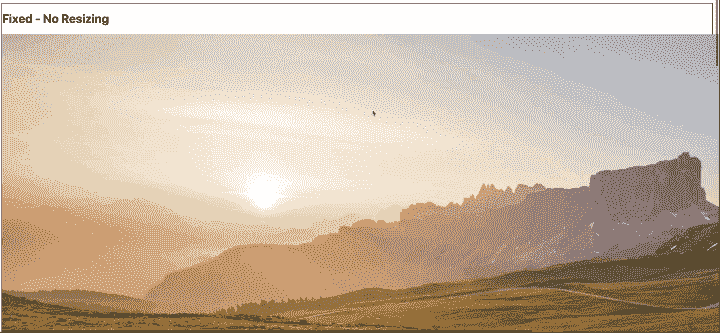
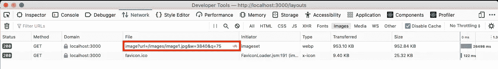
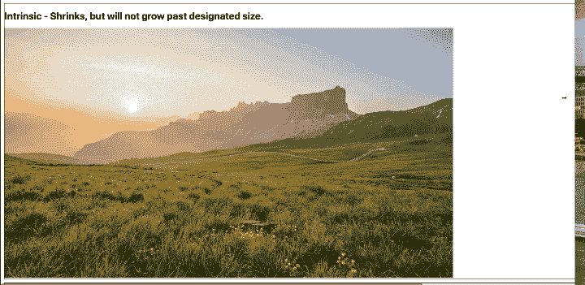
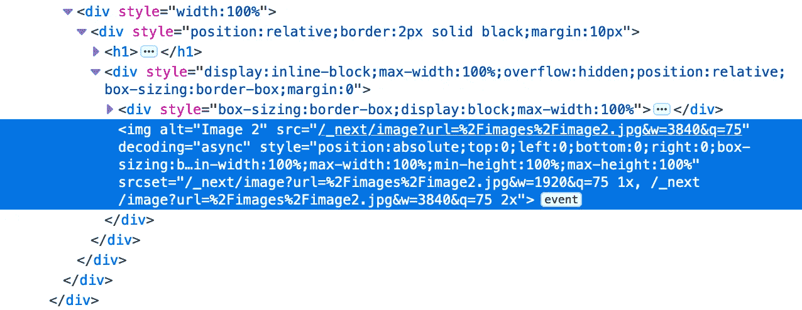
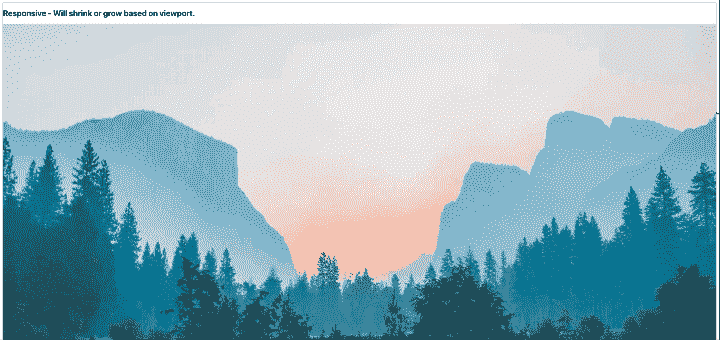
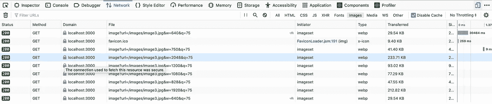
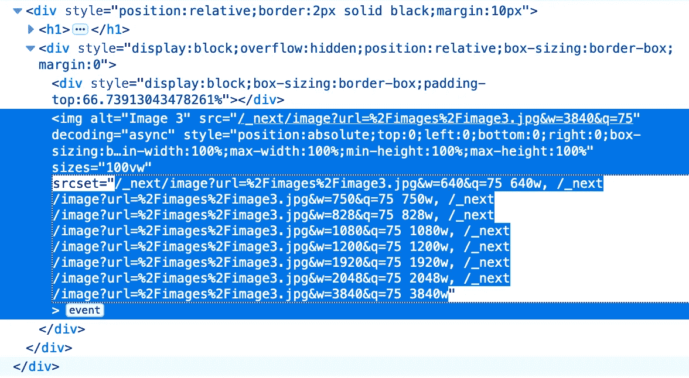
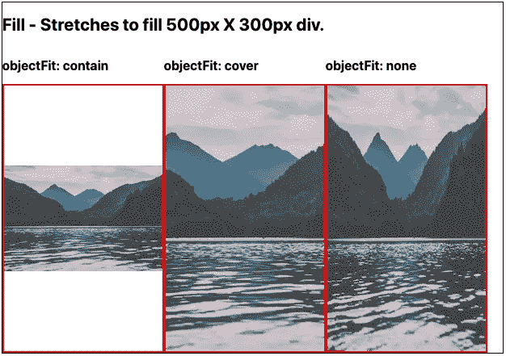
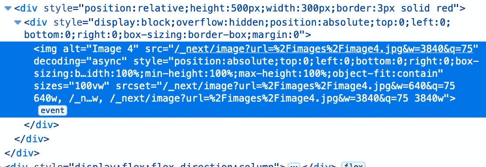

# NextJS 中的神奇图像组件:前端开发人员的好朋友

> 原文：<https://medium.com/nerd-for-tech/the-magic-image-component-in-nextjs-a-front-end-devs-best-friend-21e09a25df30?source=collection_archive---------4----------------------->


由[马雷克·皮尼基](https://unsplash.com/@marekpiwnicki?utm_source=medium&utm_medium=referral)在 [Unsplash](https://unsplash.com?utm_source=medium&utm_medium=referral) 上拍摄的照片

页面加载速度已经成为现代网页设计中最热门的话题之一。据估计，如果页面加载时间超过 3 秒，25%的用户会离开该页面，而页面加载时间的最重要因素之一是它需要加载的图像的大小和数量。自从互联网出现以来，开发人员就一直受到这个问题的困扰，并试图创建精简、响应迅速的图像标准来制作 web。

NextJS 是一个流行的新 React 框架，它为 React 应用程序带来了许多好处。除了服务器端渲染、代码分割和热模块替换(所有这些都是为了提高性能和减少加载时间)，NextJS 最近还推出了一个惊人的`<Image>`组件，它可以自动解决大量的这些问题:

*   调整大小，优化和服务图像。这将根据视口大小传送较小的图像。
*   在构建时优化图像，并在用户请求时按需优化。
*   默认情况下延迟加载，在需要之前从不下载额外的图片。
*   定制图像渲染以避免累积布局偏移，因此页面不会随着图像加载而跳跃和增长。

每一个都有助于核心网站的活力，谷歌在搜索排名中使用的数据，以及网页的搜索引擎优化配置文件的质量。开发人员过去不得不在考虑这些因素的情况下考虑编码，但是 NextJS `<Image>`组件会在幕后处理所有的事情。

在本文中，我将带您浏览一个演示项目，您可以参考这个项目，在下一个 NextJS 项目中实现这些好处！我已经在 GitHub 上创建了一个 repo，其中包含了我将要检查的所有工作，因此您可以跟随，或者简单地参考完成的项目:

[](https://github.com/dirklo/image-demonstration) [## dirk lo/图像-演示

### 这是一个用 create-next-app 引导的 Next.js 项目。首先，运行开发服务器:打开…

github.com](https://github.com/dirklo/image-demonstration) 

出于本演示的目的，我将跳过 NextJS 的安装。如果你不熟悉这些步骤，那么[文档](https://nextjs.org/docs)很好地涵盖了基本安装。

## 最重要的布局道具


由 [mostafa meraji](https://unsplash.com/@mostafa_meraji?utm_source=medium&utm_medium=referral) 在 [Unsplash](https://unsplash.com?utm_source=medium&utm_medium=referral) 拍摄的照片

让我们从你需要传递到你的`<Image>` 组件的最重要的道具开始:“布局”:

你有 4 个图像布局选项。让我们逐一查看一下:

*   修正——这很像传统的``标签。您的图像尺寸不会改变，也不会随视窗的大小而缩放。
*   固有——`<Image>`组件的标准设置。图像将随着视口缩小，但不会变得比传入的宽度和高度属性更大。
*   响应式—根据视口大小缩小或放大的图像。
*   填充—图像将填充其父容器的尺寸。通常与 objectFit 一起使用。

检查演示项目中的 4 个链接，看看这些布局如何影响我们的图像。

## 固定布局



固定图像演示

让我们来看看这个布局的代码:

```
<div style={{position: 'relative', border: '2px solid black', margin: '10px'}}> <h1>
        Fixed - No Resizing
    </h1> <Image
        src='/images/image1.jpg'
        alt='Image 1'
        layout='fixed'
        width={7360/3}
        height={4100/3}
    />
</div>
```

固定布局的操作很像我们传统的``标签。对于这个布局，我们需要声明一个宽度和一个高度作为组件的道具，事实上，我们可以从``标签传入任何传统属性作为道具。这个演示图像很大，所以我只是用一个简单的划分来缩小图像的参考尺寸。如您所见，无论屏幕大小如何，该图像都将保持这些声明的尺寸，并将溢出其容器。

我想在这里向你展示第一点魔法。让我们看看开发工具的“网络”选项卡:



固定布局网络选项卡

请注意，因为我们声明了(7360 / 3)像素的宽度，`<Image>`组件将自动调整大小并提供源文件，所以客户端只下载 3840 像素的文件，而不是原来的 7360 像素。这仍然是一个很大的文件，但是与``标签相比，这仍然为我们节省了很多数据。还要注意，该组件还将文件转换为. webp 图像，这是一种优化的图像格式，可以节省更多的空间。我们的 5.4MB。仅仅通过实现一个新的组件，jpeg 已经精简到了 953KB。让我们继续下去，看看我们能在这些优化上走多远。

## 内在布局



内在布局演示

固有是`<Image>`组件的默认设置。在这里，我们开始看到一些更高级的好处。我们可以首先声明一个高度和一个宽度作为道具，这将作为图像的最大尺寸。在较小的视窗中，图像会自动缩小，但它永远不会超过我们声明的高度和宽度。

正如我们在检查器中看到的，内部布局不会有很多用于加载图像的断点:



在我们的代码中，我们将图像缩小到 1/4 的大小:

```
<div style={{position: 'relative', border: '2px solid black', margin: '10px'}}> <h1>
        Intrinsic - Shrinks, but will not grow past designated size.
    </h1> <Image
        src='/images/image2.jpg'
        alt='Image 2' 
        layout='intrinsic'
        width={4928/4}
        height={3264/4}
    /></div>
```

在这种情况下，图像将始终加载宽度为 1，920 像素的图像，但它会根据视窗大小缩小。

## 响应布局



响应式布局是我最喜欢的，因为它在调整图片大小和提供图片服务时最有魔力。当我们使用这种布局时，请看一下我们的 DOM 元素:



响应网络选项卡

当我监视这个网络活动时，我缩小和增大了我的视窗大小，注意发生了什么。每当我们达到一个尺寸临界点时，Next 实际上是在说“嘿，你不需要这么大的文件来显示这么小的屏幕，让我为你调整大小，只发送你需要的分辨率”。接下来感谢！例如，如果我们在手机上查看这张图片，我们将只加载一个 29KB 的小文件。这对于快速加载非常重要，尤其是对于那些很少使用带宽的小型设备。

你可能会问“我们从哪里得到这些断点？”。我们可以在检查员那里看到:



响应布局上的检查员

您可能以前没有见过这个`srcset`属性。当视窗是特定大小时，源集允许我们提供不同的图像，类似于 CSS 中的媒体查询。NextJS 会自动为我们创建这些断点，并为用户提供适当的文件大小，从而消除了下载过大图像的浪费。

## 填充布局



填充布局演示

最后，我们有填充布局。填充布局通常与`objectFit`属性结合在一起，让您可以灵活地选择如何填充父容器。

==注意= =

本质上，这个填充图像将被定位为“绝对”，所以你需要指定`position: 'relative'`来确保 div 和图像被正确放置。让我们看看这个填充图像将加载什么样的文件大小:

对于其中的每一个，我们仍然得到自动生成的源集，它根据用户的屏幕大小重新加载图像。



# 结论

我只是开始触及 NextJS `<Image>`组件功能的皮毛，肯定会有它不尽人意的地方。我们没有很多工具来转换我们的图像，例如裁剪或效果。然而，NextJS 内置了连接 Cloudinary 或 Imgix 等服务的选项，允许您配置组件来获取图像，并利用第三方服务的这些“按需”工具。我会在下面留下一篇文章的链接。

我最近刚刚开始使用 NextJS 带来的所有工具，但是如果没有像这样的现代框架，开发人员就没有机会创建快速加载、SEO 快乐的网页，或者至少不会在 NextJS 出色管理的细节上花费精力。我希望这能启发你探索框架，并快乐编码！

# 附加阅读

[](https://spacejelly.dev/posts/how-to-use-cloudinary-images-in-next-js-with-blurred-placeholders/) [## 如何在带有模糊占位符的 Next.js 中使用 Cloudinary 图像

### next/image 是 Next.js 中支持的第一类组件。它提供了一些易于使用的图像管理功能，如…

spacejelly.dev](https://spacejelly.dev/posts/how-to-use-cloudinary-images-in-next-js-with-blurred-placeholders/) [](https://nextjs.org/docs/api-reference/next/image) [## next/image | Next.js

### 在继续之前，我们建议您先阅读图像优化。图像优化可以通过…

nextjs.org](https://nextjs.org/docs/api-reference/next/image) [](https://nextjs.org/docs/basic-features/image-optimization) [## 基本功能:图像优化| Next.js

### 从 10.0.0 版本开始，Next.js 具有内置的图像组件和自动图像优化。下一个. js 图像…

nextjs.org](https://nextjs.org/docs/basic-features/image-optimization)